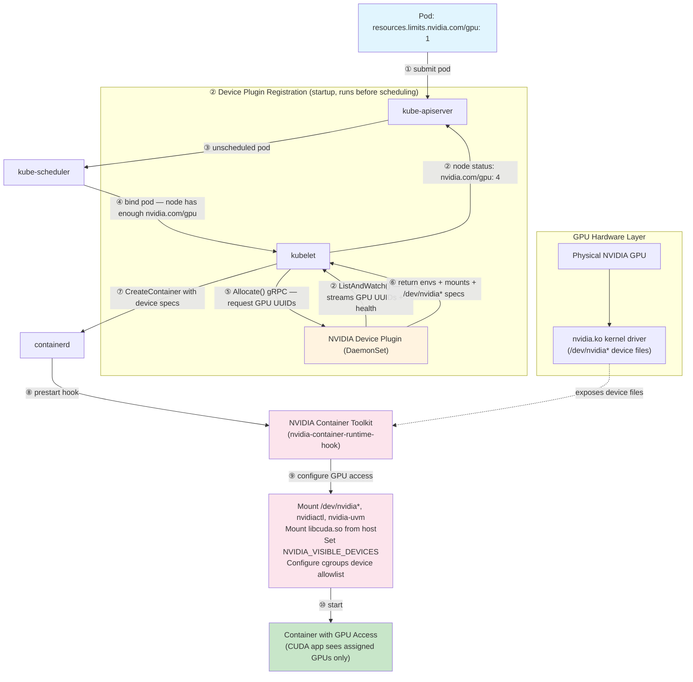
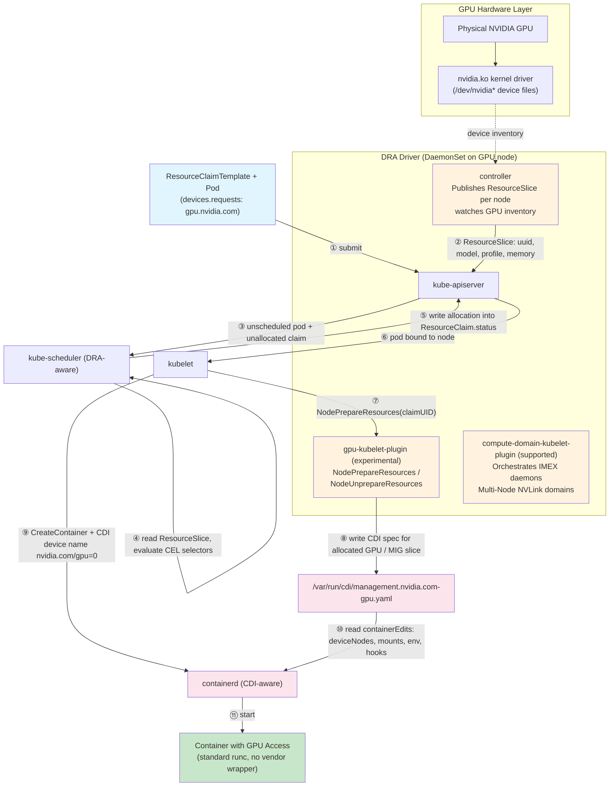

*A deep dive into how Kubernetes makes GPUs accessible to containers, from bare metal to CUDA applications*

---

## Introduction

Getting a GPU from silicon to a running CUDA container is a longer trip than a single `nvidia.com/gpu: 1` resource
request suggests. Behind that one line, kernel drivers, container runtimes, device plugins/DRA driver, and Kubernetes
scheduling all have to agree before a workload can touch the hardware.

This guide traces that full path in three parts, mirroring how GPUs actually get used in a cluster:

- **Provisioning** — from the PCIe device and kernel driver, through the NVIDIA Container Toolkit and CUDA stack,
  to how Kubernetes discovers, schedules, and allocates GPUs to pods.
- **Sharing** — the isolation and multiplexing options — MIG, time-slicing, MPS, HAMi, and vGPU — that let
  multiple workloads split a physical GPU, and what each one trades away to do it.
- **Administration** — the standards and controllers that operate GPUs at scale: the Container Device Interface
  (CDI) replacing vendor-specific runtime hooks, and Dynamic Resource Allocation (DRA) as the next generation of
  GPU scheduling.

By the end, you'll be able to trace exactly what happens between a pod spec ``nvidia.com/gpu: 1`, container `cudaMalloc()` call succeeding
on physical silicon.

## Table of Contents

**Basics**

1. [GPU & CUDA Basics](#gpu--cuda-basics)

**Provisioning**

2. [Hardware & Kernel Foundation](#hardware--kernel-foundation)
3. [Container Runtime GPU Access](#container-runtime-gpu-access)
4. [CUDA in Containers](#cuda-in-containers)
5. [Kubernetes GPU Scheduling](#kubernetes-gpu-scheduling)
6. [GPU Isolation & Visibility](#gpu-isolation--visibility)
7. [Complete Flow Example](#complete-flow-example)

**Sharing**

8. [GPU Sharing Options](#gpu-sharing-options)

**Container Standards**

9. [The Container Device Interface (CDI) Revolution](#the-container-device-interface-cdi-revolution)

**Administration**

10. [Dynamic Resource Allocation (DRA): Next-Generation GPU Scheduling](#dynamic-resource-allocation-dra-next-generation-gpu-scheduling)
11. [Conclusion](#conclusion)

---

## GPU & CUDA Basics

Before descending into kernel modules and cgroups, it helps to know what's actually running on the silicon.

### What a GPU Is

A GPU is a massively parallel processor. Where a modern CPU has a handful of cores optimized for sequential,
branch-heavy logic, a GPU packs thousands of simpler cores — organized into **Streaming Multiprocessors (SMs)**
— built to run the *same* instruction across *many* data elements at once (SIMT: Single Instruction, Multiple
Threads).

Each SM has its own register file and fast on-chip shared memory; all SMs share a much larger but slower global
memory — the "GPU memory" `nvidia-smi` reports (e.g., 40GB on an A100).

```bash
# ./device_info
Device 0: NVIDIA H100 80GB HBM3
  Compute Capability: 9.0
  SM count: 132
  CUDA cores/SM: 128
  Total CUDA cores: 16896
  Tensor cores/SM: 4
  Total Tensor cores: 528
  Total Global Memory: 85.02 GB
```


### What CUDA Is

**CUDA** (Compute Unified Device Architecture) is NVIDIA's platform for programming that hardware: a C/C++
language extension, a compiler (`nvcc`), and a runtime/driver API. It lets you write a function that runs on
the GPU — a **kernel** — and launch it across thousands of threads with a few lines of host (CPU) code.

CUDA matters for AI/ML because training and inference are dominated by matrix multiplies and convolutions —
exactly the massively parallel work GPUs are built for. Frameworks like PyTorch and TensorFlow compile down to
CUDA (via libraries like cuDNN and cuBLAS) to get that speedup.

`nvcc` splits this file into host code (compiled with a regular C++ compiler) and device code (compiled to
  PTX, then to GPU-specific machine code called SASS), bundling both into one binary.

This is the kind of program a Kubernetes pod is ultimately running. Everything from here on — driver modules,
device files, container mounts, device plugins, DRA — exists to get a call like `vectorAdd<<<...>>>()` a
physical GPU to execute on.

---

## Provisioning

From the PCIe device and kernel driver, through the NVIDIA Container Toolkit and CUDA stack, to how Kubernetes
discovers, schedules, and allocates GPUs to pods.

### Hardware & Kernel Foundation

#### Physical GPU Access

At the most fundamental level, a GPU is a PCIe device connected to the host system. The Linux kernel communicates with it through 
a sophisticated driver stack.

##### GPU Driver Architecture

The NVIDIA driver (similar concepts apply to AMD and Intel) consists of several kernel modules:
```bash
nvidia.ko              # Core driver module
nvidia-uvm.ko          # Unified Memory module
nvidia-modeset.ko      # Display mode setting
nvidia-drm.ko          # Direct Rendering Manager
```

`modinfo` confirms what's actually loaded and, via its `alias` field, previews the major number claimed for the device files below:
```bash
# modinfo nvidia
filename:       /lib/modules/6.11.0-1016-nvidia/updates/dkms/nvidia.ko.zst
import_ns:      DMA_BUF
alias:          char-major-195-*
description:    NVIDIA core GPU kernel module
version:        580.173.02
```
The `char-major-195-*` alias is the kernel's device-major registration — it's why every `/dev/nvidia0`, `/dev/nvidia1`,
`/dev/nvidiactl`, and `/dev/nvidia-modeset` below shares major number **195**.

Once created, the device files are:
```bash
/dev/nvidia0           # First GPU device
/dev/nvidia1           # Second GPU device
/dev/nvidiactl         # Control device for driver management
/dev/nvidia-uvm        # Unified Virtual Memory device
/dev/nvidia-uvm-tools  # UVM debugging and profiling
/dev/nvidia-modeset    # Mode setting operations
```

These character devices provide the fundamental interface between userspace applications and GPU hardware.

##### Device File Permissions

Device files have specific ownership and permissions:
```bash
# ls -l /dev/nvidia*
crw-rw-rw- 1 root root 195,   0 Oct 23 09:00 /dev/nvidia0
crw-rw-rw- 1 root root 195,   1 Oct 23 09:00 /dev/nvidia1
crw-rw-rw- 1 root root 195, 254 Oct 23 09:00 /dev/nvidia-modeset
crw-rw-rw- 1 root root 195, 255 Oct 23 09:00 /dev/nvidiactl
crw-rw-rw- 1 root root 509,   0 Oct 23 09:00 /dev/nvidia-uvm   # major varies — see note below
```

The major number for NVIDIA GPU devices (`/dev/nvidia*`, `/dev/nvidiactl`, `/dev/nvidia-modeset`) is **195**, a fixed number
registered at driver load time. The UVM device (`/dev/nvidia-uvm`) is different: its major number is **dynamically allocated**
by the kernel's `misc` subsystem and is **not a stable value** — it varies across kernel versions and distributions.
The value 509 shown above is illustrative; on kernels 6.x it is commonly 511. Minor numbers (0, 1, …) identify individual GPU instances.

On multi-GPU systems wired together with NVLink (e.g. DGX-class nodes), a driver load also creates
`/dev/nvidia-nvswitchctl` — the control device for the NVSwitch fabric that interconnects the GPUs. It uses its own
major number (unrelated to the 195 used for the GPUs themselves) and only shows up when NVSwitch hardware is present.

---

### Container Runtime GPU Access

#### The Container Isolation Challenge

Containers use Linux namespaces to create isolated environments. By default, a container cannot access the host's GPU devices because:

1. **Device namespace isolation**: Container has its own `/dev` filesystem
2. **cgroups device controller**: Controls which devices a process can access
3. **Mount namespace**: Container filesystem doesn't include host device files

#### NVIDIA Container Toolkit: Bridging the Gap

The **NVIDIA Container Toolkit** (formerly nvidia-docker2) solves this problem by modifying the container creation process.

##### Component Architecture
```
┌─────────────────────────────────────────┐
│   Container Runtime (Docker/containerd) │
└──────────────┬──────────────────────────┘
               │
               ↓
┌──────────────────────────────────────────┐
│   nvidia-container-runtime               │
│   (OCI-compliant runtime wrapper)        │
└──────────────┬───────────────────────────┘
               │
               ↓
┌──────────────────────────────────────────┐
│   nvidia-container-runtime-hook          │
│   (Prestart hook)                        │
└──────────────┬───────────────────────────┘
               │
               ↓
┌──────────────────────────────────────────┐
│   nvidia-container-cli                   │
│   (Performs actual GPU provisioning)     │
└──────────────────────────────────────────┘
```

##### What Gets Mounted Into the Container

When a container requests GPU access, the NVIDIA Container Toolkit mounts:

**Device Files:**
```bash
/dev/nvidia0              # GPU device
/dev/nvidia1              # Additional GPUs
/dev/nvidiactl            # Control device
/dev/nvidia-uvm           # Unified Memory device
/dev/nvidia-uvm-tools     # UVM tools
/dev/nvidia-modeset       # Mode setting
```

**Driver Libraries** (from host):
```bash
/usr/lib/x86_64-linux-gnu/libnvidia-ml.so.535.104.05
/usr/lib/x86_64-linux-gnu/libcuda.so.535.104.05
/usr/lib/x86_64-linux-gnu/libnvidia-ptxjitcompiler.so.535.104.05
# ... and few more
```

**Utilities:**
```bash
/usr/bin/nvidia-smi
/usr/bin/nvidia-debugdump
/usr/bin/nvidia-persistenced
```

##### cgroups Device Permissions

The toolkit also configures cgroups to allow device access:
```bash
# In the container's cgroup
devices.allow: c 195:* rwm    # Allow all NVIDIA devices (major 195)
devices.allow: c 195:255 rwm  # Allow nvidiactl
devices.allow: c <uvm-major>:* rwm  # Allow nvidia-uvm (major dynamically assigned by kernel)
```

The format `c 195:* rwm` means:
- `c`: Character device
- `195`: Major number (NVIDIA devices)
- `*`: All minor numbers (all GPUs)
- `rwm`: Read, write, and mknod permissions

---

### CUDA in Containers

#### Understanding the CUDA Stack

CUDA applications communicate with GPUs through a layered software stack:

```
┌──────────────────────────────┐
│   Your CUDA Application      │
│   (compiled with nvcc)       │
└─────────────┬────────────────┘
              │
              ↓
┌──────────────────────────────┐
│   CUDA Runtime API           │
│   (libcudart.so)             │
│   - cudaMalloc()             │
│   - cudaMemcpy()             │
│   - kernel<<<>>>()           │
└─────────────┬────────────────┘
              │
              ↓
┌──────────────────────────────┐
│   CUDA Driver API            │
│   (libcuda.so)               │
│   - cuMemAlloc()             │
│   - cuLaunchKernel()         │
└─────────────┬────────────────┘
              │
              ↓
┌──────────────────────────────┐
│   Kernel Driver              │
│   (nvidia.ko)                │
└─────────────┬────────────────┘
              │
              ↓
┌──────────────────────────────┐
│   Physical GPU Hardware      │
└──────────────────────────────┘
```

#### CUDA in a Containerized Environment

When user run a CUDA application inside a container, the call stack looks like:

```
[Container] CUDA Application
                ↓
[Container] libcudart.so (CUDA Runtime)
                ↓
[Mounted from Host] libcuda.so (CUDA Driver Library)
                ↓
[ioctl() system calls]
                ↓
[Mounted Device] /dev/nvidia0
                ↓
[Host Kernel] nvidia.ko driver
                ↓
[Physical Hardware] GPU
```

##### The Critical Driver Compatibility Requirement

**Key Point**: The `libcuda.so` driver library version must match the host kernel driver version. That is why its preferred 
to mount the driver library from the host rather than packaging it in the container image.

Example compatibility matrix:
```
Host Driver Version    Compatible CUDA Toolkit Versions
-------------------    --------------------------------
535.104.05            CUDA 11.0 - 12.2
525.85.12             CUDA 11.0 - 12.1
515.65.01             CUDA 11.0 - 11.8
```

The CUDA toolkit in the container must be compatible with the host's driver version, but it doesn't need to
match exactly — newer drivers support older CUDA toolkits.

In practice, images pin toolkit packages to a specific CUDA minor version rather than to the host driver. vLLM's
Dockerfile, for instance, installs `cuda-nvcc-${CUDA_VERSION_DASH}`, `cuda-cudart-${CUDA_VERSION_DASH}`, `cuda-nvrtc-${CUDA_VERSION_DASH}`,
and related `-dev` packages for runtime JIT compilation (FlashInfer, DeepGEMM, EP kernels), then separately resolves a
matching NCCL version with `apt-cache madison libnccl-dev | grep "+cuda${CUDA_VERSION_SHORT}"` — because NCCL packages
don't follow the `cuda-MAJOR-MINOR` naming convention the rest of the toolkit uses, so version pinning has to be done
by hand. The host driver only needs to be new enough to satisfy whatever `$CUDA_VERSION` got baked into the image this way
(see [vLLM's Dockerfile, lines 586–607](https://github.com/vllm-project/vllm/blob/releases/v0.21.0/docker/Dockerfile#L586-L607)).

#### A Simple CUDA Example

Here's what happens when you run a basic CUDA program:
```c
#include <stdio.h>
#include <cuda_runtime.h>

int main() {
    float *d_data;
    size_t size = 1024 * sizeof(float);
    
    // This triggers the entire stack
    cudaError_t err = cudaMalloc(&d_data, size);
    
    if (err == cudaSuccess) {
        printf("Successfully allocated %zu bytes on GPU\n", size);
        cudaFree(d_data);
    }
    
    return 0;
}
```

Behind the scenes:

1. `cudaMalloc()` calls `cuMemAlloc()` in `libcuda.so`
2. `libcuda.so` opens `/dev/nvidia0`
3. Issues `ioctl()` system call with `NVIDIA_IOCTL_ALLOC_MEM`
4. Kernel driver `nvidia.ko` receives the request
5. Driver checks cgroups: "Is this process allowed to access device 195:0?"
6. If allowed, driver allocates GPU memory
7. Returns device memory pointer to application

---

### Kubernetes GPU Scheduling

Kubernetes exposes GPUs to pods in two ways: the **Device Plugin** framework, stable since 1.10 and still the
recommended default for most clusters as of writing, and the newer **Dynamic Resource Allocation (DRA)**, better suited to
multi-node GPU topologies and richer sharing. This layer walks the Device Plugin flow end to end; DRA gets its
own deep dive later in [Dynamic Resource Allocation (DRA)](#dynamic-resource-allocation-dra-next-generation-gpu-scheduling).

#### The Device Plugin Framework

Kubernetes uses an extensible **Device Plugin** system to manage specialized hardware like GPUs, FPGAs, and InfiniBand adapters.

##### Architecture Overview

These are two separate flows, driven by different triggers — worth keeping distinct rather than reading as one
straight-line pipeline. Discovery/registration runs at plugin startup (and periodically after); allocation only
runs once the scheduler has already bound a pod to the node.

**1. Discovery & Registration** — runs at Device Plugin startup, independent of any pod:
```
┌────────────────────────────────────────┐
│   NVIDIA Device Plugin (DaemonSet)     │
│   - Discovers GPUs (nvidia-smi)        │
│   - Registers with kubelet             │
└───────────────┬────────────────────────┘
                │
                ↓
┌────────────────────────────────────────┐
│   kubelet (on GPU node)                │
│   - Discovers device plugins           │
│   - Tracks GPU allocation              │
└───────────────┬────────────────────────┘
                │
                ↓
┌────────────────────────────────────────┐
│   kube-apiserver                       │
│   (Node status: nvidia.com/gpu: 4)     │
└───────────────┬────────────────────────┘
                │
                ↓
┌────────────────────────────────────────┐
│   kube-scheduler                       │
│   (Finds nodes with requested GPUs)    │
└────────────────────────────────────────┘
```

**2. Allocation** — runs per pod, only after the scheduler has bound it to this node:
```
┌────────────────────────────────────────┐
│   kube-scheduler                       │
│   Binds pod to node with enough GPUs   │
└───────────────┬────────────────────────┘
                │
                ↓
┌────────────────────────────────────────┐
│   kubelet (on GPU node)                │
│   - Calls Allocate() for the pod       │
└───────────────┬────────────────────────┘
                │
                ↓
┌────────────────────────────────────────┐
│   NVIDIA Device Plugin (DaemonSet)     │
│   - Allocates specific GPUs            │
│   - Returns envs/mounts/device specs   │
│     (pre-CDI) or a CDI device name     │
│     (CDI mode, v0.14+)                 │
└────────────────────────────────────────┘
```

What the plugin returns from `Allocate()` depends on its mode. Older versions — and newer ones running with CDI
disabled — work out the envs, mounts, and device nodes on the fly for every call, shown as the "Pre-CDI Device
Plugin" code in [CDI in Kubernetes](#cdi-in-kubernetes). NVIDIA Device Plugin v0.14+ with CDI enabled skips that
per-call computation entirely: `Allocate()` just returns a CDI device name (e.g. `nvidia.com/gpu=0`), and
containerd resolves the actual devices/mounts/env from the static spec already generated on disk — nothing is
discovered or assembled "on the go" at allocation time anymore.

#### Device Plugin Discovery and Registration

The NVIDIA Device Plugin runs as a DaemonSet on every GPU node:

```yaml
apiVersion: apps/v1
kind: DaemonSet
metadata:
  name: nvidia-device-plugin-daemonset
  namespace: kube-system
spec:
  selector:
    matchLabels:
      name: nvidia-device-plugin-ds
  template:
    spec:
      containers:
      - name: nvidia-device-plugin
        image: nvcr.io/nvidia/k8s-device-plugin:v0.14.1
        volumeMounts:
        - name: device-plugin
          mountPath: /var/lib/kubelet/device-plugins
```

##### The Registration Process

1. **Device Plugin Starts**
```
   nvidia-device-plugin container starts
              ↓
   Queries GPUs: nvidia-smi --query-gpu=uuid --format=csv
              ↓
   Discovers: GPU-a4f8c2d1, GPU-b3e9d4f2, GPU-c8f1a5b3, GPU-d2c7e9a4
```

2. **Registration with kubelet**
```
   Device plugin connects to: unix:///var/lib/kubelet/device-plugins/kubelet.sock
              ↓
   Sends Register() gRPC call:
   {
     "version": "v1beta1",
     "endpoint": "nvidia.sock",
     "resourceName": "nvidia.com/gpu"
   }
```

3. **Advertising Resources**
```
   kubelet calls ListAndWatch() on device plugin
              ↓
   Device plugin responds:
   {
     "devices": [
       {"id": "GPU-a4f8c2d1", "health": "Healthy"},
       {"id": "GPU-b3e9d4f2", "health": "Healthy"},
       {"id": "GPU-c8f1a5b3", "health": "Healthy"},
       {"id": "GPU-d2c7e9a4", "health": "Healthy"}
     ]
   }
              ↓
   kubelet updates node status:
   status.capacity.nvidia.com/gpu: "4"
   status.allocatable.nvidia.com/gpu: "4"
```

#### Pod Scheduling Flow

Let's trace a complete pod scheduling workflow:

##### Step 1: User Creates Pod
```yaml
apiVersion: v1
kind: Pod
metadata:
  name: gpu-pod
spec:
  containers:
  - name: cuda-container
    image: nvidia/cuda:11.8.0-base-ubuntu22.04
    command: ["nvidia-smi"]
    resources:
      limits:
        nvidia.com/gpu: 2  # Request 2 GPUs
```

##### Step 2: Scheduler Filters and Scores
```
kube-scheduler receives unscheduled pod
         ↓
Filtering Phase:
  - node-1: cpu OK, memory OK, nvidia.com/gpu=0 ✗ (no GPUs)
  - node-2: cpu OK, memory OK, nvidia.com/gpu=2 ✓
  - node-3: cpu OK, memory OK, nvidia.com/gpu=4 ✓
  - node-4: cpu ✗ (insufficient CPU)
         ↓
Scoring Phase:
  - node-2: score 85 (2 GPUs available, high utilization)
  - node-3: score 92 (4 GPUs available, moderate utilization)
         ↓
Selected: node-3
         ↓
Binding: pod assigned to node-3
```

##### Step 3: kubelet Allocates GPUs
```
kubelet on node-3 receives pod assignment
         ↓
For container "cuda-container" requesting 2 GPUs:
         ↓
kubelet calls: DevicePlugin.Allocate(deviceIds=["GPU-a4f8c2d1", "GPU-b3e9d4f2"])
         ↓
Device plugin responds:
{
  "containerResponses": [{
    "envs": {
      "NVIDIA_VISIBLE_DEVICES": "GPU-a4f8c2d1,GPU-b3e9d4f2"
    },
    "mounts": [{
      "hostPath": "/usr/lib/x86_64-linux-gnu/libcuda.so.535.104.05",
      "containerPath": "/usr/lib/x86_64-linux-gnu/libcuda.so.1",
      "readOnly": true
    }],
    "devices": [{
      "hostPath": "/dev/nvidia0",
      "containerPath": "/dev/nvidia0",
      "permissions": "rwm"
    }, {
      "hostPath": "/dev/nvidia1",
      "containerPath": "/dev/nvidia1",
      "permissions": "rwm"
    }]
  }]
}
```

**If the device plugin is CDI-enabled** (NVIDIA device plugin ≥ v0.14 with `--device-list-strategy=cdi-annotations` or `cdi-cri`),
the `Allocate()` response looks different: instead of enumerating raw `devices`/`mounts`/`envs`, it returns a `cdiDevices`
list of fully-qualified CDI device names, and lets containerd resolve each name against the CDI spec on disk:

```json
{
  "containerResponses": [{
    "envs": {},
    "cdiDevices": [
      { "name": "nvidia.com/gpu=GPU-a4f8c2d1" },
      { "name": "nvidia.com/gpu=GPU-b3e9d4f2" }
    ]
  }]
}
```

The device plugin no longer needs to know host paths, library versions, or major/minor numbers at Allocate() time — it
just points at a CDI device name and defers all of that resolution to whatever generated `/etc/cdi/nvidia.yaml`
(`nvidia-ctk cdi generate`, run once per driver update).

##### Step 4: Container Runtime Provisions GPU
```
kubelet → containerd: CreateContainer with:
  - Environment: NVIDIA_VISIBLE_DEVICES=GPU-a4f8c2d1,GPU-b3e9d4f2
  - Mounts: driver libraries
  - Devices: /dev/nvidia0, /dev/nvidia1
         ↓
containerd calls: nvidia-container-runtime-hook (prestart)
         ↓
Hook configures:
  - Mounts all required device files
  - Mounts NVIDIA libraries
  - Sets up cgroups device controller
  - Configures environment variables
         ↓
Container starts with GPU access
         ↓
nvidia-smi inside container shows 2 GPUs
```

**CDI variant of Step 4**: containerd receives the CDI device names (either via CRI's `CDIDevices` field, or via the
`cdi.k8s.io/devices` pod annotation on older kubelet versions) instead of a devices/mounts list. There's no
`nvidia-container-runtime-hook` prestart step — containerd's built-in CDI support looks up each name in the on-disk CDI
spec directly and applies its `containerEdits` (device nodes, mounts, env, hooks) to the OCI spec before `runc` ever
runs. See ["Post-CDI Device Plugin"](#post-cdi-device-plugin) later in this post for the full Allocate() implementation
and containerd integration flow.

---

### GPU Isolation & Visibility

#### The Magic of NVIDIA_VISIBLE_DEVICES

The `NVIDIA_VISIBLE_DEVICES` environment variable is the key to GPU isolation in containers. It controls which GPUs are visible to CUDA applications.

##### How It Works

Consider a host with 4 GPUs:
```bash
# On the host
$ nvidia-smi --query-gpu=index,uuid --format=csv
index, uuid
0, GPU-a4f8c2d1-e5f6-7a8b-9c0d-1e2f3a4b5c6d
1, GPU-b3e9d4f2-f6a7-8b9c-0d1e-2f3a4b5c6d7e
2, GPU-c8f1a5b3-a7b8-9c0d-1e2f-3a4b5c6d7e8f
3, GPU-d2c7e9a4-b8c9-0d1e-2f3a-4b5c6d7e8f9a
```

**Container 1 configuration:**
```bash
NVIDIA_VISIBLE_DEVICES=GPU-a4f8c2d1-e5f6-7a8b-9c0d-1e2f3a4b5c6d

# Inside container 1
# nvidia-smi
+-----------------------------------------------------------------------------------------+
| NVIDIA-SMI 580.173.02             Driver Version: 580.173.02     CUDA Version: 13.0     |
+-----------------------------------------+------------------------+----------------------+
| GPU  Name                 Persistence-M | Bus-Id          Disp.A | Volatile Uncorr. ECC |
| Fan  Temp   Perf          Pwr:Usage/Cap |           Memory-Usage | GPU-Util  Compute M. |
|                                         |                        |               MIG M. |
|=========================================+========================+======================|
|   0  NVIDIA H100 80GB HBM3          Off |   00000000:8D:00.0 Off |                   On |
| N/A   31C    P0             69W /  700W |       0MiB /  81559MiB |     N/A      Default |
|                                         |                        |              Enabled |
+-----------------------------------------+------------------------+----------------------+
```

Notice that:
- Container 1 sees only 1 GPU, renumbered as GPU 0, even though the host has 4
- Setting `NVIDIA_VISIBLE_DEVICES` to a different UUID (or comma-separated list) gives another container a different
  subset — each container gets its own isolated, independently-numbered GPU namespace

##### Driver-Level Enforcement

When a CUDA application initializes:
```c
cudaError_t err = cudaSetDevice(0);
```

The CUDA driver:
1. Reads `NVIDIA_VISIBLE_DEVICES` environment variable
2. Creates a virtual-to-physical GPU mapping
3. Only allows access to visible devices
```c
cuInit() {
    visible_devices = getenv("NVIDIA_VISIBLE_DEVICES");
    
    if (visible_devices) {
        parse_and_filter_devices(visible_devices);
        // User's "GPU 0" maps to physical GPU as specified
    }
}
```

#### cgroups: Kernel-Level Protection

Environment variables provide application-level isolation, but cgroups enforce it at the kernel level.

For each container, cgroups device controller is configured:

**Container 1:**
```bash
# /sys/fs/cgroup/devices/kubepods/pod<uid>/<container-id>/devices.list
c 195:0 rwm      # Allow /dev/nvidia0 only
c 195:255 rwm    # Allow /dev/nvidiactl
c <uvm-major>:0 rwm  # Allow /dev/nvidia-uvm (major dynamically assigned by kernel)

# Implicit deny for:
# c 195:1 (would be /dev/nvidia1)
# c 195:2 (would be /dev/nvidia2)
# c 195:3 (would be /dev/nvidia3)
```

Even if a malicious process inside Container 1 tries to open `/dev/nvidia1`, the kernel blocks it:
```c
// Malicious code attempt
int fd = open("/dev/nvidia1", O_RDWR);
// Returns: -1 (EPERM - Operation not permitted)
// Kernel: cgroups device controller denied access
```

This provides defense-in-depth: both application-level (CUDA driver) and kernel-level (cgroups) isolation.

---

### Complete Flow Example

Let's trace a complete end-to-end flow from pod creation to CUDA memory allocation.

#### The Scenario

We'll deploy a pod requesting 2 GPUs and run a simple CUDA program that allocates GPU memory.

##### Step 1: Deploy the Pod
```yaml
apiVersion: v1
kind: Pod
metadata:
  name: cuda-mem-test
spec:
  restartPolicy: Never
  containers:
  - name: cuda-app
    image: nvidia/cuda:11.8.0-devel-ubuntu22.04
    command: ["./cuda_malloc_test"]
    resources:
      limits:
        nvidia.com/gpu: 2
```
```bash
$ kubectl apply -f cuda-pod.yaml
pod/cuda-mem-test created
```

Scheduling and allocation from here follow the same flow already walked through in
[Pod Scheduling Flow](#pod-scheduling-flow): the scheduler filters and scores nodes on `nvidia.com/gpu` availability
(say it lands on `node-gpu-03`), kubelet calls the device plugin's `Allocate()` for GPU UUIDs `GPU-uuid-1234` and
`GPU-uuid-5678`, and containerd folds the resulting devices, mounts, and env (or, on a CDI-enabled setup, a
`cdiDevices` list) into the OCI spec before `runc` starts the container. What's different this time is what happens
*inside* the container once it's running — that's the part worth tracing in detail.

##### Step 2: CUDA Application Runs

Inside the container, our CUDA application executes:
```c
#include <stdio.h>
#include <cuda_runtime.h>

int main() {
    int deviceCount;
    cudaGetDeviceCount(&deviceCount);
    printf("Visible GPUs: %d\n", deviceCount);
    
    for (int i = 0; i < deviceCount; i++) {
        cudaSetDevice(i);
        
        float *d_data;
        size_t size = 1024 * 1024 * 1024;  // 1 GB
        
        cudaError_t err = cudaMalloc(&d_data, size);
        if (err == cudaSuccess) {
            printf("GPU %d: Allocated 1 GB\n", i);
            cudaFree(d_data);
        }
    }
    
    return 0;
}
```

**The execution flow:**
```
Application calls: cudaGetDeviceCount(&deviceCount)
         ↓
CUDA Runtime (libcudart.so): cuDeviceGetCount()
         ↓
CUDA Driver (libcuda.so):
  - Reads NVIDIA_VISIBLE_DEVICES from environment
  - Parses: "GPU-uuid-1234,GPU-uuid-5678"
  - Returns: deviceCount = 2
         ↓
Application prints: "Visible GPUs: 2"
         ↓
Application calls: cudaMalloc(&d_data, 1GB) for GPU 0
         ↓
CUDA Runtime: cuMemAlloc(1073741824)  // 1 GB in bytes
         ↓
CUDA Driver:
  - Determines physical GPU from NVIDIA_VISIBLE_DEVICES mapping
  - Virtual GPU 0 → Physical GPU-uuid-1234 → /dev/nvidia0
  - Opens file descriptor: fd = open("/dev/nvidia0", O_RDWR)
         ↓
Kernel checks cgroups:
  - Process in cgroup: /kubepods/pod-xyz/container-abc
  - Requested device: major=195, minor=0
  - cgroups device allowlist: c 195:0 rwm ✓ ALLOWED
         ↓
Kernel forwards to nvidia.ko driver
         ↓
nvidia.ko driver:
  - Allocates 1 GB of GPU memory on physical GPU
  - Programs GPU memory controller
  - Returns device memory address: 0x7f8c40000000
         ↓
CUDA Driver returns to application
         ↓
Application prints: "GPU 0: Allocated 1 GB"
         ↓
[Repeat for GPU 1 with /dev/nvidia1]
         ↓
Application prints: "GPU 1: Allocated 1 GB"
```

**System calls involved:**
```bash
# Traced with strace
openat(AT_FDCWD, "/dev/nvidia0", O_RDWR) = 3
ioctl(3, NVIDIA_IOC_QUERY_DEVICE_CLASS, ...) = 0
ioctl(3, NVIDIA_IOC_CARD_INFO, ...) = 0
ioctl(3, NVIDIA_IOC_ALLOC_MEM, {size=1073741824, ...}) = 0
# ... GPU memory now allocated ...
ioctl(3, NVIDIA_IOC_FREE_MEM, ...) = 0
close(3) = 0
```

---

## Sharing


Default Kubernetes scheduling assigns GPUs as atomic units ([nvidia.com/gpu](https://nvidia.com/gpu): 8). 
When a lightweight container requests a GPU, it monopolizes the entire device regardless of actual compute or memory utilization. 
Running eight small workloads consumes all eight available cards, falsely reporting a fully saturated cluster while significant capacity remains wasted.

The isolation and multiplexing options — MIG, time-slicing, MPS, HAMi, and vGPU — that let multiple workloads split a
physical GPU, and what each one trades away to do it.

### GPU Sharing Options

#### GPU Time-Slicing
For workloads that don't require full GPU utilization, time-slicing allows multiple containers to share a single GPU.

##### Device Plugin ConfigMap

```yaml
apiVersion: v1
kind: ConfigMap
metadata:
  name: nvidia-device-plugin-config
  namespace: kube-system
data:
  config.yaml: |
    version: v1
    sharing:
      timeSlicing:
        replicas: 4
        renameByDefault: false
        failRequestsGreaterThanOne: true
    resources:
      - name: nvidia.com/gpu
        devices: all
```

All containers:
1. See the same GPU device
2. Create separate CUDA contexts
3. GPU hardware time-multiplexes between contexts
4. No memory isolation (pods can see each other's allocations!)

##### Why "Time-Slicing" Oversells What's Happening

Time-slicing doesn't divide the GPU — it still runs exactly one context at a time, just in very short turns, which
makes it look like concurrent sharing from the outside. 

Time-slicing shares a GPU by using hardware context switches, but because saving and restoring massive tensor footprints, registers, and cache states overhead is high, performance degrades significantly under heavy use. It works well for bursty, spiky inference or development workloads, but fails on saturated training jobs. It's a Kubernetes-level configuration for the NVIDIA device plugin / GPU Operator, not a GPU driver setting — so there's no enforcement from the GPU, OS, or CUDA runtime, and a tenant submitting back-to-back work can hold the card continuously while neighboring tasks stall.

In Kubernetes, setting timeSlicing.replicas simply tricks the control plane into advertising a single GPU as multiple schedulable units, leaving pods to battle for access at the silicon level. Crucially, memory is neither metered nor isolated: all pods draw from a single shared pool. As a result, one pod's memory leak or over-allocation routinely triggers cascading Out-of-Memory (OOM) crashes for whichever unrelated pod happens to request memory next.

##### `nvidia-smi` Has No Time-Slicing Toggle

Time-slicing isn't something you turn on — it's the default behavior whenever multiple processes hold CUDA contexts on a GPU without MIG or MPS, so there's nothing to configure at the `nvidia-smi` layer. What it *can* control is adjacent, not equivalent — compute mode, which governs whether multiple contexts are even allowed to coexist:

```bash
nvidia-smi -i 0 -c DEFAULT            # multiple processes can share (default)
nvidia-smi -i 0 -c EXCLUSIVE_PROCESS  # only one process at a time
nvidia-smi -i 0 -c PROHIBITED         # no compute processes allowed
```

**Time-Slicing Summary**

- **Broad compatibility:** works on any GPU architecture — a ConfigMap change, no MIG hardware, no driver reboot.
- **Good for bursty workloads:** reclaims idle GPU cycles between spiky inference or dev requests.
- **No isolation:** no memory or QoS boundaries, so compute-heavy pods can starve neighbors.
- **Cascading OOM:** one pod's leak crashes whichever pod happens to allocate next — not necessarily the culprit.

#### NVIDIA MPS (Multi-Process Service)

Time-slicing gives each process the whole GPU in turn; MPS instead lets multiple processes run *on* the GPU
concurrently, through a shared context. A daemon (`nvidia-cuda-mps-control`) sits between the processes and the
driver and merges their kernel submissions into a single context, so the GPU can interleave work from different
containers within the same execution window instead of context-switching between fully separate ones.

```
Without MPS                          With MPS
Process A ─┐                         Process A ─┐
Process B ─┼→ separate contexts      Process B ─┼→ MPS daemon → one shared context → GPU
Process C ─┘   (time-sliced)         Process C ─┘   (concurrent kernel execution)
```

Practically, this matters for many small, low-occupancy kernels — MPI-style multi-process workloads, or several
lightweight inference processes — that don't individually saturate the SMs. Time-slicing would serialize them and
waste the idle capacity each one leaves on the table; MPS packs their kernels onto the GPU together instead.

**What it doesn't give you:**
- **No memory isolation.** All clients share the daemon's context, so one process can allocate its way into
  starving the others — same failure mode as time-slicing on that front.
- **A single misbehaving client can take down the daemon**, which takes every other client sharing it down too. In
  Kubernetes terms, that turns one pod's crash into an outage for every other pod scheduled onto the same MPS set.
- **No per-client fault isolation** — MPS clients are cooperating processes under one shared context, not
  walled-off instances.

On Kubernetes, the device plugin's `sharing.mps` mode (the sibling config to `timeSlicing` shown earlier) is what
wires this up — it starts the control daemon on the node and hands each pod a client ID instead of a full GPU.
It's a reasonable middle ground when workloads are trusted and cooperative but still need real concurrent
execution rather than turn-taking — HAMi's `libvgpu.so` approach (below) targets the same "trusted but resource-
starved" niche with per-pod metering instead of a shared context, which is why the two are worth comparing rather
than treating MPS as strictly better or worse.

#### Multi-Instance GPU (MIG)

This isn't a scheduler trick — the GPU's memory controllers and streaming multiprocessors
(SMs) are physically fenced off per instance, so one tenant's workload literally cannot see or starve another's.

##### MIG Architecture

MIG partitioning happens in two layers, and it's worth keeping them distinct because the CLI and the Kubernetes
device plugin both expose this split:

- **GPU Instance (GI)** — carves off a fixed slab of VRAM with its own memory controllers. This is the hardware
  boundary; two GIs cannot see each other's memory even if the host is compromised.
- **Compute Instance (CI)** — carves dedicated SMs *inside* a GI for execution. A CI can't exist without a parent
  GI, and the CLI enforces that ordering: you destroy CIs before you can destroy their GI.

A single A100 (40GB) can be sliced into up to 7 instances:
```
Physical A100 (40GB)
├─ MIG Instance 0: 3g.20gb (3 compute slices, 20GB memory)
├─ MIG Instance 1: 3g.20gb (3 compute slices, 20GB memory)
├─ MIG Instance 2: 2g.10gb (2 compute slices, 10GB memory)
└─ MIG Instance 3: 1g.5gb  (1 compute slice, 5GB memory)
```

Each MIG instance:
- Has dedicated compute resources (streaming multiprocessors)
- Has dedicated memory partition
- Provides hardware-level isolation
- Appears as a separate GPU device

##### MIG Device Management
```bash
# Enable MIG mode

# nvidia-smi -i 0 -mig 1
All done.
```

```bash
# List All Profile 

# nvidia-smi mig -i 0 -lgip
+-------------------------------------------------------------------------------+
| GPU instance profiles:                                                        |
| GPU   Name               ID    Instances   Memory     P2P    SM    DEC   ENC  |
|                                Free/Total   GiB              CE    JPEG  OFA  |
|===============================================================================|
|   0  MIG 1g.10gb         19     7/7        9.75       No     16     1     0   |
|                                                               1     1     0   |
+-------------------------------------------------------------------------------+
|   0  MIG 1g.10gb+me      20     1/1        9.75       No     16     1     0   |
|                                                               1     1     1   |
+-------------------------------------------------------------------------------+
|   0  MIG 1g.20gb         15     4/4        19.62      No     26     1     0   |
|                                                               1     1     0   |
+-------------------------------------------------------------------------------+
|   0  MIG 2g.20gb         14     3/3        19.62      No     32     2     0   |
|                                                               2     2     0   |
+-------------------------------------------------------------------------------+
|   0  MIG 3g.40gb          9     2/2        39.50      No     60     3     0   |
|                                                               3     3     0   |
+-------------------------------------------------------------------------------+
|   0  MIG 4g.40gb          5     1/1        39.50      No     64     4     0   |
|                                                               4     4     0   |
+-------------------------------------------------------------------------------+
|   0  MIG 7g.80gb          0     1/1        79.25      No     132    7     0   |
|                                                               8     7     1   |
+-------------------------------------------------------------------------------+


```

```bash
# Create GPU Instances (GI) — using profile IDs from your -lgip output. Example: one 3g.40gb (ID 9) and one 2g.20gb (ID 14):

# nvidia-smi mig -i 0 -cgi 9,14
Successfully created GPU instance ID  2 on GPU  0 using profile MIG 3g.40gb (ID  9)
Successfully created GPU instance ID  3 on GPU  0 using profile MIG 2g.20gb (ID 14)
```


```bash
# List GIs to confirm IDs

# nvidia-smi mig -i 0 -lgi
+---------------------------------------------------------+
| GPU instances:                                          |
| GPU   Name               Profile  Instance   Placement  |
|                            ID       ID       Start:Size |
|=========================================================|
|   0  MIG 2g.20gb           14        3          0:2     |
+---------------------------------------------------------+
|   0  MIG 3g.40gb            9        2          4:4     |
+---------------------------------------------------------+

```

```bash

# Create Compute Instances (CI) inside each GI — using the default profile that consumes the full GI

# nvidia-smi mig -i 0 -gi 2 -cci
Successfully created compute instance ID  0 on GPU  0 GPU instance ID  2 using profile MIG 3g.40gb (ID  2)

# nvidia-smi mig -i 0 -gi 3 -cci
Successfully created compute instance ID  0 on GPU  0 GPU instance ID  3 using profile MIG 2g.20gb (ID  1)

```

```bash

# List CIs to confirm

# nvidia-smi mig -i 0 -lci
+--------------------------------------------------------------------+
| Compute instances:                                                 |
| GPU     GPU       Name             Profile   Instance   Placement  |
|       Instance                       ID        ID       Start:Size |
|         ID                                                         |
|====================================================================|
|   0      3       MIG 2g.20gb          1         0          0:2     |
+--------------------------------------------------------------------+
|   0      2       MIG 3g.40gb          2         0          0:4     |
+--------------------------------------------------------------------+

```

```bash
# New device files appear
❯ # ls -l /dev/nvidia*
  crw-rw-rw- 1 root root 195, 254 Aug  9 09:11 /dev/nvidia-modeset
  crw-rw-rw- 1 root root 236, 255 Aug  9 09:11 /dev/nvidia-nvswitchctl
  crw-rw-rw- 1 root root 511,   0 Aug  9 09:11 /dev/nvidia-uvm
  crw-rw-rw- 1 root root 511,   1 Aug  9 09:11 /dev/nvidia-uvm-tools
  crw-rw-rw- 1 root root 195,   0 Aug  9 09:11 /dev/nvidia0
  crw-rw-rw- 1 root root 195, 255 Aug  9 09:11 /dev/nvidiactl

  /dev/nvidia-caps:
  total 0
  cr-------- 1 root root 238,  1 Aug  9 09:11 nvidia-cap1
  cr--r--r-- 1 root root 238, 12 Aug  9 10:43 nvidia-cap12
  cr--r--r-- 1 root root 238, 13 Aug  9 10:44 nvidia-cap13
  cr--r--r-- 1 root root 238,  2 Aug  9 09:11 nvidia-cap2
  cr--r--r-- 1 root root 238, 21 Aug  9 10:42 nvidia-cap21
  cr--r--r-- 1 root root 238, 22 Aug  9 10:45 nvidia-cap22
  cr--r--r-- 1 root root 238,  3 Aug  9 11:55 nvidia-cap3
  cr--r--r-- 1 root root 238, 30 Aug  9 12:02 nvidia-cap30
  cr--r--r-- 1 root root 238, 31 Aug  9 12:06 nvidia-cap31
  cr--r--r-- 1 root root 238,  4 Aug  9 11:55 nvidia-cap4

for f in /proc/driver/nvidia/capabilities/gpu0/mig/gi*/ci*/access; do
  gi=$(echo "$f" | grep -oP 'gi\K[0-9]+')
  ci=$(echo "$f" | grep -oP 'ci\K[0-9]+')
  minor=$(grep DeviceFileMinor "$f" | awk '{print $2}')
  echo "GI $gi / CI $ci -> nvidia-cap$minor"
done

GI 2 / CI 0 -> nvidia-cap22
GI 3 / CI 0 -> nvidia-cap31
```

##### MIG in Kubernetes
The NVIDIA Device Plugin discovers MIG instances and advertises them as separate resources:

```yaml
apiVersion: v1
kind: Node
status:
  capacity:
    nvidia.com/mig-3g.20gb: "2"
    nvidia.com/mig-1g.5gb: "1"
  allocatable:
    nvidia.com/mig-3g.20gb: "2"
    nvidia.com/mig-1g.5gb: "1"
```

```yaml
#Pods can request specific MIG profiles:
apiVersion: v1
kind: Pod
metadata:
  name: mig-pod
spec:
  containers:
  - name: cuda-app
    image: nvidia/cuda:11.8.0-base-ubuntu22.04
    resources:
      limits:
        nvidia.com/mig-3g.20gb: 1  # Request one 3g.20gb instance
```

##### MIG benefits
- True hardware isolation (unlike time-slicing)
- Guaranteed memory allocation
- Fault isolation (one instance failure doesn't affect others)
- Quality of Service (QoS) guarantees

##### MIG Trade-offs
- The GPU is partitioned into whatever profiles the hardware supports (`1g.5gb`, `3g.20gb`, …) — you can't ask for
  an arbitrary split, only the combinations NVIDIA has defined for that silicon.
- Reshaping the layout means destroying and recreating instances, which briefly takes the GPU offline.
- Fixed profiles fit steady-state, predictable workloads (multi-tenant inference) far better than bursty or
  variable-sized jobs.

##### Who Actually Stands MIG Up

None of the above happens by hand-running `nvidia-smi` on every node in a real cluster. In practice the **NVIDIA
GPU Operator** owns the whole stack — kernel driver, container toolkit, and device plugin — as a set of
DaemonSets, and a companion **MIG Manager** DaemonSet watches a node label to decide the partition layout:

```bash
# Point every GPU on the node at a uniform 1g.24gb-style layout
kubectl label node <node-name> nvidia.com/mig.config=all-1g.24gb --overwrite

# Revert to whole, unpartitioned GPUs
kubectl label node <node-name> nvidia.com/mig.config=all-disabled --overwrite
```

The manager reacts to that label by draining workloads, resetting the GPU, and re-carving instances — no manual
`nvidia-smi mig -cgi` sequence required once it's running. Mixed geometries (say, one `2g.48gb` slice alongside
two `1g.24gb` slices on the same card) are still possible, just via a custom `mig-parted` ConfigMap instead of the
canned label values.

**Where this breaks in practice**, and worth budgeting time for when you're standing up a MIG-enabled node:

- **containerd's config path isn't universal.** The GPU Operator's toolkit component assumes stock containerd
  locations. On RKE2 or k3s the socket and config file live somewhere else entirely, and the toolkit will fail
  silently against the wrong path unless you override `CONTAINERD_CONFIG` / `CONTAINERD_SOCKET` explicitly in the
  Helm values.
- **The MIG Manager treats "no label" as "no MIG."** If a node has no `nvidia.com/mig.config` label at all, the
  manager's default reconciliation target is `all-disabled` — which will tear down any instances you carved by
  hand the moment the manager starts watching that node. Label the node *before* you touch `nvidia-smi mig`, not
  after.
- **The manager only reacts to Kubernetes events, not hardware state.** If you SSH in and change the MIG layout
  directly with `nvidia-smi`, the operator has no way to notice — its controller loop is driven by label
  watches, not a poll of `nvidia-smi mig -lgi`. A stuck reconciliation usually means restarting the
  `nvidia-mig-manager` DaemonSet or toggling the label off and back on to force a re-evaluation.
- **The GI/CI hierarchy is enforced, not advisory.** Attempting to delete a GPU Instance while a Compute Instance
  still lives inside it fails outright ("In use by another client"), and a slice with a running pod on it can't
  be destroyed until that pod is evicted.
- **New architectures need new container images.** Blackwell-class cards need a CUDA toolkit and PyTorch/TensorFlow
  build compiled for that compute capability — an older NGC image will schedule fine and then fail at the first
  kernel launch with an "unsupported" error that has nothing to do with Kubernetes.
- **You can't see inside a slice from the outside.** Because isolation is hardware-enforced, standard cluster
  GPU dashboards need per-slice telemetry (the DCGM exporter plus a MIG-aware Grafana dashboard) — whole-GPU
  utilization graphs will just show the parent card and hide how the individual slices are actually being used.

#### HAMi: Fractional GPUs Without Repartitioning Hardware

MIG solves fragmentation by cutting the GPU into fixed, hardware-defined shapes. That's great for predictable
multi-tenant inference, but it has a rigidity problem: a `1g.24gb` slice is a `1g.24gb` slice, and reshaping the
layout means draining pods and resetting the card. Time-slicing goes the other direction — infinitely flexible,
zero isolation. **HAMi** (Heterogeneous AI Computing Virtualization, a CNCF Incubating project) sits between the
two: it keeps the GPU whole at the hardware level and instead adds a software layer that meters memory and
compute *per pod*, changeable purely through the pod spec.

##### How the sharing model actually works

Where the device plugin flow in [Kubernetes GPU Scheduling](#kubernetes-gpu-scheduling) only ever hands out whole GPU UUIDs,
HAMi inserts itself at four points in that flow:

```
Pod requests nvidia.com/gpu + gpumem + gpucores
         ↓
Mutating webhook reroutes the pod to the HAMi scheduler extender
         ↓
HAMi scheduler checks aggregate count / memory / compute budgets
across the cluster before binding (not just device count)
         ↓
HAMi device plugin allocates a logical slot and injects libvgpu.so
into the container via LD_PRELOAD
         ↓
libvgpu.so intercepts CUDA memory-allocation and kernel-launch calls
at runtime, enforcing the pod's memory ceiling and compute-time share
```

The pod spec gains two extended resources beyond the familiar `nvidia.com/gpu` count:

```yaml
resources:
  limits:
    nvidia.com/gpu: 1        # a physical GPU, possibly shared with other pods
    nvidia.com/gpumem: 8000  # hard ceiling in MiB
    nvidia.com/gpucores: 10  # compute-time share, in percent
  requests:
    nvidia.com/gpu: 1
    nvidia.com/gpumem: 8000
    nvidia.com/gpucores: 10
```

A cluster with eight physical GPUs and a `deviceSplitCount` of 10 exposes 80 schedulable slots — that's 80
*scheduling opportunities*, not 80 GPUs or a memory multiplier. The scheduler is doing admission control against
the real 8-card, N-gigabyte budget underneath.

##### Where this differs from MIG in ways that matter operationally

- **Isolation is enforced in userspace, not silicon.** `libvgpu.so` polices allocations at the CUDA API boundary.
  A workload that goes around it — a static binary calling the driver directly, or one setting
  `CUDA_DISABLE_CONTROL` — can slip past the memory ceiling. Treat HAMi as resource governance for cooperative,
  trusted workloads, not as a tenant security boundary; adversarial multi-tenancy is still MIG's job.
- **`nvidia.com/gpu: 1` alone means the whole card.** Forgetting `gpumem`/`gpucores` doesn't yield some sane
  default fraction — it grants exclusive access to 100% of memory and compute, silently defeating the point of
  installing HAMi in the first place.
- **Requests must equal limits.** Kubernetes extended resources aren't overcommittable, so a mismatched
  request/limit pair for `gpumem` or `gpucores` is rejected at admission, before the scheduler even runs.
- **The failure mode is a clean OOM, not a crash.** When one pod's actual usage exceeds its `gpumem` ceiling,
  HAMi-Core returns a CUDA out-of-memory error to that process specifically — neighboring pods sharing the same
  card keep running untouched. That's the practical payoff of the interception approach: a noisy-neighbor
  incident stays contained to the pod that caused it.
- **Two separate metrics endpoints matter for capacity planning**: the scheduler exposes what it has *promised*
  (aggregate allocation across the cluster), while the device plugin exposes what's *actually being consumed* per
  container. Reading only one side hides either over-subscription risk or real headroom, depending on which one
  you skip.

HAMi is the better fit when workloads are numerous, small, and variable in size — dev notebooks, small inference
services, CI GPU jobs — where carving fixed MIG profiles would waste capacity or require constant reshaping. MIG
remains the better fit once isolation has to survive a hostile or untrusted tenant, not just a well-behaved one.

#### vGPU (Virtual GPU)

NVIDIA vGPU technology provides software-defined GPU sharing with:
- Hypervisor-level virtualization
- Memory isolation between VMs
- QoS policies and scheduling
- Live migration support
```
Hypervisor (VMware vSphere / KVM)
├─ VM 1: vGPU (4GB, 1/4 GPU compute)
├─ VM 2: vGPU (4GB, 1/4 GPU compute)
├─ VM 3: vGPU (8GB, 1/2 GPU compute)
└─ Physical GPU (16GB total)
```

Each vGPU appears as a complete GPU to the guest OS, enabling standard CUDA applications without modification.
Can use the Kata containers to enable vGPU on the Kubernetes.

`Note: In order to use vGPU, vGPU requires NVIDIA vGPU license`

#### Comparison Matrix

| Technology | Isolation | Memory | Performance | Flexibility | Use Case |
|-----------|-----------|---------|-------------|-------------|----------|
| **Full GPU** | Hardware | Dedicated | 100% | Low | Training, HPC |
| **MIG** | Hardware | Dedicated | Guaranteed | Medium | Inference, Multi-tenant |
| **HAMi** | Software (userspace intercept) | Metered, not walled off | Throttled share | High | Dev/Test, small inference, CI |
| **MPS** | None (shared context) | Shared | Concurrent, no throttling | Medium | Many small/cooperative processes |
| **Time-Slicing** | None | Shared | Variable | High | Dev/Test, Jupyter |
| **vGPU** | Software | Isolated | Good | High | VDI, Cloud VMs |

---

## The Container Device Interface (CDI) Revolution

In 2023-2024, the container ecosystem began transitioning to the **Container Device Interface (CDI)** — 
a standardized specification that fundamentally changes how devices are exposed to containers.

### The Problem CDI Solves

#### The Old Way: Vendor-Specific Runtime Hooks

Before CDI, each hardware vendor needed custom integration:
```
┌─────────────────────────────────────────┐
│   Container Runtime (containerd)        │
└─────────────┬───────────────────────────┘
              │
              ↓
┌─────────────────────────────────────────┐
│   nvidia-container-runtime (wrapper)    │  ← NVIDIA-specific
└─────────────┬───────────────────────────┘
              │
              ↓
┌─────────────────────────────────────────┐
│   nvidia-container-runtime-hook         │  ← Vendor logic
└─────────────┬───────────────────────────┘
              │
              ↓
┌─────────────────────────────────────────┐
│   nvidia-container-cli                  │  ← Device provisioning
└─────────────────────────────────────────┘
```

Problems:

Vendor Lock-in: AMD needed rocm-container-runtime, Intel their own
Runtime Coupling: Required wrapping or modifying the container runtime
Complex Integration: Each vendor's device plugin needed runtime-specific knowledge
No Standardization: Every vendor solved the problem differently

#### The New Way: Declarative Device Specifications

Instead of runtime hooks, CDI uses a static YAML (or JSON) file on each node that declaratively describes everything a runtime needs to inject a device into a container: device nodes, library mounts, environment variables, and hooks. The NVIDIA Container Toolkit generates these files once via `nvidia-ctk cdi generate`; the NVIDIA DRA driver generates them dynamically at allocation time.

The container runtime reads this file at container creation time and applies the edits directly to the OCI spec — no vendor wrapper required.

### CDI Architecture

```
┌──────────────────────────────────────────┐
│   Container Orchestrator                 │
│   (Kubernetes, Podman, Docker)           │
└─────────────┬────────────────────────────┘
              │ Request: "nvidia.com/gpu=0"
              ↓
┌──────────────────────────────────────────┐
│   Container Runtime                      │
│   (containerd, CRI-O, Docker)            │
│   + Native CDI Support                   │
└─────────────┬────────────────────────────┘
              │ Reads CDI specs from disk
              ↓
┌──────────────────────────────────────────┐
│   CDI Specification Files (YAML or JSON) │
│   /etc/cdi/*.yaml   ← static, admin-gen │
│   /var/run/cdi/*.yaml ← dynamic, runtime│
└─────────────┬────────────────────────────┘
              │ Describes device configuration
              ↓
┌──────────────────────────────────────────┐
│   Host System Resources                  │
│   - Device nodes (/dev/nvidia*)          │
│   - Libraries (libcuda.so, etc.)         │
│   - Utilities (nvidia-smi)               │
└──────────────────────────────────────────┘
```

A CDI spec file (`/etc/cdi/nvidia.yaml`) is generated once by `nvidia-ctk` and contains three main sections:

```yaml
# /etc/cdi/nvidia.yaml
cdiVersion: "0.6.0"          # CDI specification version
kind: nvidia.com/gpu          # Fully-qualified device kind (vendor.com/type)
                              # Prevents collisions: nvidia.com/gpu, amd.com/gpu, intel.com/gpu
devices:
  - name: "0"
    containerEdits:           # Everything to inject for this device
      deviceNodes:
        - path: /dev/nvidia0
          type: c
          major: 195
          minor: 0
        - path: /dev/nvidiactl
          type: c
          major: 195
          minor: 255
        - path: /dev/nvidia-uvm
          type: c
          major: 511  # dynamically assigned by kernel — verify with `ls -l /dev/nvidia-uvm`
          minor: 0
      mounts:
        - hostPath: /usr/lib/x86_64-linux-gnu/libcuda.so.535.104.05
          containerPath: /usr/lib/x86_64-linux-gnu/libcuda.so.1
          options: ["ro", "nosuid", "nodev", "bind"]
        - hostPath: /usr/lib/x86_64-linux-gnu/libnvidia-ml.so.535.104.05
          containerPath: /usr/lib/x86_64-linux-gnu/libnvidia-ml.so.1
          options: ["ro", "nosuid", "nodev", "bind"]
        - hostPath: /usr/bin/nvidia-smi
          containerPath: /usr/bin/nvidia-smi
          options: ["ro", "nosuid", "nodev", "bind"]
      env:
        - "NVIDIA_VISIBLE_DEVICES=0"
        - "NVIDIA_DRIVER_CAPABILITIES=compute,utility"
      hooks:
        - hookName: createContainer
          path: /usr/bin/nvidia-ctk
          args: ["hook", "update-ldcache"]

  - name: "1"
    containerEdits:
      deviceNodes:
        - path: /dev/nvidia1
          type: c
          major: 195
          minor: 1
        - path: /dev/nvidiactl
          type: c
          major: 195
          minor: 255
        - path: /dev/nvidia-uvm
          type: c
          major: 511  # dynamically assigned by kernel — verify with `ls -l /dev/nvidia-uvm`
          minor: 0
      mounts:
        # ... same libraries as device "0" ...
      env:
        - "NVIDIA_VISIBLE_DEVICES=1"
        - "NVIDIA_DRIVER_CAPABILITIES=compute,utility"
```

> **What real `nvidia-ctk cdi generate` output looks like**: the `mounts`/`hostPath` pairing above is simplified for
> readability. Current toolkit versions (e.g. driver 580.173.02) instead bind-mount the versioned host libraries once and
> use a dedicated `createContainer` hook, `nvidia-cdi-hook create-symlinks`, to build every `.so` → `.so.1`/`.so.N` symlink
> a container needs — `libcuda.so.1`, `libnvidia-ml.so.1`, `libnvcuvid.so.1`, `libnvidia-opencl.so.1`, and more, each
> passed as a `--link target::linkname` argument. This avoids baking exact driver-version filenames into every mount and
> keeps symlink creation as an explicit, inspectable step rather than an implicit side effect of the bind mount.

### CDI vs Traditional Flow Comparison

#### Traditional NVIDIA Container Toolkit Flow

```
1. User runs container:
   docker run --gpus all nvidia/cuda
         ↓
2. Docker daemon calls nvidia-container-runtime
         ↓
3. nvidia-container-runtime wraps runc
         ↓
4. Prestart hook executes: nvidia-container-runtime-hook
         ↓
5. Hook reads --gpus flag and NVIDIA_VISIBLE_DEVICES
         ↓
6. nvidia-container-cli dynamically queries nvidia-smi
         ↓
7. Determines required devices, libraries, mounts
         ↓
8. Modifies OCI spec on-the-fly (adds devices, mounts, env)
         ↓
9. runc creates container with GPU access
```

**Characteristics:**
- Dynamic device discovery at container start
- Runtime wrapper required
- Vendor-specific magic in environment variables
- Black box: hard to inspect what's being configured

#### CDI-Based Flow

```
1. One-time setup (on node):
   nvidia-ctk cdi generate --output=/etc/cdi/nvidia.yaml
         ↓
2. User runs container:
   docker run --device nvidia.com/gpu=0 nvidia/cuda
         ↓
3. containerd (with native CDI support) receives request
         ↓
4. Parses CDI device name: "nvidia.com/gpu=0"
         ↓
5. Looks up device in /etc/cdi/nvidia.yaml
         ↓
6. Reads containerEdits for device "0"
         ↓
7. Applies edits to OCI spec:
   - Adds device nodes
   - Adds mounts
   - Sets environment variables
   - Registers hooks
         ↓
8. runc creates container with GPU access
```

**Characteristics:**

- Static device specification (generated once)
- No runtime wrapper needed
- Standard OCI runtime (runc) works unmodified
- Transparent: inspect CDI specs to see exact configuration
- Vendor provides only CDI spec generator

### CDI in Kubernetes
Device Plugin is responsible to adher CDI

#### Pre-CDI Device Plugin
```go
func (m *NvidiaDevicePlugin) Allocate(
    req *pluginapi.AllocateRequest,
) (*pluginapi.AllocateResponse, error) {
    responses := pluginapi.AllocateResponse{}
    
    for _, request := range req.ContainerRequests {
        // Device plugin must know HOW to provision GPU
        response := pluginapi.ContainerAllocateResponse{
            Envs: map[string]string{
                "NVIDIA_VISIBLE_DEVICES": "GPU-uuid-1234",
            },
            Mounts: []*pluginapi.Mount{
                {
                    HostPath: "/usr/lib/x86_64-linux-gnu/libcuda.so",
                    ContainerPath: "/usr/lib/x86_64-linux-gnu/libcuda.so",
                    ReadOnly: true,
                },
                // ... many more mounts ...
            },
            Devices: []*pluginapi.DeviceSpec{
                {
                    HostPath: "/dev/nvidia0",
                    ContainerPath: "/dev/nvidia0",
                    Permissions: "rwm",
                },
                {
                    HostPath: "/dev/nvidiactl",
                    ContainerPath: "/dev/nvidiactl",
                    Permissions: "rwm",
                },
                // ... more devices ...
            },
        }
        responses.ContainerResponses = append(
            responses.ContainerResponses, 
            &response,
        )
    }
    
    return &responses, nil
}
```

#### Post-CDI Device Plugin
```go
func (m *NvidiaDevicePlugin) Allocate(
    req *pluginapi.AllocateRequest,
) (*pluginapi.AllocateResponse, error) {
    responses := pluginapi.AllocateResponse{}
    
    for _, request := range req.ContainerRequests {
        // Device plugin just returns CDI device names!
        var cdiDevices []string
        for _, deviceID := range request.DevicesIDs {
            cdiDevices = append(
                cdiDevices,
                fmt.Sprintf("nvidia.com/gpu=%s", deviceID),
            )
        }
        
        response := pluginapi.ContainerAllocateResponse{
            CDIDevices: cdiDevices,  // That's it!
        }
        responses.ContainerResponses = append(
            responses.ContainerResponses,
            &response,
        )
    }
    
    return &responses, nil
}
```

**Key simplification:** The device plugin no longer needs vendor-specific knowledge about mounts, device nodes, or environment variables. 
It simply returns CDI device identifiers.

#### Container Runtime Integration

When kubelet creates a container with CDI devices:

```
kubelet receives CDI device names from device plugin:
  ["nvidia.com/gpu=0", "nvidia.com/gpu=1"]
         ↓
kubelet adds CDI annotation to container config:
  annotations: {
    "cdi.k8s.io/devices": "nvidia.com/gpu=0,nvidia.com/gpu=1"
  }
         ↓
kubelet → containerd CRI: CreateContainer
         ↓
containerd reads CDI annotation
         ↓
containerd loads CDI registry from /etc/cdi/*.yaml and /var/run/cdi/*.yaml
         ↓
For each CDI device:
  registry.GetDevice("nvidia.com/gpu=0")
  registry.GetDevice("nvidia.com/gpu=1")
         ↓
Applies container edits to OCI spec:
  - Merges all device nodes
  - Merges all mounts
  - Merges all environment variables
  - Collects all hooks
         ↓
Creates final OCI spec and calls runc
```
#### Generating CDI Specifications
**NVIDIA Container Toolkit**

```bash
# Basic generation
nvidia-ctk cdi generate --output=/etc/cdi/nvidia.yaml

# With custom options
nvidia-ctk cdi generate \
  --output=/etc/cdi/nvidia.yaml \
  --format=yaml \
  --device-name-strategy=index \
  --driver-root=/ \
  --nvidia-ctk-path=/usr/bin/nvidia-ctk \
  --ldcache-path=/etc/ld.so.cache
```
**AMD ROCm**
```bash
rocm-smi --showdriverversion
rocm-cdi-generator --output=/etc/cdi/amd.yaml
```

---

## Administration

Dynamic Resource Allocation (DRA), the next generation of GPU scheduling that succeeds the device plugin
framework for fine-grained, topology-aware device allocation.

### Dynamic Resource Allocation (DRA): Next-Generation GPU Scheduling

The **[Device Plugin](#kubernetes-gpu-scheduling)** framework works well for simple whole-GPU assignment, but it has fundamental limitations
when workloads need fine-grained control — specific MIG profiles, multi-node NVLink topology, shared resources, or
per-claim lifecycle management. Kubernetes **Dynamic Resource Allocation (DRA)**, stabilised in `resource.k8s.io/v1`
from Kubernetes 1.32, addresses these limitations by replacing the opaque device plugin gRPC API with a structured,
declarative model visible to the scheduler.

The official DRA driver for NVIDIA GPUs is maintained at
**[github.com/kubernetes-sigs/dra-driver-nvidia-gpu](https://github.com/kubernetes-sigs/dra-driver-nvidia-gpu)** under the `kubernetes-sigs` organisation.

#### Why Device Plugin Falls Short

| Limitation | Device Plugin Behaviour |
|---|---|
| Resource granularity | Allocates whole devices; MIG is bolted on via separate resource names |
| Topology awareness | Scheduler has no visibility into NVLink or NUMA topology |
| Shared resources | No first-class concept; time-slicing is a plugin-level workaround |
| Lifecycle | GPU bound to pod at creation; cannot be pre-allocated or shared across pods |
| Introspection | Allocation decisions are a black box to the control plane |

#### DRA Core Concepts

DRA replaces the device plugin gRPC interface with three Kubernetes API objects.

##### ResourceSlice — Driver Advertises Devices

A DRA driver publishes `ResourceSlice` objects (one per node) instead of calling `ListAndWatch()`.
Each slice describes the devices on that node with structured, queryable attributes:

```yaml
apiVersion: resource.k8s.io/v1
kind: ResourceSlice
metadata:
  name: node-gpu-01-nvidia-gpus
spec:
  driver: gpu.nvidia.com
  pool:
    name: node-gpu-01
    resourceSliceCount: 1
  nodeName: node-gpu-01
  devices:
  - name: gpu-0
    basic:
      attributes:
        uuid:        { string: "GPU-a4f8c2d1-e5f6-7a8b-9c0d-1e2f3a4b5c6d" }
        model:       { string: "NVIDIA H100 SXM5 80GB" }
        profile:     { string: "3g.20gb" }        # populated for MIG slices
        parentUUID:  { string: "GPU-a4f8c2d1..." } # used for co-location constraints
      capacity:
        memory: 80Gi
```

##### DeviceClass — Cluster Policy for a Device Type

`DeviceClass` is a cluster-scoped object set by administrators. The NVIDIA DRA driver registers two
device classes out of the box:

- `gpu.nvidia.com` — whole GPU devices
- `mig.nvidia.com` — MIG (Multi-Instance GPU) slices

##### ResourceClaim — User Requests Devices

Instead of `resources.limits.nvidia.com/gpu: 1`, a workload creates a `ResourceClaim`.
The `exactly:` stanza specifies how many devices are required and optional CEL selectors:

```yaml
# Two pods, each getting their own single GPU
apiVersion: resource.k8s.io/v1
kind: ResourceClaimTemplate       # per-pod claims for Jobs / Deployments
metadata:
  namespace: gpu-test1
  name: single-gpu
spec:
  spec:
    devices:
      requests:
      - name: gpu
        exactly:
          deviceClassName: gpu.nvidia.com
---
apiVersion: v1
kind: Pod
metadata:
  namespace: gpu-test1
  name: pod1
spec:
  resourceClaims:
  - name: gpu
    resourceClaimTemplateName: single-gpu
  containers:
  - name: ctr
    image: ubuntu:22.04
    command: ["bash", "-c"]
    args: ["nvidia-smi -L; trap 'exit 0' TERM; sleep 9999 & wait"]
    resources:
      claims:
      - name: gpu
  tolerations:
  - key: "nvidia.com/gpu"
    operator: "Exists"
    effect: "NoSchedule"
```

Two containers in the **same pod** can share one GPU claim by both referencing the same entry:

```yaml
# One pod, two containers sharing one GPU
apiVersion: resource.k8s.io/v1
kind: ResourceClaimTemplate
metadata:
  namespace: gpu-test2
  name: single-gpu
spec:
  spec:
    devices:
      requests:
      - name: gpu
        exactly:
          deviceClassName: gpu.nvidia.com
---
apiVersion: v1
kind: Pod
metadata:
  namespace: gpu-test2
  name: shared-gpu-pod
spec:
  resourceClaims:
  - name: shared-gpu
    resourceClaimTemplateName: single-gpu
  containers:
  - name: ctr0
    image: ubuntu:22.04
    command: ["bash", "-c"]
    args: ["nvidia-smi -L; trap 'exit 0' TERM; sleep 9999 & wait"]
    resources:
      claims:
      - name: shared-gpu   # both containers reference the same claim
  - name: ctr1
    image: ubuntu:22.04
    command: ["bash", "-c"]
    args: ["nvidia-smi -L; trap 'exit 0' TERM; sleep 9999 & wait"]
    resources:
      claims:
      - name: shared-gpu
  tolerations:
  - key: "nvidia.com/gpu"
    operator: "Exists"
    effect: "NoSchedule"
```

#### NVIDIA DRA Driver (`dra-driver-nvidia-gpu`)

The driver is maintained at **[github.com/kubernetes-sigs/dra-driver-nvidia-gpu](https://github.com/kubernetes-sigs/dra-driver-nvidia-gpu)** and ships two
kubelet plugins:

| Plugin | Status | Purpose |
|---|---|---|
| `gpu-kubelet-plugin` | Experimental | Whole-GPU and MIG device allocation |
| `compute-domain-kubelet-plugin` | Officially supported | Multi-Node NVLink / ComputeDomain orchestration |

##### Architecture

```
┌────────────────────────────────────────────────────┐
│   kube-apiserver                                   │
│   ResourceSlice, ResourceClaim, DeviceClass        │
└─────────────┬──────────────────────────────────────┘
              │
              ↓
┌────────────────────────────────────────────────────┐
│   kube-scheduler (DRA-aware)                       │
│   Reads ResourceSlice attributes via CEL           │
│   Writes allocation into ResourceClaim.status      │
└─────────────┬──────────────────────────────────────┘
              │
              ↓
┌────────────────────────────────────────────────────┐
│   kubelet                                          │
│   Calls DRA plugin NodePrepareResources() gRPC     │
└─────────────┬──────────────────────────────────────┘
              │
              ↓
┌────────────────────────────────────────────────────────────┐
│  dra-driver-nvidia-gpu (DaemonSet on every GPU node)       │
│  ┌─────────────────────────────────────────────────────┐   │
│  │  gpu-kubelet-plugin  (experimental)                 │   │
│  │  - NodePrepareResources / NodeUnprepareResources    │   │
│  │  - Writes CDI spec for the allocated GPU/MIG slice  │   │
│  └─────────────────────────────────────────────────────┘   │
│  ┌─────────────────────────────────────────────────────┐   │
│  │  compute-domain-kubelet-plugin  (supported)         │   │
│  │  - Orchestrates IMEX daemons, domains, channels     │   │
│  │  - Guarantees NVLink-reachability across nodes      │   │
│  └─────────────────────────────────────────────────────┘   │
│  ┌─────────────────────────────────────────────────────┐   │
│  │  controller (Deployment on control-plane)           │   │
│  │  - Publishes ResourceSlice objects per node         │   │
│  │  - Watches GPU inventory changes                    │   │
│  └─────────────────────────────────────────────────────┘   │
└────────────────┬───────────────────────────────────────────┘
                 │  CDI device name
                 ↓
┌────────────────────────────────────────────────────┐
│   containerd (CDI-aware)                           │
│   Reads CDI spec, injects devices/libs/env         │
└────────────────────────────────────────────────────┘
```

##### Installing via Helm

The chart image is served from `registry.k8s.io/dra-driver-nvidia/dra-driver-nvidia-gpu`.
GPU allocation is gated behind `gpuResourcesEnabledOverride=true` because it is still experimental —
the upstream README is explicit that "GPU allocation features can be tried out" but "are not yet officially
supported," which is why the Helm chart leaves the GPU kubelet plugin disabled unless you opt in.

```bash
helm upgrade -i \
  --create-namespace \
  --namespace dra-driver-nvidia-gpu \
  dra-driver-nvidia-gpu \
  oci://registry.k8s.io/dra-driver-nvidia/dra-driver-nvidia-gpu \
  --set gpuResourcesEnabledOverride=true \
  --wait

# Verify — each GPU node should show a 2-container pod
kubectl -n dra-driver-nvidia-gpu get pods
# NAME                                  READY   STATUS
# dra-driver-nvidia-gpu-node-xxxxx      2/2     Running
```

Requires Kubernetes 1.32+ with the `DynamicResourceAllocation` feature gate enabled.

**A second, more opinionated install path** runs through the NVIDIA GPU Operator itself (v26.3.3+ ships DRA
support as a documented install target rather than a bare Helm chart) — that route is worth knowing about because
its prerequisites are noticeably stricter than "1.32+ with the feature gate on":

- Kubernetes v1.34.2+ (bump to v1.36.0+ if you intend to mix traditional `resources.limits.nvidia.com/gpu`
  requests with DRA claims on the same cluster)
- GPU driver 580+, with CDI enabled in the container runtime
- Node Feature Discovery and GPU Feature Discovery already deployed
- GPU nodes labeled `nvidia.com/dra-kubelet-plugin=true`, and the traditional NVIDIA Device Plugin disabled on
  those nodes — the two allocation paths aren't meant to run against the same GPUs at once

Two operational rough edges are worth planning around before you rely on this in a real cluster:

- **The NVIDIA Driver Manager doesn't cleanly evict the DRA kubelet plugin** when it needs to reload the driver —
  the documented workaround is to pass the DRA node labels through `driver.manager.env` so the manager knows to
  drain it first.
- **A100 MIG reconfiguration doesn't auto-propagate to the DRA plugin.** After changing a MIG layout on an A100,
  the `gpu-kubelet-plugin` needs a manual restart to pick up the new `ResourceSlice` shape — it won't notice on
  its own the way [the MIG Manager does for the device-plugin path](#who-actually-stands-mig-up).

And if you're upgrading an existing install from the pre-`v0.4.0` chart generation, set `nameOverride=nvidia-dra-driver-gpu`
explicitly — omitting it produces duplicate manifests alongside the old release instead of replacing it.
Downgrading back past `v0.4.0` isn't supported once you've moved forward.

##### MIG Allocation via DRA

DRA makes MIG allocation first-class. The `mig.nvidia.com` DeviceClass exposes individual MIG slices
as devices in `ResourceSlice`. CEL selectors on the `profile` attribute replace the separate
`nvidia.com/mig-3g.20gb` resource names used by the device plugin.

The `matchAttribute` constraint ensures all requested slices come from the **same physical GPU**:

```yaml
# One pod, 4 containers — each getting a different MIG slice from the same A100
apiVersion: resource.k8s.io/v1
kind: ResourceClaimTemplate
metadata:
  namespace: gpu-test4
  name: mig-devices
spec:
  spec:
    devices:
      requests:
      - name: mig-1g-5gb-0
        exactly:
          deviceClassName: mig.nvidia.com
          selectors:
          - cel:
              expression: "device.attributes['gpu.nvidia.com'].profile == '1g.5gb'"
      - name: mig-1g-5gb-1
        exactly:
          deviceClassName: mig.nvidia.com
          selectors:
          - cel:
              expression: "device.attributes['gpu.nvidia.com'].profile == '1g.5gb'"
      - name: mig-2g-10gb
        exactly:
          deviceClassName: mig.nvidia.com
          selectors:
          - cel:
              expression: "device.attributes['gpu.nvidia.com'].profile == '2g.10gb'"
      - name: mig-3g-20gb
        exactly:
          deviceClassName: mig.nvidia.com
          selectors:
          - cel:
              expression: "device.attributes['gpu.nvidia.com'].profile == '3g.20gb'"
      constraints:
      - requests: []
        matchAttribute: "gpu.nvidia.com/parentUUID"  # all slices from one GPU
```

The driver handles MIG instance creation and teardown as part of the claim lifecycle — no manual
`nvidia-smi mig` commands needed.

##### ComputeDomains — Multi-Node NVLink (Officially Supported)

A **ComputeDomain** is an abstraction for robust, secure Multi-Node NVLink (MNNVL) connectivity — the kind of
setup that turns a rack of GB200 NVL72-class nodes into what's effectively one supercomputer, with chip-to-chip
bandwidth around 1.8 TB/s. Without ComputeDomains, wiring that up means hand-managing the low-level NVLink fabric
topology yourself; the driver instead gives you a Kubernetes object and does the orchestration underneath it.

It guarantees two things for pods inside the domain: MNNVL-reachability between them, and isolation from pods
outside it. That isolation is implemented via **IMEX (Internode Memory Exchange)** — the driver launches and
configures the IMEX daemons, domains, and channels for you, rather than requiring a manually managed IMEX
deployment alongside the workload.

```yaml
apiVersion: resource.k8s.io/v1
kind: ResourceClaimTemplate
metadata:
  name: compute-domain
spec:
  spec:
    devices:
      requests:
      - name: domain
        exactly:
          deviceClassName: computedomain.nvidia.com
```

Unlike the experimental GPU plugin, ComputeDomain support is officially maintained and production-ready — but two
details matter before you treat it as a hard multi-tenancy boundary:

- **The isolation guarantee is scoped to namespaces, not workloads.** A job in namespace A can never join a
  ComputeDomain created for namespace B, but two workloads *sharing a namespace* aren't protected from each other
  the same way — same-namespace actors have enough access to the IMEX primitives to interfere with one another.
  Treat "one ComputeDomain, one namespace, one tenant" as the safe default, not an incidental detail.
- **ComputeDomains are ephemeral, tied to the workload's lifetime.** The domain forms around the pods as they're
  scheduled and tears down when the job completes — there's no long-lived, pre-provisioned domain sitting idle
  waiting for work the way a MIG slice can.

Above the DRA layer, NCCL 2.25+ is the minimum version with MNNVL support — an older NCCL in your training image
will simply not use the NVLink fabric a ComputeDomain gives it, silently falling back to slower interconnects
instead of failing outright.

#### DRA Scheduling Flow

```
User creates ResourceClaim (status: unallocated)
         ↓
kube-scheduler reads ResourceSlice objects from all nodes
         ↓
Evaluates CEL selectors against device attributes
         ↓
Scores and selects the best matching node
         ↓
Scheduler writes result into ResourceClaim.status.allocation:
  {
    "devices": { "results": [
      { "driver": "gpu.nvidia.com", "pool": "node-gpu-01", "device": "gpu-0", "request": "gpu" }
    ]}
  }
         ↓
kubelet on node-gpu-01 sees the bound claim
         ↓
kubelet calls: gpu-kubelet-plugin.NodePrepareResources(claimUID)
         ↓
Driver writes CDI spec for the allocated device
         ↓
kubelet passes CDI device name to containerd
         ↓
containerd applies CDI spec → container starts with GPU access
```

The key difference from the device plugin flow: **the scheduler has full visibility into device
attributes and makes the allocation decision**, rather than the plugin deciding inside an opaque
gRPC call at pod start.

#### DRA vs Device Plugin Comparison

| Aspect | Device Plugin | DRA Driver |
|---|---|---|
| Resource discovery | gRPC `ListAndWatch()` | `ResourceSlice` Kubernetes objects |
| Resource request | `resources.limits` | `ResourceClaim` / `ResourceClaimTemplate` |
| Scheduler visibility | Opaque count only | Full attributes queryable via CEL |
| Allocation decision | Plugin at pod start | Scheduler at scheduling time |
| MIG support | Separate resource names per profile | CEL selectors on `profile` attribute |
| Multi-node NVLink | Not supported | ComputeDomain plugin (officially supported) |
| Shared GPU between containers | Not supported | Supported via shared `ResourceClaim` |
| Kubernetes version | Stable since 1.10 | GA (`v1`) from Kubernetes 1.32 |

---

## Conclusion

Lets summerize the GPU Container Enablement Flow

### Architecture Components
1. **Kubernetes Scheduler** - Selects nodes with GPU resources
2. **NVIDIA Device Plugin** - Discovers and advertises GPU devices (traditional path)
3. **NVIDIA DRA Driver** - Publishes ResourceSlice objects and prepares devices (modern path)
4. **Kubelet** - Manages pod lifecycle
5. **Container Runtime (containerd)** - Creates containers
6. **NVIDIA Container Toolkit / CDI** - Provides GPU access hooks and declarative device specs
7. **GPU Hardware Layer** - Physical NVIDIA GPUs and drivers

### Device Plugin Flow



### DRA Flow



### Key Components

#### GPU Device Plugin (Traditional Path)
- Discovers GPU resources and advertises to Kubernetes via gRPC `ListAndWatch`
- Manages GPU allocation to pods (DaemonSet)

#### NVIDIA DRA Driver (Modern Path) — `kubernetes-sigs/dra-driver-nvidia-gpu`
- Publishes structured `ResourceSlice` objects describing each GPU's attributes (`gpu.nvidia.com`) and MIG slices (`mig.nvidia.com`)
- Implements `NodePrepareResources` so kubelet can activate allocated devices via CDI
- `gpu-kubelet-plugin` (experimental): CEL-based GPU/MIG selection and lifecycle management
- `compute-domain-kubelet-plugin` (supported): Multi-Node NVLink / ComputeDomain orchestration
- Requires Kubernetes 1.32+ with `DynamicResourceAllocation` feature gate

#### Kubelet
- Node agent managing pod lifecycle
- Communicates with device plugins (traditional) or DRA driver plugins (DRA path) and container runtime

#### Container Runtime (containerd)
- Creates containers and integrates with NVIDIA Container Toolkit or CDI
- Mounts GPU devices into containers

#### NVIDIA Container Toolkit / CDI
- Runtime hook for GPU container creation (legacy path)
- CDI: declarative YAML specs for vendor-neutral device injection (modern path used by DRA driver); specs are written to `/etc/cdi/` (static, admin-generated) or `/var/run/cdi/` (dynamic, runtime-generated by the DRA driver)


