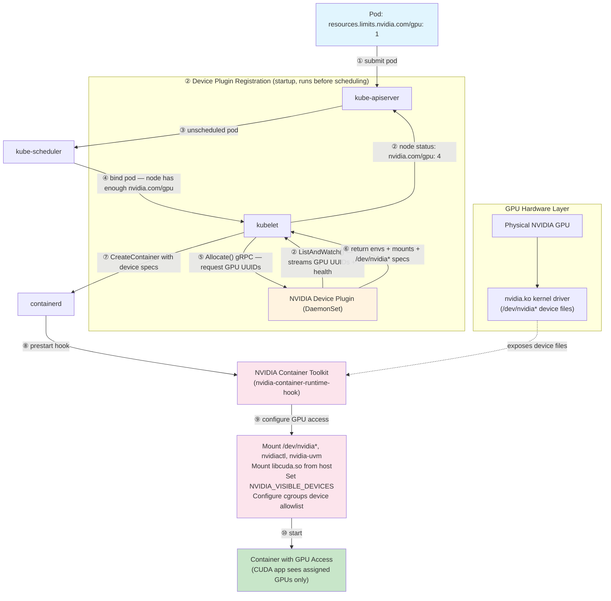
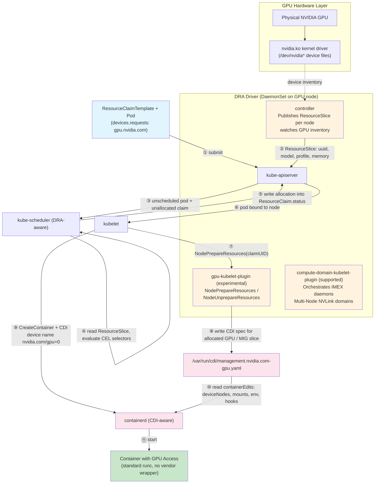

*A deep dive into how Kubernetes makes GPUs accessible to containers, from bare metal to CUDA applications*

---

## Introduction

When a application container request a GPU resource in a Kubernetes with a simple `nvidia.com/gpu: 1` resource request/limit, 
an intricate dance of kernel drivers, container runtimes, device plugins, and orchestration layers springs into action. 
This journey from physical hardware to a running CUDA application involves multiple abstraction layers working in concert.

In this comprehensive guide, we'll explore every layer of this stack—from PCIe device files to the emerging 
Container Device Interface (CDI) standard—revealing the elegant complexity that makes GPU-accelerated 
containerized workloads possible.

## Table of Contents

1. [Layer 1: Hardware & Kernel Foundation](#layer-1-hardware--kernel-foundation)
2. [Layer 2: Container Runtime GPU Access](#layer-2-container-runtime-gpu-access)
3. [Layer 3: CUDA in Containers](#layer-3-cuda-in-containers)
4. [Layer 4: Kubernetes GPU Scheduling](#layer-4-kubernetes-gpu-scheduling)
5. [Layer 5: GPU Isolation & Visibility](#layer-5-gpu-isolation--visibility)
6. [Layer 6: Complete Flow Example](#layer-6-complete-flow-example)
7. [Layer 7: Advanced GPU Sharing](#layer-7-advanced-gpu-sharing)
8. [The Container Device Interface (CDI) Revolution](#the-container-device-interface-cdi-revolution)
9. [Dynamic Resource Allocation (DRA): Next-Generation GPU Scheduling](#dynamic-resource-allocation-dra-next-generation-gpu-scheduling)
10. [Conclusion](#conclusion)

---

## Layer 1: Hardware & Kernel Foundation

### Physical GPU Access

At the most fundamental level, a GPU is a PCIe device connected to the host system. The Linux kernel communicates with it through 
a sophisticated driver stack.

#### GPU Driver Architecture

The NVIDIA driver (similar concepts apply to AMD and Intel) consists of several kernel modules:
```bash
nvidia.ko              # Core driver module
nvidia-uvm.ko          # Unified Memory module
nvidia-modeset.ko      # Display mode setting
nvidia-drm.ko          # Direct Rendering Manager
```

When loaded, these modules create device files in `/dev/`:
```bash
/dev/nvidia0           # First GPU device
/dev/nvidia1           # Second GPU device
/dev/nvidiactl         # Control device for driver management
/dev/nvidia-uvm        # Unified Virtual Memory device
/dev/nvidia-uvm-tools  # UVM debugging and profiling
/dev/nvidia-modeset    # Mode setting operations
```

These character devices provide the fundamental interface between userspace applications and GPU hardware.

#### Device File Permissions

Device files have specific ownership and permissions:
```bash
# ls -l /dev/nvidia*
crw-rw-rw- 1 root root 195,   0 Oct 23 09:00 /dev/nvidia0
crw-rw-rw- 1 root root 195,   1 Oct 23 09:00 /dev/nvidia1
crw-rw-rw- 1 root root 195, 255 Oct 23 09:00 /dev/nvidiactl
crw-rw-rw- 1 root root 509,   0 Oct 23 09:00 /dev/nvidia-uvm   # major varies — see note below
```

The major number for NVIDIA GPU devices (`/dev/nvidia*`, `/dev/nvidiactl`, `/dev/nvidia-modeset`) is **195**, a fixed number
registered at driver load time. The UVM device (`/dev/nvidia-uvm`) is different: its major number is **dynamically allocated**
by the kernel's `misc` subsystem and is **not a stable value** — it varies across kernel versions and distributions.
The value 509 shown above is illustrative; on kernels 6.x it is commonly 511. Minor numbers (0, 1, …) identify individual GPU instances.

---

## Layer 2: Container Runtime GPU Access

### The Container Isolation Challenge

Containers use Linux namespaces to create isolated environments. By default, a container cannot access the host's GPU devices because:

1. **Device namespace isolation**: Container has its own `/dev` filesystem
2. **cgroups device controller**: Controls which devices a process can access
3. **Mount namespace**: Container filesystem doesn't include host device files

### NVIDIA Container Toolkit: Bridging the Gap

The **NVIDIA Container Toolkit** (formerly nvidia-docker2) solves this problem by modifying the container creation process.

#### Component Architecture
```
┌─────────────────────────────────────────┐
│   Container Runtime (Docker/containerd) │
└──────────────┬──────────────────────────┘
               │
               ↓
┌──────────────────────────────────────────┐
│   nvidia-container-runtime               │
│   (OCI-compliant runtime wrapper)        │
└──────────────┬───────────────────────────┘
               │
               ↓
┌──────────────────────────────────────────┐
│   nvidia-container-runtime-hook          │
│   (Prestart hook)                        │
└──────────────┬───────────────────────────┘
               │
               ↓
┌──────────────────────────────────────────┐
│   nvidia-container-cli                   │
│   (Performs actual GPU provisioning)     │
└──────────────────────────────────────────┘
```

#### What Gets Mounted Into the Container

When a container requests GPU access, the NVIDIA Container Toolkit mounts:

**Device Files:**
```bash
/dev/nvidia0              # GPU device
/dev/nvidia1              # Additional GPUs
/dev/nvidiactl            # Control device
/dev/nvidia-uvm           # Unified Memory device
/dev/nvidia-uvm-tools     # UVM tools
/dev/nvidia-modeset       # Mode setting
```

**Driver Libraries** (from host):
```bash
/usr/lib/x86_64-linux-gnu/libnvidia-ml.so.535.104.05
/usr/lib/x86_64-linux-gnu/libcuda.so.535.104.05
/usr/lib/x86_64-linux-gnu/libnvidia-ptxjitcompiler.so.535.104.05
# ... and few more
```

**Utilities:**
```bash
/usr/bin/nvidia-smi
/usr/bin/nvidia-debugdump
/usr/bin/nvidia-persistenced
```

#### cgroups Device Permissions

The toolkit also configures cgroups to allow device access:
```bash
# In the container's cgroup
devices.allow: c 195:* rwm    # Allow all NVIDIA devices (major 195)
devices.allow: c 195:255 rwm  # Allow nvidiactl
devices.allow: c <uvm-major>:* rwm  # Allow nvidia-uvm (major dynamically assigned by kernel)
```

The format `c 195:* rwm` means:
- `c`: Character device
- `195`: Major number (NVIDIA devices)
- `*`: All minor numbers (all GPUs)
- `rwm`: Read, write, and mknod permissions

---

## Layer 3: CUDA in Containers

### Understanding the CUDA Stack

CUDA applications communicate with GPUs through a layered software stack:

```
┌──────────────────────────────┐
│   Your CUDA Application      │
│   (compiled with nvcc)       │
└─────────────┬────────────────┘
              │
              ↓
┌──────────────────────────────┐
│   CUDA Runtime API           │
│   (libcudart.so)             │
│   - cudaMalloc()             │
│   - cudaMemcpy()             │
│   - kernel<<<>>>()           │
└─────────────┬────────────────┘
              │
              ↓
┌──────────────────────────────┐
│   CUDA Driver API            │
│   (libcuda.so)               │
│   - cuMemAlloc()             │
│   - cuLaunchKernel()         │
└─────────────┬────────────────┘
              │
              ↓
┌──────────────────────────────┐
│   Kernel Driver              │
│   (nvidia.ko)                │
└─────────────┬────────────────┘
              │
              ↓
┌──────────────────────────────┐
│   Physical GPU Hardware      │
└──────────────────────────────┘
```

### CUDA in a Containerized Environment

When user run a CUDA application inside a container, the call stack looks like:

```
[Container] CUDA Application
                ↓
[Container] libcudart.so (CUDA Runtime)
                ↓
[Mounted from Host] libcuda.so (CUDA Driver Library)
                ↓
[ioctl() system calls]
                ↓
[Mounted Device] /dev/nvidia0
                ↓
[Host Kernel] nvidia.ko driver
                ↓
[Physical Hardware] GPU
```

#### The Critical Driver Compatibility Requirement

**Key Point**: The `libcuda.so` driver library version must match the host kernel driver version. That is why its preferred 
to mount the driver library from the host rather than packaging it in the container image.

Example compatibility matrix:
```
Host Driver Version    Compatible CUDA Toolkit Versions
-------------------    --------------------------------
535.104.05            CUDA 11.0 - 12.2
525.85.12             CUDA 11.0 - 12.1
515.65.01             CUDA 11.0 - 11.8
```

The CUDA toolkit in container must be compatible with the host's driver version, but it doesn't need to 
match exactly — newer drivers support older CUDA toolkits.

### A Simple CUDA Example

Here's what happens when you run a basic CUDA program:
```c
#include <stdio.h>
#include <cuda_runtime.h>

int main() {
    float *d_data;
    size_t size = 1024 * sizeof(float);
    
    // This triggers the entire stack
    cudaError_t err = cudaMalloc(&d_data, size);
    
    if (err == cudaSuccess) {
        printf("Successfully allocated %zu bytes on GPU\n", size);
        cudaFree(d_data);
    }
    
    return 0;
}
```

Behind the scenes:

1. `cudaMalloc()` calls `cuMemAlloc()` in `libcuda.so`
2. `libcuda.so` opens `/dev/nvidia0`
3. Issues `ioctl()` system call with `NVIDIA_IOCTL_ALLOC_MEM`
4. Kernel driver `nvidia.ko` receives the request
5. Driver checks cgroups: "Is this process allowed to access device 195:0?"
6. If allowed, driver allocates GPU memory
7. Returns device memory pointer to application

---

## Layer 4: Kubernetes GPU Scheduling

### The Device Plugin Framework

Kubernetes uses an extensible **Device Plugin** system to manage specialized hardware like GPUs, FPGAs, and InfiniBand adapters.

#### Architecture Overview
```
┌────────────────────────────────────────┐
│   kube-apiserver                       │
│   (Node status: nvidia.com/gpu: 4)     │
└───────────────┬────────────────────────┘
                │
                ↓
┌────────────────────────────────────────┐
│   kube-scheduler                       │
│   (Finds nodes with requested GPUs)    │
└───────────────┬────────────────────────┘
                │
                ↓
┌────────────────────────────────────────┐
│   kubelet (on GPU node)                │
│   - Discovers device plugins           │
│   - Tracks GPU allocation              │
│   - Calls Allocate() for pods          │
└───────────────┬────────────────────────┘
                │
                ↓
┌────────────────────────────────────────┐
│   NVIDIA Device Plugin (DaemonSet)     │
│   - Discovers GPUs (nvidia-smi)        │
│   - Registers with kubelet             │
│   - Allocates GPUs to containers       │
└────────────────────────────────────────┘
```

### Device Plugin Discovery and Registration

The NVIDIA Device Plugin runs as a DaemonSet on every GPU node:

```yaml
apiVersion: apps/v1
kind: DaemonSet
metadata:
  name: nvidia-device-plugin-daemonset
  namespace: kube-system
spec:
  selector:
    matchLabels:
      name: nvidia-device-plugin-ds
  template:
    spec:
      containers:
      - name: nvidia-device-plugin
        image: nvcr.io/nvidia/k8s-device-plugin:v0.14.1
        volumeMounts:
        - name: device-plugin
          mountPath: /var/lib/kubelet/device-plugins
```

#### The Registration Process

1. **Device Plugin Starts**
```
   nvidia-device-plugin container starts
              ↓
   Queries GPUs: nvidia-smi --query-gpu=uuid --format=csv
              ↓
   Discovers: GPU-a4f8c2d1, GPU-b3e9d4f2, GPU-c8f1a5b3, GPU-d2c7e9a4
```

2. **Registration with kubelet**
```
   Device plugin connects to: unix:///var/lib/kubelet/device-plugins/kubelet.sock
              ↓
   Sends Register() gRPC call:
   {
     "version": "v1beta1",
     "endpoint": "nvidia.sock",
     "resourceName": "nvidia.com/gpu"
   }
```

3. **Advertising Resources**
```
   kubelet calls ListAndWatch() on device plugin
              ↓
   Device plugin responds:
   {
     "devices": [
       {"id": "GPU-a4f8c2d1", "health": "Healthy"},
       {"id": "GPU-b3e9d4f2", "health": "Healthy"},
       {"id": "GPU-c8f1a5b3", "health": "Healthy"},
       {"id": "GPU-d2c7e9a4", "health": "Healthy"}
     ]
   }
              ↓
   kubelet updates node status:
   status.capacity.nvidia.com/gpu: "4"
   status.allocatable.nvidia.com/gpu: "4"
```

### Pod Scheduling Flow

Let's trace a complete pod scheduling workflow:

#### Step 1: User Creates Pod
```yaml
apiVersion: v1
kind: Pod
metadata:
  name: gpu-pod
spec:
  containers:
  - name: cuda-container
    image: nvidia/cuda:11.8.0-base-ubuntu22.04
    command: ["nvidia-smi"]
    resources:
      limits:
        nvidia.com/gpu: 2  # Request 2 GPUs
```

#### Step 2: Scheduler Filters and Scores
```
kube-scheduler receives unscheduled pod
         ↓
Filtering Phase:
  - node-1: cpu OK, memory OK, nvidia.com/gpu=0 ✗ (no GPUs)
  - node-2: cpu OK, memory OK, nvidia.com/gpu=2 ✓
  - node-3: cpu OK, memory OK, nvidia.com/gpu=4 ✓
  - node-4: cpu ✗ (insufficient CPU)
         ↓
Scoring Phase:
  - node-2: score 85 (2 GPUs available, high utilization)
  - node-3: score 92 (4 GPUs available, moderate utilization)
         ↓
Selected: node-3
         ↓
Binding: pod assigned to node-3
```

#### Step 3: kubelet Allocates GPUs
```
kubelet on node-3 receives pod assignment
         ↓
For container "cuda-container" requesting 2 GPUs:
         ↓
kubelet calls: DevicePlugin.Allocate(deviceIds=["GPU-a4f8c2d1", "GPU-b3e9d4f2"])
         ↓
Device plugin responds:
{
  "containerResponses": [{
    "envs": {
      "NVIDIA_VISIBLE_DEVICES": "GPU-a4f8c2d1,GPU-b3e9d4f2"
    },
    "mounts": [{
      "hostPath": "/usr/lib/x86_64-linux-gnu/libcuda.so.535.104.05",
      "containerPath": "/usr/lib/x86_64-linux-gnu/libcuda.so.1",
      "readOnly": true
    }],
    "devices": [{
      "hostPath": "/dev/nvidia0",
      "containerPath": "/dev/nvidia0",
      "permissions": "rwm"
    }, {
      "hostPath": "/dev/nvidia1",
      "containerPath": "/dev/nvidia1",
      "permissions": "rwm"
    }]
  }]
}
```

#### Step 4: Container Runtime Provisions GPU
```
kubelet → containerd: CreateContainer with:
  - Environment: NVIDIA_VISIBLE_DEVICES=GPU-a4f8c2d1,GPU-b3e9d4f2
  - Mounts: driver libraries
  - Devices: /dev/nvidia0, /dev/nvidia1
         ↓
containerd calls: nvidia-container-runtime-hook (prestart)
         ↓
Hook configures:
  - Mounts all required device files
  - Mounts NVIDIA libraries
  - Sets up cgroups device controller
  - Configures environment variables
         ↓
Container starts with GPU access
         ↓
nvidia-smi inside container shows 2 GPUs
```

---

## Layer 5: GPU Isolation & Visibility

### The Magic of NVIDIA_VISIBLE_DEVICES

The `NVIDIA_VISIBLE_DEVICES` environment variable is the key to GPU isolation in containers. It controls which GPUs are visible to CUDA applications.

#### How It Works

Consider a host with 4 GPUs:
```bash
# On the host
$ nvidia-smi --query-gpu=index,uuid --format=csv
index, uuid
0, GPU-a4f8c2d1-e5f6-7a8b-9c0d-1e2f3a4b5c6d
1, GPU-b3e9d4f2-f6a7-8b9c-0d1e-2f3a4b5c6d7e
2, GPU-c8f1a5b3-a7b8-9c0d-1e2f-3a4b5c6d7e8f
3, GPU-d2c7e9a4-b8c9-0d1e-2f3a-4b5c6d7e8f9a
```

**Container 1 configuration:**
```bash
NVIDIA_VISIBLE_DEVICES=GPU-a4f8c2d1-e5f6-7a8b-9c0d-1e2f3a4b5c6d

# Inside container 1
$ nvidia-smi
+-----------------------------------------------------------------------------+
| NVIDIA-SMI 535.104.05   Driver Version: 535.104.05   CUDA Version: 12.2   |
|-------------------------------+----------------------+----------------------+
| GPU  Name        Persistence-M| Bus-Id        Disp.A | Volatile Uncorr. ECC |
|===============================+======================+======================|
|   0  Tesla V100-SXM2...  Off  | 00000000:00:1E.0 Off |                    0 |
+-------------------------------+----------------------+----------------------+
```

**Container 2 configuration:**
```bash
NVIDIA_VISIBLE_DEVICES=GPU-b3e9d4f2-f6a7-8b9c-0d1e-2f3a4b5c6d7e,GPU-c8f1a5b3-a7b8-9c0d-1e2f-3a4b5c6d7e8f

# Inside container 2
$ nvidia-smi
+-----------------------------------------------------------------------------+
| NVIDIA-SMI 535.104.05   Driver Version: 535.104.05   CUDA Version: 12.2   |
|-------------------------------+----------------------+----------------------+
| GPU  Name        Persistence-M| Bus-Id        Disp.A | Volatile Uncorr. ECC |
|===============================+======================+======================|
|   0  Tesla V100-SXM2...  Off  | 00000000:00:1F.0 Off |                    0 |
|   1  Tesla V100-SXM2...  Off  | 00000000:00:20.0 Off |                    0 |
+-------------------------------+----------------------+----------------------+
```

Notice that:
- Container 1 sees only 1 GPU (renumbered as GPU 0)
- Container 2 sees 2 GPUs (renumbered as GPU 0 and 1)
- Each container has its own isolated GPU namespace

#### Driver-Level Enforcement

When a CUDA application initializes:
```c
cudaError_t err = cudaSetDevice(0);
```

The CUDA driver:
1. Reads `NVIDIA_VISIBLE_DEVICES` environment variable
2. Creates a virtual-to-physical GPU mapping
3. Only allows access to visible devices
```c
cuInit() {
    visible_devices = getenv("NVIDIA_VISIBLE_DEVICES");
    
    if (visible_devices) {
        parse_and_filter_devices(visible_devices);
        // User's "GPU 0" maps to physical GPU as specified
    }
}
```

### cgroups: Kernel-Level Protection

Environment variables provide application-level isolation, but cgroups enforce it at the kernel level.

For each container, cgroups device controller is configured:

**Container 1:**
```bash
# /sys/fs/cgroup/devices/kubepods/pod<uid>/<container-id>/devices.list
c 195:0 rwm      # Allow /dev/nvidia0 only
c 195:255 rwm    # Allow /dev/nvidiactl
c <uvm-major>:0 rwm  # Allow /dev/nvidia-uvm (major dynamically assigned by kernel)

# Implicit deny for:
# c 195:1 (would be /dev/nvidia1)
# c 195:2 (would be /dev/nvidia2)
# c 195:3 (would be /dev/nvidia3)
```

Even if a malicious process inside Container 1 tries to open `/dev/nvidia1`, the kernel blocks it:
```c
// Malicious code attempt
int fd = open("/dev/nvidia1", O_RDWR);
// Returns: -1 (EPERM - Operation not permitted)
// Kernel: cgroups device controller denied access
```

This provides defense-in-depth: both application-level (CUDA driver) and kernel-level (cgroups) isolation.

---

## Layer 6: Complete Flow Example

Let's trace a complete end-to-end flow from pod creation to CUDA memory allocation.

### The Scenario

We'll deploy a pod requesting 2 GPUs and run a simple CUDA program that allocates GPU memory.

#### Step 1: Deploy the Pod
```yaml
apiVersion: v1
kind: Pod
metadata:
  name: cuda-mem-test
spec:
  restartPolicy: Never
  containers:
  - name: cuda-app
    image: nvidia/cuda:11.8.0-devel-ubuntu22.04
    command: ["./cuda_malloc_test"]
    resources:
      limits:
        nvidia.com/gpu: 2
```
```bash
$ kubectl apply -f cuda-pod.yaml
pod/cuda-mem-test created
```

#### Step 2: Scheduler Assignment
```
kube-scheduler watches for unscheduled pods
         ↓
Finds cuda-mem-test pod (status.phase: Pending)
         ↓
Queries all nodes for available resources:
  node-gpu-01: nvidia.com/gpu available: 0/4 (fully allocated)
  node-gpu-02: nvidia.com/gpu available: 2/4 ✓
  node-gpu-03: nvidia.com/gpu available: 4/4 ✓
         ↓
Applies scoring algorithms:
  node-gpu-02: score 75 (50% GPU utilization)
  node-gpu-03: score 90 (0% GPU utilization, better choice)
         ↓
Selects node-gpu-03
         ↓
Creates binding: pod cuda-mem-test → node-gpu-03
         ↓
Updates pod: status.nodeName: node-gpu-03
```

#### Step 3: kubelet Provisions Container
```
kubelet on node-gpu-03 receives pod assignment
         ↓
Examines resource requests: nvidia.com/gpu: 2
         ↓
Calls device plugin's Allocate() via gRPC:
{
  "containerRequests": [{
    "devicesIDs": ["GPU-uuid-1234", "GPU-uuid-5678"]
  }]
}
         ↓
Device plugin responds:
{
  "containerResponses": [{
    "devices": [
      {"hostPath": "/dev/nvidia0", "containerPath": "/dev/nvidia0"},
      {"hostPath": "/dev/nvidia1", "containerPath": "/dev/nvidia1"},
      {"hostPath": "/dev/nvidiactl", "containerPath": "/dev/nvidiactl"},
      {"hostPath": "/dev/nvidia-uvm", "containerPath": "/dev/nvidia-uvm"}
    ],
    "mounts": [
      {
        "hostPath": "/usr/lib/x86_64-linux-gnu/libcuda.so.535.104.05",
        "containerPath": "/usr/lib/x86_64-linux-gnu/libcuda.so.1"
      },
      {
        "hostPath": "/usr/bin/nvidia-smi",
        "containerPath": "/usr/bin/nvidia-smi"
      }
      // ... more libraries
    ],
    "envs": {
      "NVIDIA_VISIBLE_DEVICES": "GPU-uuid-1234,GPU-uuid-5678",
      "NVIDIA_DRIVER_CAPABILITIES": "compute,utility"
    }
  }]
}
```

#### Step 4: Container Runtime Configuration
```
kubelet → containerd CRI: CreateContainer
         ↓
containerd creates OCI spec:
{
  "linux": {
    "devices": [
      {"path": "/dev/nvidia0", "type": "c", "major": 195, "minor": 0},
      {"path": "/dev/nvidia1", "type": "c", "major": 195, "minor": 1},
      {"path": "/dev/nvidiactl", "type": "c", "major": 195, "minor": 255},
      {"path": "/dev/nvidia-uvm", "type": "c", "major": 511, "minor": 0}  // major varies by kernel
    ],
    "resources": {
      "devices": [
        {"allow": false, "access": "rwm"},  // Deny all by default
        {"allow": true, "type": "c", "major": 195, "minor": 0, "access": "rwm"},
        {"allow": true, "type": "c", "major": 195, "minor": 1, "access": "rwm"},
        {"allow": true, "type": "c", "major": 195, "minor": 255, "access": "rwm"},
        {"allow": true, "type": "c", "major": 511, "minor": 0, "access": "rwm"}  // UVM — major varies by kernel
      ]
    }
  },
  "mounts": [...],
  "process": {
    "env": [
      "NVIDIA_VISIBLE_DEVICES=GPU-uuid-1234,GPU-uuid-5678",
      "NVIDIA_DRIVER_CAPABILITIES=compute,utility"
    ]
  }
}
         ↓
containerd calls runc with nvidia-container-runtime-hook
         ↓
Hook performs final configuration and mounts
         ↓
Container starts
```

#### Step 5: CUDA Application Runs

Inside the container, our CUDA application executes:
```c
#include <stdio.h>
#include <cuda_runtime.h>

int main() {
    int deviceCount;
    cudaGetDeviceCount(&deviceCount);
    printf("Visible GPUs: %d\n", deviceCount);
    
    for (int i = 0; i < deviceCount; i++) {
        cudaSetDevice(i);
        
        float *d_data;
        size_t size = 1024 * 1024 * 1024;  // 1 GB
        
        cudaError_t err = cudaMalloc(&d_data, size);
        if (err == cudaSuccess) {
            printf("GPU %d: Allocated 1 GB\n", i);
            cudaFree(d_data);
        }
    }
    
    return 0;
}
```

**The execution flow:**
```
Application calls: cudaGetDeviceCount(&deviceCount)
         ↓
CUDA Runtime (libcudart.so): cuDeviceGetCount()
         ↓
CUDA Driver (libcuda.so):
  - Reads NVIDIA_VISIBLE_DEVICES from environment
  - Parses: "GPU-uuid-1234,GPU-uuid-5678"
  - Returns: deviceCount = 2
         ↓
Application prints: "Visible GPUs: 2"
         ↓
Application calls: cudaMalloc(&d_data, 1GB) for GPU 0
         ↓
CUDA Runtime: cuMemAlloc(1073741824)  // 1 GB in bytes
         ↓
CUDA Driver:
  - Determines physical GPU from NVIDIA_VISIBLE_DEVICES mapping
  - Virtual GPU 0 → Physical GPU-uuid-1234 → /dev/nvidia0
  - Opens file descriptor: fd = open("/dev/nvidia0", O_RDWR)
         ↓
Kernel checks cgroups:
  - Process in cgroup: /kubepods/pod-xyz/container-abc
  - Requested device: major=195, minor=0
  - cgroups device allowlist: c 195:0 rwm ✓ ALLOWED
         ↓
Kernel forwards to nvidia.ko driver
         ↓
nvidia.ko driver:
  - Allocates 1 GB of GPU memory on physical GPU
  - Programs GPU memory controller
  - Returns device memory address: 0x7f8c40000000
         ↓
CUDA Driver returns to application
         ↓
Application prints: "GPU 0: Allocated 1 GB"
         ↓
[Repeat for GPU 1 with /dev/nvidia1]
         ↓
Application prints: "GPU 1: Allocated 1 GB"
```

**System calls involved:**
```bash
# Traced with strace
openat(AT_FDCWD, "/dev/nvidia0", O_RDWR) = 3
ioctl(3, NVIDIA_IOC_QUERY_DEVICE_CLASS, ...) = 0
ioctl(3, NVIDIA_IOC_CARD_INFO, ...) = 0
ioctl(3, NVIDIA_IOC_ALLOC_MEM, {size=1073741824, ...}) = 0
# ... GPU memory now allocated ...
ioctl(3, NVIDIA_IOC_FREE_MEM, ...) = 0
close(3) = 0
```

---

## Layer 7: Advanced GPU Sharing

Modern GPU workloads often don't need an entire GPU. Several technologies enable GPU sharing:

### Multi-Instance GPU (MIG)

NVIDIA A100 and H100 GPUs support hardware-level partitioning into Multiple Instances.

#### MIG Architecture

A single A100 GPU can be divided into up to 7 instances:
```
Physical A100 (40GB)
├─ MIG Instance 0: 3g.20gb (3 compute slices, 20GB memory)
├─ MIG Instance 1: 3g.20gb (3 compute slices, 20GB memory)
├─ MIG Instance 2: 2g.10gb (2 compute slices, 10GB memory)
└─ MIG Instance 3: 1g.5gb  (1 compute slice, 5GB memory)
```

Each MIG instance:
- Has dedicated compute resources (streaming multiprocessors)
- Has dedicated memory partition
- Provides hardware-level isolation
- Appears as a separate GPU device

#### MIG Device Files
```bash
# Enable MIG mode
$ nvidia-smi -i 0 -mig 1

# Create MIG instances
$ nvidia-smi mig -cgi 3g.20gb -C
$ nvidia-smi mig -cgi 3g.20gb -C
$ nvidia-smi mig -cgi 1g.5gb -C

# New device files appear

$ ls -l /dev/nvidia*
crw-rw-rw- 1 root root 195,   0 Oct 23 09:00 /dev/nvidia0          # Parent GPU
crw-rw-rw- 1 root root 195, 255 Oct 23 09:00 /dev/nvidiactl
crw-rw-rw- 1 root root 511,   0 Oct 23 09:00 /dev/nvidia-uvm       # major varies by kernel

# MIG device files
crw-rw-rw- 1 root root 195,   1 Oct 23 09:00 /dev/nvidia0mig0      # First 3g.20gb
crw-rw-rw- 1 root root 195,   2 Oct 23 09:00 /dev/nvidia0mig1      # Second 3g.20gb
crw-rw-rw- 1 root root 195,   3 Oct 23 09:00 /dev/nvidia0mig2      # 1g.5gb
```

#### MIG in Kubernetes
The NVIDIA Device Plugin discovers MIG instances and advertises them as separate resources:

```yaml
apiVersion: v1
kind: Node
status:
  capacity:
    nvidia.com/mig-3g.20gb: "2"
    nvidia.com/mig-1g.5gb: "1"
  allocatable:
    nvidia.com/mig-3g.20gb: "2"
    nvidia.com/mig-1g.5gb: "1"
```

```yaml
#Pods can request specific MIG profiles:
apiVersion: v1
kind: Pod
metadata:
  name: mig-pod
spec:
  containers:
  - name: cuda-app
    image: nvidia/cuda:11.8.0-base-ubuntu22.04
    resources:
      limits:
        nvidia.com/mig-3g.20gb: 1  # Request one 3g.20gb instance
```

#### MIG benefits
- True hardware isolation (unlike time-slicing)
- Guaranteed memory allocation
- Fault isolation (one instance failure doesn't affect others)
- Quality of Service (QoS) guarantees

#### MIG Trade-offs
- Partiations the GPU in as per device capabilities, less control over GPU partitioning layout

### GPU Time-Slicing
For workloads that don't require full GPU utilization, time-slicing allows multiple containers to share a single GPU.

#### Device Plugin ConfigMap

```yaml
apiVersion: v1
kind: ConfigMap
metadata:
  name: nvidia-device-plugin-config
  namespace: kube-system
data:
  config.yaml: |
    version: v1
    sharing:
      timeSlicing:
        replicas: 4
        renameByDefault: false
        failRequestsGreaterThanOne: true
    resources:
      - name: nvidia.com/gpu
        devices: all
```

With this configuration:
- Each physical GPU appears as 4 schedulable resources
- Kubernetes can schedule 4 pods per GPU
- All pods access the same physical GPU

#### How Time-Slicing Works
```
Pod 1 Container
     ↓
NVIDIA_VISIBLE_DEVICES=GPU-0
     ↓
cudaMalloc() → /dev/nvidia0

Pod 2 Container
     ↓
NVIDIA_VISIBLE_DEVICES=GPU-0  # Same GPU!
     ↓
cudaMalloc() → /dev/nvidia0

Pod 3 Container
     ↓
NVIDIA_VISIBLE_DEVICES=GPU-0  # Same GPU!
     ↓
cudaMalloc() → /dev/nvidia0
```

All containers:
1. See the same GPU device
2. Create separate CUDA contexts
3. GPU hardware time-multiplexes between contexts
4. No memory isolation (pods can see each other's allocations!)

**Time-slicing characteristics:**
- **Pros:**
  - Easy to configure
  - Works with any GPU
  - Higher utilization for bursty workloads
  
- **Cons:**
  - No memory isolation (security risk)
  - No performance(Qos) guarantees
  - One container can starve others
  - OOM on one container affects all

**Best for:**
- Development/testing environments
- Interactive workloads (Jupyter notebooks)
- Bursty inference workloads with low duty cycle

### vGPU (Virtual GPU)

NVIDIA vGPU technology provides software-defined GPU sharing with:
- Hypervisor-level virtualization
- Memory isolation between VMs
- QoS policies and scheduling
- Live migration support
```
Hypervisor (VMware vSphere / KVM)
├─ VM 1: vGPU (4GB, 1/4 GPU compute)
├─ VM 2: vGPU (4GB, 1/4 GPU compute)
├─ VM 3: vGPU (8GB, 1/2 GPU compute)
└─ Physical GPU (16GB total)
```

Each vGPU appears as a complete GPU to the guest OS, enabling standard CUDA applications without modification.
Can use the Kata containers to enable vGPU on the Kubernetes.

`Note: In order to use vGPU, vGPU requires NVIDIA vGPU license`

### Comparison Matrix

| Technology | Isolation | Memory | Performance | Flexibility | Use Case |
|-----------|-----------|---------|-------------|-------------|----------|
| **Full GPU** | Hardware | Dedicated | 100% | Low | Training, HPC |
| **MIG** | Hardware | Dedicated | Guaranteed | Medium | Inference, Multi-tenant |
| **Time-Slicing** | None | Shared | Variable | High | Dev/Test, Jupyter |
| **vGPU** | Software | Isolated | Good | High | VDI, Cloud VMs |

---

## The Container Device Interface (CDI) Revolution

In 2023-2024, the container ecosystem began transitioning to the **Container Device Interface (CDI)** — 
a standardized specification that fundamentally changes how devices are exposed to containers.

### The Problem CDI Solves

#### The Old Way: Vendor-Specific Runtime Hooks

Before CDI, each hardware vendor needed custom integration:
```
┌─────────────────────────────────────────┐
│   Container Runtime (containerd)        │
└─────────────┬───────────────────────────┘
              │
              ↓
┌─────────────────────────────────────────┐
│   nvidia-container-runtime (wrapper)    │  ← NVIDIA-specific
└─────────────┬───────────────────────────┘
              │
              ↓
┌─────────────────────────────────────────┐
│   nvidia-container-runtime-hook         │  ← Vendor logic
└─────────────┬───────────────────────────┘
              │
              ↓
┌─────────────────────────────────────────┐
│   nvidia-container-cli                  │  ← Device provisioning
└─────────────────────────────────────────┘
```

Problems:

Vendor Lock-in: AMD needed rocm-container-runtime, Intel their own
Runtime Coupling: Required wrapping or modifying the container runtime
Complex Integration: Each vendor's device plugin needed runtime-specific knowledge
No Standardization: Every vendor solved the problem differently

#### The New Way: Declarative Device Specifications

Instead of runtime hooks, CDI uses a static YAML (or JSON) file on each node that declaratively describes everything a runtime needs to inject a device into a container: device nodes, library mounts, environment variables, and hooks. The NVIDIA Container Toolkit generates these files once via `nvidia-ctk cdi generate`; the NVIDIA DRA driver generates them dynamically at allocation time.

The container runtime reads this file at container creation time and applies the edits directly to the OCI spec — no vendor wrapper required.

### CDI Architecture

```
┌──────────────────────────────────────────┐
│   Container Orchestrator                 │
│   (Kubernetes, Podman, Docker)           │
└─────────────┬────────────────────────────┘
              │ Request: "nvidia.com/gpu=0"
              ↓
┌──────────────────────────────────────────┐
│   Container Runtime                      │
│   (containerd, CRI-O, Docker)            │
│   + Native CDI Support                   │
└─────────────┬────────────────────────────┘
              │ Reads CDI specs from disk
              ↓
┌──────────────────────────────────────────┐
│   CDI Specification Files (YAML or JSON) │
│   /etc/cdi/*.yaml   ← static, admin-gen │
│   /var/run/cdi/*.yaml ← dynamic, runtime│
└─────────────┬────────────────────────────┘
              │ Describes device configuration
              ↓
┌──────────────────────────────────────────┐
│   Host System Resources                  │
│   - Device nodes (/dev/nvidia*)          │
│   - Libraries (libcuda.so, etc.)         │
│   - Utilities (nvidia-smi)               │
└──────────────────────────────────────────┘
```

A CDI spec file (`/etc/cdi/nvidia.yaml`) is generated once by `nvidia-ctk` and contains three main sections:

```yaml
# /etc/cdi/nvidia.yaml
cdiVersion: "0.6.0"          # CDI specification version
kind: nvidia.com/gpu          # Fully-qualified device kind (vendor.com/type)
                              # Prevents collisions: nvidia.com/gpu, amd.com/gpu, intel.com/gpu
devices:
  - name: "0"
    containerEdits:           # Everything to inject for this device
      deviceNodes:
        - path: /dev/nvidia0
          type: c
          major: 195
          minor: 0
        - path: /dev/nvidiactl
          type: c
          major: 195
          minor: 255
        - path: /dev/nvidia-uvm
          type: c
          major: 511  # dynamically assigned by kernel — verify with `ls -l /dev/nvidia-uvm`
          minor: 0
      mounts:
        - hostPath: /usr/lib/x86_64-linux-gnu/libcuda.so.535.104.05
          containerPath: /usr/lib/x86_64-linux-gnu/libcuda.so.1
          options: ["ro", "nosuid", "nodev", "bind"]
        - hostPath: /usr/lib/x86_64-linux-gnu/libnvidia-ml.so.535.104.05
          containerPath: /usr/lib/x86_64-linux-gnu/libnvidia-ml.so.1
          options: ["ro", "nosuid", "nodev", "bind"]
        - hostPath: /usr/bin/nvidia-smi
          containerPath: /usr/bin/nvidia-smi
          options: ["ro", "nosuid", "nodev", "bind"]
      env:
        - "NVIDIA_VISIBLE_DEVICES=0"
        - "NVIDIA_DRIVER_CAPABILITIES=compute,utility"
      hooks:
        - hookName: createContainer
          path: /usr/bin/nvidia-ctk
          args: ["hook", "update-ldcache"]

  - name: "1"
    containerEdits:
      deviceNodes:
        - path: /dev/nvidia1
          type: c
          major: 195
          minor: 1
        - path: /dev/nvidiactl
          type: c
          major: 195
          minor: 255
        - path: /dev/nvidia-uvm
          type: c
          major: 511  # dynamically assigned by kernel — verify with `ls -l /dev/nvidia-uvm`
          minor: 0
      mounts:
        # ... same libraries as device "0" ...
      env:
        - "NVIDIA_VISIBLE_DEVICES=1"
        - "NVIDIA_DRIVER_CAPABILITIES=compute,utility"
```

### CDI vs Traditional Flow Comparison

#### Traditional NVIDIA Container Toolkit Flow

```
1. User runs container:
   docker run --gpus all nvidia/cuda
         ↓
2. Docker daemon calls nvidia-container-runtime
         ↓
3. nvidia-container-runtime wraps runc
         ↓
4. Prestart hook executes: nvidia-container-runtime-hook
         ↓
5. Hook reads --gpus flag and NVIDIA_VISIBLE_DEVICES
         ↓
6. nvidia-container-cli dynamically queries nvidia-smi
         ↓
7. Determines required devices, libraries, mounts
         ↓
8. Modifies OCI spec on-the-fly (adds devices, mounts, env)
         ↓
9. runc creates container with GPU access
```

**Characteristics:**
- Dynamic device discovery at container start
- Runtime wrapper required
- Vendor-specific magic in environment variables
- Black box: hard to inspect what's being configured

#### CDI-Based Flow

```
1. One-time setup (on node):
   nvidia-ctk cdi generate --output=/etc/cdi/nvidia.yaml
         ↓
2. User runs container:
   docker run --device nvidia.com/gpu=0 nvidia/cuda
         ↓
3. containerd (with native CDI support) receives request
         ↓
4. Parses CDI device name: "nvidia.com/gpu=0"
         ↓
5. Looks up device in /etc/cdi/nvidia.yaml
         ↓
6. Reads containerEdits for device "0"
         ↓
7. Applies edits to OCI spec:
   - Adds device nodes
   - Adds mounts
   - Sets environment variables
   - Registers hooks
         ↓
8. runc creates container with GPU access
```

**Characteristics:**

- Static device specification (generated once)
- No runtime wrapper needed
- Standard OCI runtime (runc) works unmodified
- Transparent: inspect CDI specs to see exact configuration
- Vendor provides only CDI spec generator

### CDI in Kubernetes
Device Plugin is responsible to adher CDI

#### Pre-CDI Device Plugin
```go
func (m *NvidiaDevicePlugin) Allocate(
    req *pluginapi.AllocateRequest,
) (*pluginapi.AllocateResponse, error) {
    responses := pluginapi.AllocateResponse{}
    
    for _, request := range req.ContainerRequests {
        // Device plugin must know HOW to provision GPU
        response := pluginapi.ContainerAllocateResponse{
            Envs: map[string]string{
                "NVIDIA_VISIBLE_DEVICES": "GPU-uuid-1234",
            },
            Mounts: []*pluginapi.Mount{
                {
                    HostPath: "/usr/lib/x86_64-linux-gnu/libcuda.so",
                    ContainerPath: "/usr/lib/x86_64-linux-gnu/libcuda.so",
                    ReadOnly: true,
                },
                // ... many more mounts ...
            },
            Devices: []*pluginapi.DeviceSpec{
                {
                    HostPath: "/dev/nvidia0",
                    ContainerPath: "/dev/nvidia0",
                    Permissions: "rwm",
                },
                {
                    HostPath: "/dev/nvidiactl",
                    ContainerPath: "/dev/nvidiactl",
                    Permissions: "rwm",
                },
                // ... more devices ...
            },
        }
        responses.ContainerResponses = append(
            responses.ContainerResponses, 
            &response,
        )
    }
    
    return &responses, nil
}
```

#### Post-CDI Device Plugin
```go
func (m *NvidiaDevicePlugin) Allocate(
    req *pluginapi.AllocateRequest,
) (*pluginapi.AllocateResponse, error) {
    responses := pluginapi.AllocateResponse{}
    
    for _, request := range req.ContainerRequests {
        // Device plugin just returns CDI device names!
        var cdiDevices []string
        for _, deviceID := range request.DevicesIDs {
            cdiDevices = append(
                cdiDevices,
                fmt.Sprintf("nvidia.com/gpu=%s", deviceID),
            )
        }
        
        response := pluginapi.ContainerAllocateResponse{
            CDIDevices: cdiDevices,  // That's it!
        }
        responses.ContainerResponses = append(
            responses.ContainerResponses,
            &response,
        )
    }
    
    return &responses, nil
}
```

**Key simplification:** The device plugin no longer needs vendor-specific knowledge about mounts, device nodes, or environment variables. 
It simply returns CDI device identifiers.

#### Container Runtime Integration

When kubelet creates a container with CDI devices:

```
kubelet receives CDI device names from device plugin:
  ["nvidia.com/gpu=0", "nvidia.com/gpu=1"]
         ↓
kubelet adds CDI annotation to container config:
  annotations: {
    "cdi.k8s.io/devices": "nvidia.com/gpu=0,nvidia.com/gpu=1"
  }
         ↓
kubelet → containerd CRI: CreateContainer
         ↓
containerd reads CDI annotation
         ↓
containerd loads CDI registry from /etc/cdi/*.yaml and /var/run/cdi/*.yaml
         ↓
For each CDI device:
  registry.GetDevice("nvidia.com/gpu=0")
  registry.GetDevice("nvidia.com/gpu=1")
         ↓
Applies container edits to OCI spec:
  - Merges all device nodes
  - Merges all mounts
  - Merges all environment variables
  - Collects all hooks
         ↓
Creates final OCI spec and calls runc
```
#### Generating CDI Specifications
**NVIDIA Container Toolkit**

```bash
# Basic generation
nvidia-ctk cdi generate --output=/etc/cdi/nvidia.yaml

# With custom options
nvidia-ctk cdi generate \
  --output=/etc/cdi/nvidia.yaml \
  --format=yaml \
  --device-name-strategy=index \
  --driver-root=/ \
  --nvidia-ctk-path=/usr/bin/nvidia-ctk \
  --ldcache-path=/etc/ld.so.cache
```
**AMD ROCm**
```bash
rocm-smi --showdriverversion
rocm-cdi-generator --output=/etc/cdi/amd.yaml
```

## Dynamic Resource Allocation (DRA): Next-Generation GPU Scheduling

The **Device Plugin** framework (Layer 4) works well for simple whole-GPU assignment, but it has fundamental limitations
when workloads need fine-grained control — specific MIG profiles, multi-node NVLink topology, shared resources, or
per-claim lifecycle management. Kubernetes **Dynamic Resource Allocation (DRA)**, stabilised in `resource.k8s.io/v1`
from Kubernetes 1.32, addresses these limitations by replacing the opaque device plugin gRPC API with a structured,
declarative model visible to the scheduler.

The official DRA driver for NVIDIA GPUs is maintained at
**[github.com/kubernetes-sigs/dra-driver-nvidia-gpu](https://github.com/kubernetes-sigs/dra-driver-nvidia-gpu)** under the `kubernetes-sigs` organisation.

### Why Device Plugin Falls Short

| Limitation | Device Plugin Behaviour |
|---|---|
| Resource granularity | Allocates whole devices; MIG is bolted on via separate resource names |
| Topology awareness | Scheduler has no visibility into NVLink or NUMA topology |
| Shared resources | No first-class concept; time-slicing is a plugin-level workaround |
| Lifecycle | GPU bound to pod at creation; cannot be pre-allocated or shared across pods |
| Introspection | Allocation decisions are a black box to the control plane |

### DRA Core Concepts

DRA replaces the device plugin gRPC interface with three Kubernetes API objects.

#### ResourceSlice — Driver Advertises Devices

A DRA driver publishes `ResourceSlice` objects (one per node) instead of calling `ListAndWatch()`.
Each slice describes the devices on that node with structured, queryable attributes:

```yaml
apiVersion: resource.k8s.io/v1
kind: ResourceSlice
metadata:
  name: node-gpu-01-nvidia-gpus
spec:
  driver: gpu.nvidia.com
  pool:
    name: node-gpu-01
    resourceSliceCount: 1
  nodeName: node-gpu-01
  devices:
  - name: gpu-0
    basic:
      attributes:
        uuid:        { string: "GPU-a4f8c2d1-e5f6-7a8b-9c0d-1e2f3a4b5c6d" }
        model:       { string: "NVIDIA H100 SXM5 80GB" }
        profile:     { string: "3g.20gb" }        # populated for MIG slices
        parentUUID:  { string: "GPU-a4f8c2d1..." } # used for co-location constraints
      capacity:
        memory: 80Gi
```

#### DeviceClass — Cluster Policy for a Device Type

`DeviceClass` is a cluster-scoped object set by administrators. The NVIDIA DRA driver registers two
device classes out of the box:

- `gpu.nvidia.com` — whole GPU devices
- `mig.nvidia.com` — MIG (Multi-Instance GPU) slices

#### ResourceClaim — User Requests Devices

Instead of `resources.limits.nvidia.com/gpu: 1`, a workload creates a `ResourceClaim`.
The `exactly:` stanza specifies how many devices are required and optional CEL selectors:

```yaml
# Two pods, each getting their own single GPU
apiVersion: resource.k8s.io/v1
kind: ResourceClaimTemplate       # per-pod claims for Jobs / Deployments
metadata:
  namespace: gpu-test1
  name: single-gpu
spec:
  spec:
    devices:
      requests:
      - name: gpu
        exactly:
          deviceClassName: gpu.nvidia.com
---
apiVersion: v1
kind: Pod
metadata:
  namespace: gpu-test1
  name: pod1
spec:
  resourceClaims:
  - name: gpu
    resourceClaimTemplateName: single-gpu
  containers:
  - name: ctr
    image: ubuntu:22.04
    command: ["bash", "-c"]
    args: ["nvidia-smi -L; trap 'exit 0' TERM; sleep 9999 & wait"]
    resources:
      claims:
      - name: gpu
  tolerations:
  - key: "nvidia.com/gpu"
    operator: "Exists"
    effect: "NoSchedule"
```

Two containers in the **same pod** can share one GPU claim by both referencing the same entry:

```yaml
# One pod, two containers sharing one GPU
apiVersion: resource.k8s.io/v1
kind: ResourceClaimTemplate
metadata:
  namespace: gpu-test2
  name: single-gpu
spec:
  spec:
    devices:
      requests:
      - name: gpu
        exactly:
          deviceClassName: gpu.nvidia.com
---
apiVersion: v1
kind: Pod
metadata:
  namespace: gpu-test2
  name: shared-gpu-pod
spec:
  resourceClaims:
  - name: shared-gpu
    resourceClaimTemplateName: single-gpu
  containers:
  - name: ctr0
    image: ubuntu:22.04
    command: ["bash", "-c"]
    args: ["nvidia-smi -L; trap 'exit 0' TERM; sleep 9999 & wait"]
    resources:
      claims:
      - name: shared-gpu   # both containers reference the same claim
  - name: ctr1
    image: ubuntu:22.04
    command: ["bash", "-c"]
    args: ["nvidia-smi -L; trap 'exit 0' TERM; sleep 9999 & wait"]
    resources:
      claims:
      - name: shared-gpu
  tolerations:
  - key: "nvidia.com/gpu"
    operator: "Exists"
    effect: "NoSchedule"
```

### NVIDIA DRA Driver (`dra-driver-nvidia-gpu`)

The driver is maintained at **[github.com/kubernetes-sigs/dra-driver-nvidia-gpu](https://github.com/kubernetes-sigs/dra-driver-nvidia-gpu)** and ships two
kubelet plugins:

| Plugin | Status | Purpose |
|---|---|---|
| `gpu-kubelet-plugin` | Experimental | Whole-GPU and MIG device allocation |
| `compute-domain-kubelet-plugin` | Officially supported | Multi-Node NVLink / ComputeDomain orchestration |

#### Architecture

```
┌────────────────────────────────────────────────────┐
│   kube-apiserver                                   │
│   ResourceSlice, ResourceClaim, DeviceClass        │
└─────────────┬──────────────────────────────────────┘
              │
              ↓
┌────────────────────────────────────────────────────┐
│   kube-scheduler (DRA-aware)                       │
│   Reads ResourceSlice attributes via CEL           │
│   Writes allocation into ResourceClaim.status      │
└─────────────┬──────────────────────────────────────┘
              │
              ↓
┌────────────────────────────────────────────────────┐
│   kubelet                                          │
│   Calls DRA plugin NodePrepareResources() gRPC     │
└─────────────┬──────────────────────────────────────┘
              │
              ↓
┌────────────────────────────────────────────────────────────┐
│  dra-driver-nvidia-gpu (DaemonSet on every GPU node)       │
│  ┌─────────────────────────────────────────────────────┐   │
│  │  gpu-kubelet-plugin  (experimental)                 │   │
│  │  - NodePrepareResources / NodeUnprepareResources    │   │
│  │  - Writes CDI spec for the allocated GPU/MIG slice  │   │
│  └─────────────────────────────────────────────────────┘   │
│  ┌─────────────────────────────────────────────────────┐   │
│  │  compute-domain-kubelet-plugin  (supported)         │   │
│  │  - Orchestrates IMEX daemons, domains, channels     │   │
│  │  - Guarantees NVLink-reachability across nodes      │   │
│  └─────────────────────────────────────────────────────┘   │
│  ┌─────────────────────────────────────────────────────┐   │
│  │  controller (Deployment on control-plane)           │   │
│  │  - Publishes ResourceSlice objects per node         │   │
│  │  - Watches GPU inventory changes                    │   │
│  └─────────────────────────────────────────────────────┘   │
└────────────────┬───────────────────────────────────────────┘
                 │  CDI device name
                 ↓
┌────────────────────────────────────────────────────┐
│   containerd (CDI-aware)                           │
│   Reads CDI spec, injects devices/libs/env         │
└────────────────────────────────────────────────────┘
```

#### Installing via Helm

The chart image is served from `registry.k8s.io/dra-driver-nvidia/dra-driver-nvidia-gpu`.
GPU allocation is gated behind `gpuResourcesEnabledOverride=true` because it is still experimental.

```bash
helm upgrade -i \
  --create-namespace \
  --namespace dra-driver-nvidia-gpu \
  dra-driver-nvidia-gpu \
  oci://registry.k8s.io/dra-driver-nvidia/dra-driver-nvidia-gpu \
  --set gpuResourcesEnabledOverride=true \
  --wait

# Verify — each GPU node should show a 2-container pod
kubectl -n dra-driver-nvidia-gpu get pods
# NAME                                  READY   STATUS
# dra-driver-nvidia-gpu-node-xxxxx      2/2     Running
```

Requires Kubernetes 1.32+ with the `DynamicResourceAllocation` feature gate enabled.

#### MIG Allocation via DRA

DRA makes MIG allocation first-class. The `mig.nvidia.com` DeviceClass exposes individual MIG slices
as devices in `ResourceSlice`. CEL selectors on the `profile` attribute replace the separate
`nvidia.com/mig-3g.20gb` resource names used by the device plugin.

The `matchAttribute` constraint ensures all requested slices come from the **same physical GPU**:

```yaml
# One pod, 4 containers — each getting a different MIG slice from the same A100
apiVersion: resource.k8s.io/v1
kind: ResourceClaimTemplate
metadata:
  namespace: gpu-test4
  name: mig-devices
spec:
  spec:
    devices:
      requests:
      - name: mig-1g-5gb-0
        exactly:
          deviceClassName: mig.nvidia.com
          selectors:
          - cel:
              expression: "device.attributes['gpu.nvidia.com'].profile == '1g.5gb'"
      - name: mig-1g-5gb-1
        exactly:
          deviceClassName: mig.nvidia.com
          selectors:
          - cel:
              expression: "device.attributes['gpu.nvidia.com'].profile == '1g.5gb'"
      - name: mig-2g-10gb
        exactly:
          deviceClassName: mig.nvidia.com
          selectors:
          - cel:
              expression: "device.attributes['gpu.nvidia.com'].profile == '2g.10gb'"
      - name: mig-3g-20gb
        exactly:
          deviceClassName: mig.nvidia.com
          selectors:
          - cel:
              expression: "device.attributes['gpu.nvidia.com'].profile == '3g.20gb'"
      constraints:
      - requests: []
        matchAttribute: "gpu.nvidia.com/parentUUID"  # all slices from one GPU
```

The driver handles MIG instance creation and teardown as part of the claim lifecycle — no manual
`nvidia-smi mig` commands needed.

#### ComputeDomains — Multi-Node NVLink (Officially Supported)

A **ComputeDomain** is an abstraction for robust, secure Multi-Node NVLink connectivity. It
guarantees NVLink-reachability between all pods in the domain and isolates them from external pods.
The driver internally orchestrates IMEX (Inter-MIG Extended) daemons, domains, and channels.

```yaml
apiVersion: resource.k8s.io/v1
kind: ResourceClaimTemplate
metadata:
  name: compute-domain
spec:
  spec:
    devices:
      requests:
      - name: domain
        exactly:
          deviceClassName: computedomain.nvidia.com
```

Unlike the experimental GPU plugin, ComputeDomain support is officially maintained and production-ready.

### DRA Scheduling Flow

```
User creates ResourceClaim (status: unallocated)
         ↓
kube-scheduler reads ResourceSlice objects from all nodes
         ↓
Evaluates CEL selectors against device attributes
         ↓
Scores and selects the best matching node
         ↓
Scheduler writes result into ResourceClaim.status.allocation:
  {
    "devices": { "results": [
      { "driver": "gpu.nvidia.com", "pool": "node-gpu-01", "device": "gpu-0", "request": "gpu" }
    ]}
  }
         ↓
kubelet on node-gpu-01 sees the bound claim
         ↓
kubelet calls: gpu-kubelet-plugin.NodePrepareResources(claimUID)
         ↓
Driver writes CDI spec for the allocated device
         ↓
kubelet passes CDI device name to containerd
         ↓
containerd applies CDI spec → container starts with GPU access
```

The key difference from the device plugin flow: **the scheduler has full visibility into device
attributes and makes the allocation decision**, rather than the plugin deciding inside an opaque
gRPC call at pod start.

### DRA vs Device Plugin Comparison

| Aspect | Device Plugin | DRA Driver |
|---|---|---|
| Resource discovery | gRPC `ListAndWatch()` | `ResourceSlice` Kubernetes objects |
| Resource request | `resources.limits` | `ResourceClaim` / `ResourceClaimTemplate` |
| Scheduler visibility | Opaque count only | Full attributes queryable via CEL |
| Allocation decision | Plugin at pod start | Scheduler at scheduling time |
| MIG support | Separate resource names per profile | CEL selectors on `profile` attribute |
| Multi-node NVLink | Not supported | ComputeDomain plugin (officially supported) |
| Shared GPU between containers | Not supported | Supported via shared `ResourceClaim` |
| Kubernetes version | Stable since 1.10 | GA (`v1`) from Kubernetes 1.32 |

---

## Conclusion

Lets summerize the GPU Container Enablement Flow

### Architecture Components
1. **Kubernetes Scheduler** - Selects nodes with GPU resources
2. **NVIDIA Device Plugin** - Discovers and advertises GPU devices (traditional path)
3. **NVIDIA DRA Driver** - Publishes ResourceSlice objects and prepares devices (modern path)
4. **Kubelet** - Manages pod lifecycle
5. **Container Runtime (containerd)** - Creates containers
6. **NVIDIA Container Toolkit / CDI** - Provides GPU access hooks and declarative device specs
7. **GPU Hardware Layer** - Physical NVIDIA GPUs and drivers

### Device Plugin Flow



### DRA Flow



### Key Components

#### GPU Device Plugin (Traditional Path)
- Discovers GPU resources and advertises to Kubernetes via gRPC `ListAndWatch`
- Manages GPU allocation to pods (DaemonSet)

#### NVIDIA DRA Driver (Modern Path) — `kubernetes-sigs/dra-driver-nvidia-gpu`
- Publishes structured `ResourceSlice` objects describing each GPU's attributes (`gpu.nvidia.com`) and MIG slices (`mig.nvidia.com`)
- Implements `NodePrepareResources` so kubelet can activate allocated devices via CDI
- `gpu-kubelet-plugin` (experimental): CEL-based GPU/MIG selection and lifecycle management
- `compute-domain-kubelet-plugin` (supported): Multi-Node NVLink / ComputeDomain orchestration
- Requires Kubernetes 1.32+ with `DynamicResourceAllocation` feature gate

#### Kubelet
- Node agent managing pod lifecycle
- Communicates with device plugins (traditional) or DRA driver plugins (DRA path) and container runtime

#### Container Runtime (containerd)
- Creates containers and integrates with NVIDIA Container Toolkit or CDI
- Mounts GPU devices into containers

#### NVIDIA Container Toolkit / CDI
- Runtime hook for GPU container creation (legacy path)
- CDI: declarative YAML specs for vendor-neutral device injection (modern path used by DRA driver); specs are written to `/etc/cdi/` (static, admin-generated) or `/var/run/cdi/` (dynamic, runtime-generated by the DRA driver)


