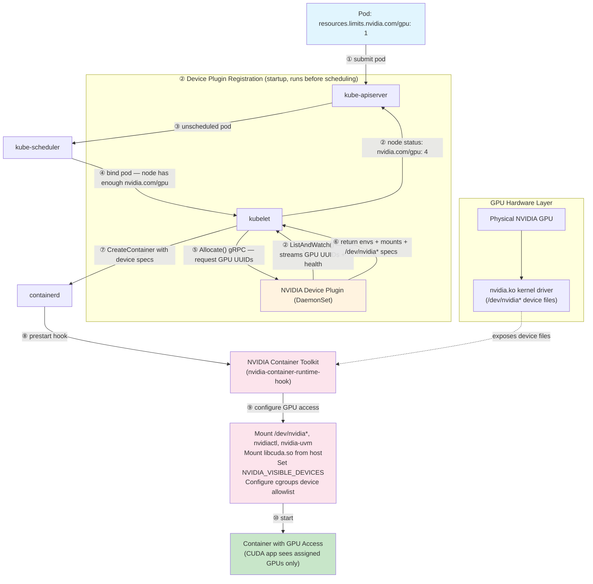
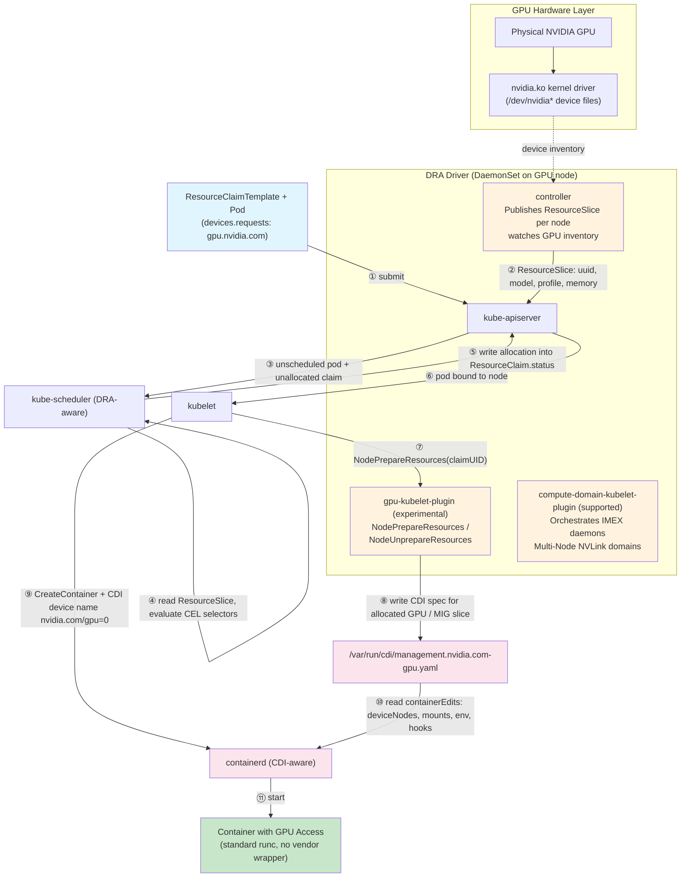

*Part 3 of a 3-part series on how Kubernetes makes GPUs accessible to containers — the final part covers the
Container Device Interface, Dynamic Resource Allocation, and running GPUs reliably in production.*

---

## Introduction

This is the final part of a 3-part series. **[Part 1](https://hrishi.dev/cuda/gpu/nvidia/2025/10/23/nvidia-cuda-gpu-on-kube-1.html)** covered GPU provisioning from silicon to a
scheduled pod; **[Part 2](https://hrishi.dev/cuda/gpu/nvidia/2025/10/24/nvidia-cuda-gpu-on-kube-2.html)** covered splitting a physical GPU across workloads with time-slicing, MPS,
MIG, HAMi, and vGPU. This part covers the standard those sharing mechanisms — and Kubernetes GPU scheduling
itself — are moving to, and what it takes to operate it.

## Table of Contents

**Next Container Technologies**

1. [The Container Device Interface (CDI) Revolution](#the-container-device-interface-cdi-revolution)
2. [Dynamic Resource Allocation (DRA): Next-Generation GPU Scheduling](#dynamic-resource-allocation-dra-next-generation-gpu-scheduling)

**Operations**

3. [GPU Operator Troubleshooting](#gpu-operator-troubleshooting)
4. [Installing the NVIDIA DRA Driver via Helm](#installing-the-nvidia-dra-driver-via-helm)
5. [GPU Fleet Reliability: Metrics and SLOs](#gpu-fleet-reliability-metrics-and-slos)

---

## The Container Device Interface (CDI) Revolution

In 2023-2024, the container ecosystem began transitioning to the **Container Device Interface (CDI)** — 
a standardized specification that fundamentally changes how devices are exposed to containers.

### The Problem CDI Solves

#### The Old Way: Vendor-Specific Runtime Hooks

Before CDI, each hardware vendor needed custom integration:

```
Container Runtime (containerd)
              ↓
nvidia-container-runtime (wrapper) ← NVIDIA-specific
              ↓
nvidia-container-runtime-hook ← Vendor logic
              ↓
nvidia-container-cli ← Device provisioning
```

Problem:

Vendor Lock-in: AMD needed rocm-container-runtime, Intel their own
Runtime Coupling: Required wrapping or modifying the container runtime
Complex Integration: Each vendor's device plugin needed runtime-specific knowledge
No Standardization: Every vendor solved the problem differently

#### The New Way: Declarative Device Specifications

Instead of runtime hooks, CDI uses a static YAML (or JSON) file on each node that declaratively describes everything a runtime needs to inject a device into a container: device nodes, library mounts, environment variables, and hooks. The NVIDIA Container Toolkit generates these files once via `nvidia-ctk cdi generate`; the NVIDIA DRA driver generates them dynamically at allocation time.

The container runtime reads this file at container creation time and applies the edits directly to the OCI spec — no vendor wrapper required.

### CDI Architecture

```
Container Orchestrator (Kubernetes, Podman, Docker)
              ↓  Request: nvidia.com/gpu=0
Container Runtime (containerd, CRI-O, Docker)
  + Native CDI Support
              ↓  Reads CDI specs from disk
CDI Specification Files (YAML or JSON)
  /etc/cdi/*.yaml ← static, admin-gen
  /var/run/cdi/*.yaml ← dynamic, runtime
              ↓  Describes device configuration
Host System Resources
  - Device nodes (/dev/nvidia*)
  - Libraries (libcuda.so, etc.)
  - Utilities (nvidia-smi)
```

A CDI spec file (`/etc/cdi/nvidia.yaml`) is generated once by `nvidia-ctk` and contains three main sections:

```yaml
# /etc/cdi/nvidia.yaml
cdiVersion: "0.6.0"          # CDI specification version
kind: nvidia.com/gpu          # Fully-qualified device kind (vendor.com/type)
                              # Prevents collisions: nvidia.com/gpu, amd.com/gpu, intel.com/gpu
devices:
  - name: "0"
    containerEdits:           # Everything to inject for this device
      deviceNodes:
        - path: /dev/nvidia0
          type: c
          major: 195
          minor: 0
        - path: /dev/nvidiactl
          type: c
          major: 195
          minor: 255
        - path: /dev/nvidia-uvm
          type: c
          major: 511  # dynamically assigned by kernel — verify with `ls -l /dev/nvidia-uvm`
          minor: 0
      mounts:
        - hostPath: /usr/lib/x86_64-linux-gnu/libcuda.so.535.104.05
          containerPath: /usr/lib/x86_64-linux-gnu/libcuda.so.1
          options: ["ro", "nosuid", "nodev", "bind"]
        - hostPath: /usr/lib/x86_64-linux-gnu/libnvidia-ml.so.535.104.05
          containerPath: /usr/lib/x86_64-linux-gnu/libnvidia-ml.so.1
          options: ["ro", "nosuid", "nodev", "bind"]
        - hostPath: /usr/bin/nvidia-smi
          containerPath: /usr/bin/nvidia-smi
          options: ["ro", "nosuid", "nodev", "bind"]
      env:
        - "NVIDIA_VISIBLE_DEVICES=0"
        - "NVIDIA_DRIVER_CAPABILITIES=compute,utility"
      hooks:
        - hookName: createContainer
          path: /usr/bin/nvidia-ctk
          args: ["hook", "update-ldcache"]

  - name: "1"
    containerEdits:
      deviceNodes:
        - path: /dev/nvidia1
          type: c
          major: 195
          minor: 1
        - path: /dev/nvidiactl
          type: c
          major: 195
          minor: 255
        - path: /dev/nvidia-uvm
          type: c
          major: 511  # dynamically assigned by kernel — verify with `ls -l /dev/nvidia-uvm`
          minor: 0
      mounts:
        # ... same libraries as device "0" ...
      env:
        - "NVIDIA_VISIBLE_DEVICES=1"
        - "NVIDIA_DRIVER_CAPABILITIES=compute,utility"
```

> **What real `nvidia-ctk cdi generate` output looks like**: the `mounts`/`hostPath` pairing above is simplified for
> readability. Current toolkit versions (e.g. driver 580.173.02) instead bind-mount the versioned host libraries once and
> use a dedicated `createContainer` hook, `nvidia-cdi-hook create-symlinks`, to build every `.so` → `.so.1`/`.so.N` symlink
> a container needs — `libcuda.so.1`, `libnvidia-ml.so.1`, `libnvcuvid.so.1`, `libnvidia-opencl.so.1`, and more, each
> passed as a `--link target::linkname` argument. This avoids baking exact driver-version filenames into every mount and
> keeps symlink creation as an explicit, inspectable step rather than an implicit side effect of the bind mount.

### CDI vs Traditional Flow Comparison

#### Traditional NVIDIA Container Toolkit Flow

1. User runs container: `docker run --gpus all nvidia/cuda`
2. Docker daemon calls `nvidia-container-runtime`
3. `nvidia-container-runtime` wraps `runc`
4. Prestart hook executes: `nvidia-container-runtime-hook`
5. Hook reads `--gpus` flag and `NVIDIA_VISIBLE_DEVICES`
6. `nvidia-container-cli` dynamically queries `nvidia-smi`
7. Determines required devices, libraries, mounts
8. Modifies OCI spec on-the-fly (adds devices, mounts, env)
9. `runc` creates container with GPU access

**Characteristics:**
- Dynamic device discovery at container start
- Runtime wrapper required
- Vendor-specific magic in environment variables
- Black box: hard to inspect what's being configured

#### CDI-Based Flow

1. One-time setup (on node): `nvidia-ctk cdi generate --output=/etc/cdi/nvidia.yaml`
2. User runs container: `docker run --device nvidia.com/gpu=0 nvidia/cuda`
3. `containerd` (with native CDI support) receives request
4. Parses CDI device name: `nvidia.com/gpu=0`
5. Looks up device in `/etc/cdi/nvidia.yaml`
6. Reads `containerEdits` for device `0`
7. Applies edits to OCI spec:
   - Adds device nodes
   - Adds mounts
   - Sets environment variables
   - Registers hooks
8. `runc` creates container with GPU access

**Characteristics:**

- Static device specification (generated once)
- No runtime wrapper or runtime hooks are needed
- Standard OCI runtime (runc) works unmodified
- Transparent: inspect CDI specs to see exact configuration
- Vendor provides only CDI spec generator

### CDI in Kubernetes
Device Plugin is responsible to adhere CDI

#### Pre-CDI Device Plugin
```go
func (m *NvidiaDevicePlugin) Allocate(
    req *pluginapi.AllocateRequest,
) (*pluginapi.AllocateResponse, error) {
    responses := pluginapi.AllocateResponse{}
    
    for _, request := range req.ContainerRequests {
        // Device plugin must know HOW to provision GPU
        response := pluginapi.ContainerAllocateResponse{
            Envs: map[string]string{
                "NVIDIA_VISIBLE_DEVICES": "GPU-uuid-1234",
            },
            Mounts: []*pluginapi.Mount{
                {
                    HostPath: "/usr/lib/x86_64-linux-gnu/libcuda.so",
                    ContainerPath: "/usr/lib/x86_64-linux-gnu/libcuda.so",
                    ReadOnly: true,
                },
                // ... many more mounts ...
            },
            Devices: []*pluginapi.DeviceSpec{
                {
                    HostPath: "/dev/nvidia0",
                    ContainerPath: "/dev/nvidia0",
                    Permissions: "rwm",
                },
                {
                    HostPath: "/dev/nvidiactl",
                    ContainerPath: "/dev/nvidiactl",
                    Permissions: "rwm",
                },
                // ... more devices ...
            },
        }
        responses.ContainerResponses = append(
            responses.ContainerResponses, 
            &response,
        )
    }
    
    return &responses, nil
}
```

#### Post-CDI Device Plugin
```go
func (m *NvidiaDevicePlugin) Allocate(
    req *pluginapi.AllocateRequest,
) (*pluginapi.AllocateResponse, error) {
    responses := pluginapi.AllocateResponse{}
    
    for _, request := range req.ContainerRequests {
        // Device plugin just returns CDI device names!
        var cdiDevices []string
        for _, deviceID := range request.DevicesIDs {
            cdiDevices = append(
                cdiDevices,
                fmt.Sprintf("nvidia.com/gpu=%s", deviceID),
            )
        }
        
        response := pluginapi.ContainerAllocateResponse{
            CDIDevices: cdiDevices,  // That's it!
        }
        responses.ContainerResponses = append(
            responses.ContainerResponses,
            &response,
        )
    }
    
    return &responses, nil
}
```

**Key simplification:** The device plugin no longer needs vendor-specific knowledge about mounts, device nodes, or environment variables. 
It simply returns CDI device identifiers.

#### Container Runtime Integration

When kubelet creates a container with CDI devices:

```
kubelet receives CDI device names from device plugin:
  ['nvidia.com/gpu=0', 'nvidia.com/gpu=1']
              ↓
kubelet adds CDI annotation to container config:
  annotations: { 'cdi.k8s.io/devices': 'nvidia.com/gpu=0,nvidia.com/gpu=1' }
              ↓
kubelet → containerd CRI: CreateContainer
              ↓
containerd reads CDI annotation
              ↓
containerd loads CDI registry from
  /etc/cdi/*.yaml and /var/run/cdi/*.yaml
              ↓
For each CDI device:
  registry.GetDevice('nvidia.com/gpu=0')
  registry.GetDevice('nvidia.com/gpu=1')
              ↓
Applies container edits to OCI spec:
  - Merges all device nodes
  - Merges all mounts
  - Merges all environment variables
  - Collects all hooks
              ↓
Creates final OCI spec and calls runc
```

#### Generating CDI Specifications
**NVIDIA Container Toolkit**

```bash
# Basic generation
nvidia-ctk cdi generate --output=/etc/cdi/nvidia.yaml

# With custom options
nvidia-ctk cdi generate \
  --output=/etc/cdi/nvidia.yaml \
  --format=yaml \
  --device-name-strategy=index \
  --driver-root=/ \
  --nvidia-ctk-path=/usr/bin/nvidia-ctk \
  --ldcache-path=/etc/ld.so.cache
```
**AMD ROCm**
```bash
rocm-smi --showdriverversion
rocm-cdi-generator --output=/etc/cdi/amd.yaml
```

---

### Dynamic Resource Allocation (DRA): Next-Generation GPU Scheduling

The **[Device Plugin](https://hrishi.dev/cuda/gpu/nvidia/2025/10/23/nvidia-cuda-gpu-on-kube-1.html#kubernetes-gpu-scheduling)** framework (Part 1) works well for simple whole-GPU assignment, but it has fundamental limitations
when workloads need fine-grained control — specific MIG profiles, multi-node NVLink topology, shared resources, or
per-claim lifecycle management. Kubernetes **Dynamic Resource Allocation (DRA)**, in beta behind a feature gate
since 1.32 and stabilised in `resource.k8s.io/v1` from Kubernetes 1.34, addresses these limitations by replacing
the opaque device plugin gRPC API with a structured, declarative model visible to the scheduler.

The official DRA driver for NVIDIA GPUs is maintained at
**[github.com/kubernetes-sigs/dra-driver-nvidia-gpu](https://github.com/kubernetes-sigs/dra-driver-nvidia-gpu)** under the `kubernetes-sigs` organisation.

#### Why Device Plugin Falls Short

**Resource granularity.** The device plugin API only knows how to hand out whole devices — a GPU is a GPU. MIG
support, covered in [Part 2](https://hrishi.dev/cuda/gpu/nvidia/2025/10/24/nvidia-cuda-gpu-on-kube-2.html), isn't
modeled by the API at all; it's bolted on by advertising each MIG profile as its own resource name
(`nvidia.com/mig-3g.20gb`), which the scheduler treats no differently than a whole GPU.

**Topology awareness.** The scheduler filters and scores nodes purely on resource *counts* — it has no concept of
which GPUs on a node share an NVLink bridge or sit on the same NUMA node. A pod can land with "2 GPUs available"
satisfied while those two GPUs are on opposite ends of the PCIe topology, silently tanking any workload that
assumed NVLink-speed interconnect between them.

**Shared resources.** There's no first-class notion of multiple pods sharing a device. Time-slicing (Part 2) only
works because the NVIDIA device plugin lies to the scheduler — advertising one physical GPU as several
schedulable "replicas" — not because the API itself understands sharing.

**Lifecycle and scheduling.** A GPU is bound to a pod the moment the plugin's `Allocate()` call returns, for the
life of that pod. There's no way to pre-allocate a device ahead of a pod being scheduled, or to have two pods
coordinate over the same device via the API — anything like that has to be built outside Kubernetes' allocation
model entirely.

**Introspection.** Once `Allocate()` returns, the control plane has no idea what actually got handed out — which
physical GPU, which MIG slice, which UUID. That information lives only inside the device plugin's own state,
invisible to `kubectl` or the scheduler, which makes debugging placement issues or building topology-aware
tooling on top of it much harder than it should be.

**Error-prone recovery.** Because the scheduler has no visibility into, or accounting for, actual GPU state, a
pod can get stuck in a container-creation error with no automated way to recover — nothing in the allocation loop
knows enough to retry or reschedule intelligently. Hand-carving MIG instances outside the device plugin's view
makes this worse: the [MIG Manager](https://hrishi.dev/cuda/gpu/nvidia/2025/10/24/nvidia-cuda-gpu-on-kube-2.html#who-actually-stands-mig-up)
has no way to reconcile a layout it didn't create, so its record of "current state" quietly drifts from what's
actually on the GPU.

#### DRA Core Concepts

DRA replaces the device plugin gRPC interface with three Kubernetes API objects.

##### ResourceSlice — Driver Advertises Devices

A DRA driver publishes `ResourceSlice` objects (one per node) instead of calling `ListAndWatch()`.
Each slice describes the devices on that node with structured, queryable attributes:

```yaml
apiVersion: resource.k8s.io/v1
kind: ResourceSlice
metadata:
  name: node-gpu-01-nvidia-gpus
spec:
  driver: gpu.nvidia.com
  pool:
    name: node-gpu-01
    resourceSliceCount: 1
  nodeName: node-gpu-01
  devices:
  - name: gpu-0
    basic:
      attributes:
        uuid:        { string: "GPU-a4f8c2d1-e5f6-7a8b-9c0d-1e2f3a4b5c6d" }
        model:       { string: "NVIDIA H100 SXM5 80GB" }
        profile:     { string: "3g.20gb" }        # populated for MIG slices
        parentUUID:  { string: "GPU-a4f8c2d1..." } # used for co-location constraints
      capacity:
        memory: 80Gi
```

##### DeviceClass — Cluster Policy for a Device Type

`DeviceClass` is a cluster-scoped object set by administrators. The NVIDIA DRA driver registers two device classes out of the box:

- `gpu.nvidia.com` — whole GPU devices
- `mig.nvidia.com` — MIG (Multi-Instance GPU) slices

##### ResourceClaim — User Requests Devices

Instead of `resources.limits.nvidia.com/gpu: 1`, a workload creates a `ResourceClaim`.
The `exactly:` stanza specifies how many devices are required and optional CEL selectors:

```yaml
# Two pods, each getting their own single GPU
apiVersion: resource.k8s.io/v1
kind: ResourceClaimTemplate       # per-pod claims for Jobs / Deployments
metadata:
  namespace: gpu-test1
  name: single-gpu
spec:
  spec:
    devices:
      requests:
      - name: gpu
        exactly:
          deviceClassName: gpu.nvidia.com
---
apiVersion: v1
kind: Pod
metadata:
  namespace: gpu-test1
  name: pod1
spec:
  resourceClaims:
  - name: gpu
    resourceClaimTemplateName: single-gpu
  containers:
  - name: ctr
    image: ubuntu:22.04
    command: ["bash", "-c"]
    args: ["nvidia-smi -L; trap 'exit 0' TERM; sleep 9999 & wait"]
    resources:
      claims:
      - name: gpu
  tolerations:
  - key: "nvidia.com/gpu"
    operator: "Exists"
    effect: "NoSchedule"
```

Two containers in the **same pod** can share one GPU claim by both referencing the same entry:

```yaml
# One pod, two containers sharing one GPU
apiVersion: resource.k8s.io/v1
kind: ResourceClaimTemplate
metadata:
  namespace: gpu-test2
  name: single-gpu
spec:
  spec:
    devices:
      requests:
      - name: gpu
        exactly:
          deviceClassName: gpu.nvidia.com
---
apiVersion: v1
kind: Pod
metadata:
  namespace: gpu-test2
  name: shared-gpu-pod
spec:
  resourceClaims:
  - name: shared-gpu
    resourceClaimTemplateName: single-gpu
  containers:
  - name: ctr0
    image: ubuntu:22.04
    command: ["bash", "-c"]
    args: ["nvidia-smi -L; trap 'exit 0' TERM; sleep 9999 & wait"]
    resources:
      claims:
      - name: shared-gpu   # both containers reference the same claim
  - name: ctr1
    image: ubuntu:22.04
    command: ["bash", "-c"]
    args: ["nvidia-smi -L; trap 'exit 0' TERM; sleep 9999 & wait"]
    resources:
      claims:
      - name: shared-gpu
  tolerations:
  - key: "nvidia.com/gpu"
    operator: "Exists"
    effect: "NoSchedule"
```

#### NVIDIA DRA Driver (`dra-driver-nvidia-gpu`)

The driver is maintained at **[github.com/kubernetes-sigs/dra-driver-nvidia-gpu](https://github.com/kubernetes-sigs/dra-driver-nvidia-gpu)** and ships two
kubelet plugins:

| Plugin | Status | Purpose |
|---|---|---|
| `gpu-kubelet-plugin` | Experimental | Whole-GPU and MIG device allocation |
| `compute-domain-kubelet-plugin` | Officially supported | Multi-Node NVLink / ComputeDomain orchestration |

##### Architecture

```
kube-apiserver
  ResourceSlice, ResourceClaim, DeviceClass
              ↓
kube-scheduler (DRA-aware)
  Reads ResourceSlice attributes via CEL
  Writes allocation into ResourceClaim.status
              ↓
kubelet
  Calls DRA plugin NodePrepareResources() gRPC
              ↓
dra-driver-nvidia-gpu — three independently deployed components:
  ├─ gpu-kubelet-plugin (experimental, DaemonSet on every GPU node)
  │    - NodePrepareResources / NodeUnprepareResources
  │    - Writes CDI spec for the allocated GPU/MIG slice
  ├─ compute-domain-kubelet-plugin (supported, DaemonSet on every GPU node)
  │    - Orchestrates IMEX daemons, domains, channels
  │    - Guarantees NVLink-reachability across nodes
  └─ controller (Deployment, control-plane)
       - Publishes ResourceSlice objects per node
       - Watches GPU inventory changes
              ↓  CDI device name
containerd (CDI-aware)
  Reads CDI spec, injects devices/libs/env
```

##### MIG Allocation via DRA

DRA makes MIG allocation first-class. The `mig.nvidia.com` DeviceClass exposes individual MIG slices
as devices in `ResourceSlice`. CEL selectors on the `profile` attribute replace the separate
`nvidia.com/mig-3g.20gb` resource names used by the gpu kubelet plugin.

The `matchAttribute` constraint ensures all requested slices come from the **same physical GPU**:

```yaml
apiVersion: resource.k8s.io/v1
kind: ResourceSlice
metadata:
  name: computeinstance-e00xn5mewbsmgdd98v-gpu.nvidia.com-pjtvh
spec:
  devices:
  - attributes:
      parentUUID:
        string: GPU-8ce1d817-8c25-50db-af0c-242b5437297f
      productName:
        string: NVIDIA H100 80GB HBM3
      profile:
        string: 4g.40gb
    capacity:
      memory:
        value: 40448Mi
      multiprocessors:
        value: "64"
    name: gpu-0-mig-4g40gb-5-0
  - attributes:
      parentUUID:
        string: GPU-8ce1d817-8c25-50db-af0c-242b5437297f
      productName:
        string: NVIDIA H100 80GB HBM3
      profile:
        string: 3g.40gb
    capacity:
      memory:
        value: 40448Mi
      multiprocessors:
        value: "60"
    name: gpu-0-mig-3g40gb-9-4
```

```yaml
apiVersion: resource.k8s.io/v1
kind: ResourceClaimTemplate
metadata:
  name: vllm-gpu
spec:
  spec:
    devices:
      requests:
      - name: gpu
        exactly:
          deviceClassName: mig.nvidia.com
          selectors:
          - cel:
              expression: "device.attributes['gpu.nvidia.com'].profile == '4g.40gb' || device.attributes['gpu.nvidia.com'].profile == '3g.40gb'"
      constraints:
      - requests: []
        matchAttribute: "gpu.nvidia.com/parentUUID"  # all slices from one GPU
```

The driver handles MIG instance creation and teardown as part of the claim lifecycle — no manual
`nvidia-smi mig` commands needed. 

> NOTE: This is where traditional device plugin were not able to allocate
more than 1 mig dynamically and sometimes needs carve out migs manually which could be error prone,
leads to production incidents as mig manager has no visibility between device changes and node 
resources.

##### ComputeDomains — Multi-Node NVLink (Officially Supported)

A **ComputeDomain** is an abstraction for robust, secure Multi-Node NVLink (MNNVL) connectivity — the kind of
setup that turns a rack of GB200 NVL72-class nodes into what's effectively one supercomputer, with chip-to-chip
bandwidth around 1.8 TB/s. Without ComputeDomains, wiring that up means hand-managing the low-level NVLink fabric
topology yourself; the driver instead gives you a Kubernetes object and does the orchestration underneath it.

It guarantees two things for pods inside the domain: MNNVL-reachability between them, and isolation from pods
outside it. That isolation is implemented via **IMEX (Internode Memory Exchange)** — the driver launches and
configures the IMEX daemons, domains, and channels for you, rather than requiring a manually managed IMEX
deployment alongside the workload.

```yaml
apiVersion: resource.k8s.io/v1
kind: ResourceClaimTemplate
metadata:
  name: compute-domain
spec:
  spec:
    devices:
      requests:
      - name: domain
        exactly:
          deviceClassName: computedomain.nvidia.com
```

Unlike the experimental GPU plugin, ComputeDomain support is officially maintained and production-ready — but two
details matter before you treat it as a hard multi-tenancy boundary:

- **The isolation guarantee is scoped to namespaces, not workloads.** A job in namespace A can never join a
  ComputeDomain created for namespace B, but two workloads *sharing a namespace* aren't protected from each other
  the same way — same-namespace actors have enough access to the IMEX primitives to interfere with one another.
  Treat "one ComputeDomain, one namespace, one tenant" as the safe default, not an incidental detail.
- **ComputeDomains are ephemeral, tied to the workload's lifetime.** The domain forms around the pods as they're
  scheduled and tears down when the job completes — there's no long-lived, pre-provisioned domain sitting idle
  waiting for work the way a MIG slice can.

Above the DRA layer, NCCL 2.25+ is the minimum version with MNNVL support — an older NCCL in your training image
will simply not use the NVLink fabric a ComputeDomain gives it, silently falling back to slower interconnects
instead of failing outright.

#### DRA Scheduling Flow

```
User creates ResourceClaim (status: unallocated)
              ↓
kube-scheduler reads ResourceSlice objects from all nodes
              ↓
Evaluates CEL selectors against device attributes
              ↓
Scores and selects the best matching node
              ↓
Scheduler writes result into ResourceClaim.status.allocation:
  { 'devices': { 'results': [
  { 'driver': 'gpu.nvidia.com', 'pool': 'node-gpu-01',
  'device': 'gpu-0', 'request': 'gpu' } ]} }
              ↓
kubelet on node-gpu-01 sees the bound claim
              ↓
kubelet calls: gpu-kubelet-plugin.NodePrepareResources(claimUID)
              ↓
Driver writes CDI spec for the allocated device
              ↓
kubelet passes CDI device name to containerd
              ↓
containerd applies CDI spec → container starts with GPU access
```

The key difference from the device plugin flow: **the scheduler has full visibility into device
attributes and makes the allocation decision**, rather than the plugin deciding inside an opaque
gRPC call at pod start.

#### DRA vs Device Plugin Comparison

| Aspect | Device Plugin | DRA Driver |
|---|---|---|
| Resource discovery | gRPC `ListAndWatch()` | `ResourceSlice` Kubernetes objects |
| Resource request | `resources.limits` | `ResourceClaim` / `ResourceClaimTemplate` |
| Scheduler visibility | Opaque count only | Full attributes queryable via CEL |
| Allocation decision | Plugin at pod start | Scheduler at scheduling time |
| MIG support | Separate resource names per profile | CEL selectors on `profile` attribute |
| Multi-node NVLink | Not supported | ComputeDomain plugin (officially supported) |
| Shared GPU between containers | Not supported | Supported via shared `ResourceClaim` |
| Kubernetes version | Stable since 1.10 | Beta since 1.32, GA (`v1`) from Kubernetes 1.34 |

---


## Operations

Operating GPUs at scale — keeping the GPU Operator's DaemonSets (and the MIG layouts they manage) healthy on real
clusters, and Dynamic Resource Allocation (DRA), the next generation of GPU scheduling that succeeds the device
plugin framework for fine-grained, topology-aware device allocation.

### GPU Operator Troubleshooting

The GPU Operator and its MIG Manager (introduced in [Who Actually Stands MIG Up](https://hrishi.dev/cuda/gpu/nvidia/2025/10/24/nvidia-cuda-gpu-on-kube-2.html#who-actually-stands-mig-up) in Part 2)
do most of the day-to-day work of running MIG on a cluster, but the automation has sharp edges. Worth budgeting
time for when you're standing up a MIG-enabled node:

##### Common MIG issues

- **The MIG Manager treats "no label" as "no MIG."** If a node has no `nvidia.com/mig.config` label at all, the
  manager's default reconciliation target is `all-disabled` — which will tear down any instances you carved by
  hand the moment the manager starts watching that node. Label the node *before* you touch `nvidia-smi mig`, not
  after.
- **The manager only reacts to Kubernetes events, not hardware state.** If you SSH in and change the MIG layout
  directly with `nvidia-smi`, the operator has no way to notice — its controller loop is driven by label
  watches, not a poll of `nvidia-smi mig -lgi`. A stuck reconciliation usually means restarting the
  `nvidia-mig-manager` DaemonSet or toggling the label off and back on to force a re-evaluation.
- **The GI/CI hierarchy is enforced, not advisory.** Attempting to delete a GPU Instance while a Compute Instance
  still lives inside it fails outright ("In use by another client"), and a slice with a running pod on it can't
  be destroyed until that pod is evicted.
- **New architectures need new container images.** Blackwell-class cards need a CUDA toolkit and PyTorch/TensorFlow
  build compiled for that compute capability — an older NGC image will schedule fine and then fail at the first
  kernel launch with an "unsupported" error that has nothing to do with Kubernetes.
- **You can't see inside a slice from the outside.** Because isolation is hardware-enforced, standard cluster
  GPU dashboards need per-slice telemetry (the DCGM exporter plus a MIG-aware Grafana dashboard) — whole-GPU
  utilization graphs will just show the parent card and hide how the individual slices are actually being used.

[`gpu-node-debug.sh`](https://github.com/hrishin/dotfiles/blob/master/scripts/gpu-node-debug.sh) automates the
checks behind the first two bullets above and the containerd mismatch below: it reads the `nvidia.com/mig.config`
node label and reconciliation state directly, cross-checks the GI/CI hierarchy via `nvidia-smi mig`, and
compares kubelet's actual containerd instance against the operator's configured `CONTAINERD_SOCKET`/
`CONTAINERD_CONFIG` — runnable remotely via `kubectl debug node`, no SSH required.

##### Containerd: CDI vs `runtimeClassName` vs non-kube containerd instance

On a cluster running the [DRA driver](#dynamic-resource-allocation-dra-next-generation-gpu-scheduling)
rather than the classic device plugin, the containerd drop-in that the GPU Operator's toolkit generates
(`/etc/containerd/conf.d/99-nvidia.toml`, or wherever `CONTAINERD_CONFIG` actually points) has three key
points worth reading before you go looking for a runtime-selection problem:

```toml
version = 3

[plugins]

  [plugins."io.containerd.cri.v1.runtime"]
    cdi_spec_dirs = ["/etc/cdi", "/var/run/cdi"]
    device_ownership_from_security_context = false
    disable_apparmor = false
    .....
    enable_cdi = true

  [plugins."io.containerd.cri.v1.runtime".containerd]
      default_runtime_name = "runc"
      ignore_blockio_not_enabled_errors = false
      ignore_rdt_not_enabled_errors = false

      [plugins."io.containerd.cri.v1.runtime".containerd.runtimes]

        [plugins."io.containerd.cri.v1.runtime".containerd.runtimes.nvidia]
          ...
          [plugins."io.containerd.cri.v1.runtime".containerd.runtimes.nvidia.options]
            BinaryName = "/usr/local/nvidia/toolkit/nvidia-container-runtime"
            ...

      [plugins."io.containerd.cri.v1.runtime".containerd.runtimes.nvidia-cdi]
          [plugins."io.containerd.cri.v1.runtime".containerd.runtimes.nvidia-cdi.options]
            BinaryName = "/usr/local/nvidia/toolkit/nvidia-container-runtime.cdi"
            ...
```

- `default_runtime_name = "runc"` — plain `runc` stays the default; nothing needs `runtimeClassName: nvidia` set
  explicitly.
- `enable_cdi = true`, `cdi_spec_dirs = ["/etc/cdi", "/var/run/cdi"]` — this is what actually matters in a
  DRA+CDI setup: since containers get GPUs via CDI device injection (driven by the DRA driver, not by selecting a
  special runtime), a plain runc-launched pod still gets GPU access as long as CDI specs are present in one of
  those directories.
- Three NVIDIA runtimes are registered anyway (`nvidia`, `nvidia-cdi`, `nvidia-legacy`), each pointing at a
  different binary under `/usr/local/nvidia/toolkit/` — available for pods that opt in via `runtimeClassName`, but
  not required.

Tracing one real pod (`vllm qwen pod`) through this confirmed all three points:

1. **No runtime class used.** `qwen`'s pod spec has `runtimeClassName` empty — it runs under plain `runc`, not
   `nvidia`/`nvidia-cdi`/`nvidia-legacy`.
2. An older device plugin that isn't CDI-aware, or a pod explicitly setting `runtimeClassName: nvidia`, falls
   back to the container hook path discussed earlier. The GPU Operator's container toolkit patches the
   *default* containerd config to add these `runtimes` entries — but on distributions like MicroK8s or RKE
   that run their own containerd instance, that default path isn't the one kubelet is actually reading. Point
   the toolkit at the wrong containerd instance and the runtime patch silently never lands, and GPU
   provisioning fails.

   **FIX**: Point the GPU Operator chart at the containerd instance kubelet actually uses.

   ```yaml
      toolkit:
        enabled: true
        env:
        - name: CONTAINERD_CONFIG
          value: /var/lib/k8s-containerd/k8s-containerd/etc/containerd/config.toml
        - name: CONTAINERD_SOCKET
          value: /var/lib/k8s-containerd/k8s-containerd/run/containerd/containerd.sock
        - name: CONTAINERD_RUNTIME_CLASS
          value: nvidia
   ```

### Installing the NVIDIA DRA Driver via Helm

The chart image for the [DRA driver](#dynamic-resource-allocation-dra-next-generation-gpu-scheduling) is served
from `registry.k8s.io/dra-driver-nvidia/dra-driver-nvidia-gpu`. GPU allocation is gated behind
`gpuResourcesEnabledOverride=true` because it is still experimental — the upstream README is explicit that "GPU
allocation features can be tried out" but "are not yet officially supported," which is why the Helm chart leaves
the GPU kubelet plugin disabled unless you opt in.

```bash
helm upgrade -i \
  --create-namespace \
  --namespace gpu-operator \
  dra-driver-nvidia-gpu \
  oci://registry.k8s.io/dra-driver-nvidia/dra-driver-nvidia-gpu \
  --set gpuResourcesEnabledOverride=true \
  --wait

# Verify — each GPU node should show a 2-container pod
kubectl -n gpu-operator get pods | grep dra
nvidia-dra-driver-gpu-controller-699474f64f-h7ppr                 1/1     Running     0               4h17m
nvidia-dra-driver-gpu-kubelet-plugin-gps66                        2/2     Running     0               42m

```

Requires Kubernetes 1.32+ with the `DynamicResourceAllocation` feature gate enabled.

**A second, more opinionated install path** runs through the NVIDIA GPU Operator itself (v26.3.3+ ships DRA
support as a documented install target rather than a bare Helm chart) — that route is worth knowing about because
its prerequisites are noticeably stricter than "1.32+ with the feature gate on":

- Kubernetes v1.34.2+ (bump to v1.36.0+ if you intend to mix traditional `resources.limits.nvidia.com/gpu`
  requests with DRA claims on the same cluster)
- GPU driver 580+, with CDI enabled in the container runtime
- Node Feature Discovery and GPU Feature Discovery already deployed
- GPU nodes labeled `nvidia.com/dra-kubelet-plugin=true`, and the traditional NVIDIA Device Plugin disabled on
  those nodes — the two allocation paths aren't meant to run against the same GPUs at once

Two operational rough edges are worth planning around before you rely on this in a real cluster:

- **The NVIDIA Driver Manager doesn't cleanly evict the DRA kubelet plugin** when it needs to reload the driver —
  the documented workaround is to pass the DRA node labels through `driver.manager.env` so the manager knows to
  drain it first.
- **A100 MIG reconfiguration doesn't auto-propagate to the DRA plugin.** After changing a MIG layout on an A100,
  the `gpu-kubelet-plugin` needs a manual restart to pick up the new `ResourceSlice` shape — it won't notice on
  its own the way [the MIG Manager does for the device-plugin path](https://hrishi.dev/cuda/gpu/nvidia/2025/10/24/nvidia-cuda-gpu-on-kube-2.html#who-actually-stands-mig-up) (Part 2).

And if you're upgrading an existing install from the pre-`v0.4.0` chart generation, set `nameOverride=nvidia-dra-driver-gpu`
explicitly — omitting it produces duplicate manifests alongside the old release instead of replacing it.
Downgrading back past `v0.4.0` isn't supported once you've moved forward.

---
### GPU Fleet Reliability: Metrics and SLOs

Everything above gets a GPU into a container. None of it tells you whether the fleet is actually *healthy* — and
for GPU capacity specifically, "healthy" means more than "the pod is Running." A GPU node that's up but silently
throttling, a MIG slice that's been torn down and never noticed, or a `ResourceClaim` that's been sitting
unallocated for ten minutes are all outages that look fine from a plain `kubectl get pods`. SLOs for a GPU fleet
split into four categories, and — matching the theme of everything in [Operations](#operations) so far — the last
one is the category the tooling is worst at surfacing on its own.

#### 1. Hardware Health

This is what [DCGM](https://developer.nvidia.com/dcgm) (Data Center GPU Manager) exists for, and it's the one
category with mature, off-the-shelf tooling: `dcgm-exporter`, deployed as a GPU Operator component
(`dcgmExporter.enabled`, on by default), exposes per-GPU and per-MIG-instance Prometheus metrics with no extra
config. Per-*pod* attribution is a separate, optional flag (`enablePodLabels: true`) — see the caveat about it
under [Utilization & Efficiency](#4-utilization--efficiency) below, because it doesn't actually work on a
DRA-based cluster. The fields that actually belong in an SLO, as opposed to a dashboard nobody looks at:

| Metric | What it means | SLO framing |
|---|---|---|
| `DCGM_FI_DEV_XID_ERRORS` | Driver-level fault code — anything from a benign transient to a fatal ECC/Xid 79 "GPU has fallen off the bus" | Don't alert on "non-zero" — verified live, the series is simply **absent** when healthy (DCGM returns a blank value, and the exporter drops it rather than emitting 0), so there's nothing to compare against. Add `DCGM_EXP_XID_ERRORS_TOTAL` instead: an exporter-owned counter, opt-in and commented out in the default CSV, that only creates a series once an XID actually fires — alert on that series existing, via `increase(...) > 0`. |
| `DCGM_FI_DEV_ECC_DBE_VOL_TOTAL` | Uncorrectable (double-bit) ECC memory errors | Any increase → page. Silent data corruption risk, not just a reliability blip. |
| `DCGM_FI_DEV_ECC_SBE_VOL_TOTAL` | Correctable (single-bit) ECC errors | Trend, don't page on one — a rising rate predicts a DBE and a future Xid. |
| `DCGM_FI_DEV_THERMAL_VIOLATION` / `DCGM_FI_DEV_POWER_VIOLATION` | Time spent throttled by thermal or power limits | Non-zero over a sustained window means the workload isn't getting the compute the profile promised — a MIG `4g.40gb` throttled to 60% clock isn't really `4g.40gb` anymore. |
| `DCGM_FI_PROF_GR_ENGINE_ACTIVE` | Fraction of time an SM has a warp resident — the *real* utilization signal | Prefer this over `DCGM_FI_DEV_GPU_UTIL`, which only reports "was any kernel running," not how much of the card that kernel actually used. A GPU can show 100% `GPU_UTIL` while running a memory-bound kernel that uses 5% of the SMs. |
| `DCGM_FI_DEV_FB_USED` / `DCGM_FI_DEV_FB_FREE` | Framebuffer (VRAM) used/free | Capacity planning input, and the fastest way to catch a memory leak before it OOMs a neighbor. |

Wiring the scrape in is the same `ServiceMonitor` pattern used everywhere else in a kube-prometheus-stack cluster —
the only GPU-specific part is that the Service and endpoint come from the GPU Operator, not something you write
by hand. **What actually gets exposed is a separate concern from scraping it**, and worth checking directly
rather than assuming: GPU Operator's own baked-in metrics list (`dcp-metrics-included.csv`) covers
utilization/clocks/memory/PCIe/energy but omits every field in the table above — no XID, no ECC, no thermal or
power violation. Getting them requires pointing `dcgmExporter.config.name` at your own ConfigMap with a superset
`dcgm-metrics.csv` (the exporter reads a three-column `DCGM field, prometheus type, help text` CSV):

```yaml
# GPU Operator values
dcgmExporter:
  enablePodLabels: true   # per-pod attribution — see the DRA caveat below
  serviceMonitor:
    enabled: true
  config:
    name: custom-dcgm-metrics   # ConfigMap with a dcgm-metrics.csv adding
                                 # DCGM_FI_DEV_XID_ERRORS, DCGM_EXP_XID_ERRORS_TOTAL,
                                 # ECC_SBE/DBE_VOL_TOTAL, THERMAL_VIOLATION,
                                 # POWER_VIOLATION, etc.
```

Verified by diffing the exporter's live `/metrics` output against the fields in the table above — six of them
were silently absent under the operator's default config until the custom `dcgm-metrics.csv` was added. XID was a
seventh, different kind of gap: it was *in* the custom CSV, but still never showed up live — it's a blank-value
gauge that the exporter drops rather than a normal metric, so adding it to a counters CSV alone doesn't get you
an alertable signal. `DCGM_EXP_XID_ERRORS_TOTAL` does.

That produces a `nvidia-dcgm-exporter` `ServiceMonitor` scraping port `gpu-metrics` at `/metrics` — check
`kube-prometheus-stack`'s `serviceMonitorSelectorNilUsesHelmValues` isn't scoped to a release label, or the
ServiceMonitor gets created but never actually picked up (an easy silent gap: everything *looks* wired up, nothing
shows up in Grafana).


Every metric from the table above, live on one node: XID Errors sits at a clean `0` — via
`DCGM_EXP_XID_ERRORS_TOTAL`, not the blank-value gauge — and SM occupancy (`GR_ENGINE_ACTIVE`) shows the
`4g.40gb` slice actually doing work while its `3g.40gb` sibling sits idle, the same per-slice split called out
under [Utilization & Efficiency](#4-utilization--efficiency) below.

#### 2. Scheduling & Allocation Latency

"Time from pod submitted to GPU compute actually running" is the SLI that maps most directly to user-visible
pain — a training job that queues for 40 minutes waiting on a GPU is a very different incident from one that
starts in 4 seconds, even though both eventually succeed. The two allocation paths expose this very differently:

- **Device Plugin path**: `kube_pod_status_scheduled` combined with `nvidia.com/gpu` allocatable/capacity gives
  you time-to-schedule. The `Allocate()` gRPC call itself isn't instrumented by default — if you need that
  granularity, it's a custom metric on top of the device plugin, not something you get for free.
- **DRA path**: there's no mature off-the-shelf histogram for this yet — `ResourceClaim` is still a young API, and
  the ecosystem's observability tooling (kube-state-metrics support, standard Grafana dashboards) hasn't fully
  caught up to it the way it has for pods and deployments. What *is* directly observable, because we relied on it
  throughout this series' troubleshooting, is the claim's own state:

  ```bash
  kubectl get resourceclaims -n qwen
  NAME                                         STATE                AGE
  vllm-qwen2-5-7b-65f4bfc79f-rdh4n-gpu-5b7cb   allocated,reserved   6s
  ```

  A claim sitting in `pending` (empty `status: {}`, no `status.allocation`) for longer than your allocation SLO is
  the DRA-native signal to alert on — poll it, or better, watch the `FailedScheduling` event on the pod, which
  carries the actual reason (`cannot allocate all claims`, `untolerated taint`, `didn't match node affinity`).
  Treat "claim pending > N minutes" as page-worthy in exactly the way "pod pending > N minutes" already is for
  CPU-only workloads — nothing about DRA changes the *category* of SLO, only the object you watch.
- **When autoscaling is in play, "pending" starts before the pod does.** A scale-up adds a new node, and
  none of the metrics above cover node-launch → node-ready → driver-ready — a gap invisible to both the Device
  Plugin and DRA signals above, since neither starts watching until the node is already `Ready`. A lifecycle
  tracer spanning that full path through to `model-ready` turns "why did this take N minutes" into an answer:

  

  Device Plugin path, 19m24s total: `node-ready-to-device-plugin-initialized` was 12m18s of it. The obvious
  read is "driver install is slow," but breaking that span down by GPU Operator sub-component (NFD → driver →
  toolkit → MIG Manager → device plugin) shows otherwise: actual driver module load/init is ~1m, MIG and
  device-plugin registration are each under a minute — the two big chunks are operator reconcile delay before
  the driver DaemonSet is even created (~5m) and DaemonSet/CNI scheduling before NFD starts (~3m). Neither is
  "work" you can bake into an image. That's the case for tracing here: without sub-spans, "driver install" is
  a plausible-sounding, wrong optimization target.

#### 3. Control-Plane Reconciliation Correctness

This is the category the tooling is genuinely weakest at, and — as covered across
[GPU Operator Troubleshooting](#gpu-operator-troubleshooting) and
[Installing the NVIDIA DRA Driver via Helm](#installing-the-nvidia-dra-driver-via-helm) — where the real incidents
in a MIG + DRA fleet actually come from. None of these show up as a failed pod; they show up as a pod stuck
`Pending` for reasons that look, from the outside, exactly like "the cluster is out of capacity" when it isn't.

- **`nvidia.com/mig.config.state` as a literal state machine.** The MIG Manager writes `pending` → `success` or
  `pending` → `failed` onto the node after every reconfiguration attempt. `failed` is unambiguous and immediately
  actionable — alert on it directly rather than inferring it from downstream symptoms:

  ```promql
  # kube-state-metrics exposes node labels as a gauge; alert on the literal value
  # (requires --metric-labels-allowlist covering this label — off by default)
  kube_node_labels{label_nvidia_com_mig_config_state="failed"}
  ```

  In practice `failed` usually means a GPU-consuming pod wasn't evicted before the manager tried to touch the
  layout (`ERROR_IN_USE` from `nvidia-smi mig -cgi`) — see the eviction point below, they're the same root cause
  wearing two different symptoms.

- **`ResourceSlice` staleness — a silent, not a loud, failure.** The DRA kubelet-plugin enumerates GPU/MIG
  topology via NVML **once at process startup** and caches it. A MIG reconfiguration can succeed completely at
  the hardware level — `nvidia-smi -L` shows the new instances immediately — while the `ResourceSlice` the
  scheduler actually reads keeps advertising the *old* device shape indefinitely, because nothing tells the
  kubelet-plugin its cached view is stale. There's no error, no event, no failed reconciliation — just a
  scheduler that keeps allocating against devices that no longer exist in that shape. The only fix is restarting
  the plugin pod after any MIG topology change; there's no notification path that makes this automatic today.
  Track it operationally as: **MIG config change → wait for `mig.config.state=success` → restart
  `*-kubelet-plugin` → verify the `ResourceSlice` device list actually changed** before assuming the change took
  effect. Skip the last step and you'll ship a config change that silently does nothing.

- **Pod eviction during driver reloads.** `gpu-operator`'s `driver.manager` init container evicts GPU-consuming
  pods before reloading the kernel module — but out of the box it only knows how to find classic device-plugin
  consumers. A DRA `ResourceClaim` pod is invisible to it unless `driver.manager.env` is explicitly pointed at the
  node label identifying DRA-eligible nodes:

  ```yaml
  driver:
    manager:
      env:
        - name: NODE_LABEL_FOR_GPU_POD_EVICTION
          value: nvidia.com/dra-kubelet-plugin
  ```

  Without this, a routine driver upgrade can restart the driver DaemonSet out from under a running DRA pod instead
  of draining it first — the pod doesn't necessarily crash, but its GPU access can end up in an undefined state
  until it's manually cycled. The SLI here is binary and worth its own alert: did every GPU-consuming pod on a
  node get cleanly evicted and rescheduled around a driver reload, or did any of them survive the reload in place
  (`kube_pod_start_time` unchanged across a `nvidia-driver-daemonset` rollout on the same node is the tell).

- **Single-instance GPU + `RollingUpdate` is a deadlock, not a slow rollout — on a fixed node pool.** A
  `Deployment` pinned to a scarce GPU (whole-device or a single MIG slice) with the default `RollingUpdate`
  strategy will try to schedule the new pod — and its new claim — before freeing the old one's device. With
  exactly one instance of that shape and no room to grow, this can't ever succeed: the new pod stays `Pending`
  forever, and the old pod is never torn down because the rollout hasn't progressed. `kubectl rollout status`
  hanging past its usual duration on a GPU workload is the signal; `strategy: { type: Recreate }` is the fix.
  The exception is cluster autoscaler adding a same-shape node so the new pod schedules there instead — and
  that's markedly more reliable on **DRA**, whose structured `ResourceSlice`/`DeviceClass` model the autoscaler
  can actually simulate against, than on the device plugin, where MIG-shaped extended resources are mostly
  opaque to that simulation. Default to `Recreate` on device plugin; on DRA with real autoscaling headroom,
  verify a rollout with `RollingUpdate` actually lands on a new node before trusting it.

#### 4. Utilization & Efficiency

Not an availability SLO in the classic sense, but on hardware this expensive, "the fleet is up" and "the fleet is
being used" are different questions worth tracking separately:

- **Per-slice, not per-card, utilization.** As noted back in
  [GPU Operator Troubleshooting](#gpu-operator-troubleshooting): a whole-GPU dashboard built on `DCGM_FI_DEV_GPU_UTIL`
  hides exactly the number you need once MIG is involved — it reports the parent card's aggregate state, not
  what each `4g.40gb` or `3g.40gb` instance is individually doing. This part works out of the box: `dcgm-exporter`
  labels every metric with `GPU_I_ID`/`GPU_I_PROFILE` per MIG instance with no configuration needed, confirmed live
  — one instance reading `36038` MiB used (the actual workload), the sibling `3g.40gb` slice reading `43` MiB
  (idle).
- **Per-*pod* attribution is a separate feature, and it doesn't work under DRA.** `dcgmExporter.enablePodLabels`
  is what's supposed to add `pod`/`namespace`/`container` labels on top of the per-slice ones above, so usage can
  be attributed to a workload rather than just a device. Tested directly against a DRA-allocated MIG slice: with
  `DCGM_EXPORTER_KUBERNETES_ENABLE_POD_LABELS=true` confirmed present in the container's own env, the raw
  `/metrics` output still carries no pod/namespace/container label at all — same per-slice series as the
  unattributed case above. The mechanism relies on the kubelet `podresources` gRPC API, which classic
  device-plugin allocations populate and DRA `ResourceClaim` allocations do not. Practically: on a DRA-based
  cluster, "which pod is using this slice" isn't answerable from `dcgm-exporter` alone — you'd need to join
  `GPU_I_ID`/`UUID` against the DRA driver's own `ResourceClaim.status.allocation` data yourself (e.g. a recording
  rule or sidecar exporter), because nothing upstream does that join today.
- **Idle-slice ratio.** `count(mig instances with near-zero DCGM_FI_PROF_GR_ENGINE_ACTIVE) / count(total mig instances)`
  over a rolling window is a direct cost signal — an idle `3g.40gb` slice sitting unclaimed is the same wasted
  spend as an idle whole GPU, just smaller and easier to lose track of because it doesn't show up as a distinct
  line item anywhere.
- **Fragmentation.** The [homogeneous-vs-heterogeneous `mig-parted` trade-off](https://hrishi.dev/cuda/gpu/nvidia/2025/10/24/nvidia-cuda-gpu-on-kube-2.html#who-actually-stands-mig-up) means
  a naive `all-<profile>` config can leave real, unallocated capacity permanently invisible — a single
  `all-4g.40gb` config on an 80GB H100 only ever creates one instance and leaves the remaining ~40GB/3 compute
  slices unpartitioned, not merely idle. `sum(DCGM_FI_DEV_FB_FREE)` at the *node* level will look fine even while
  this is happening; catching it requires comparing the physical GPU's total capacity against what's actually
  been carved into `ResourceSlice` devices, not just what's allocated out of what was carved.


[NVIDIA DCGM Dashboard for Kubernetes (MIG & Non-MIG GPUs)](https://grafana.com/grafana/dashboards/23382-nvidia-mig-dcgm/)
puts both of the points above on one screen: per-slice memory and utilization panels show one `4g.40gb` profile
doing real work while its `3g.40gb` sibling sits idle (43 MB used, matching the idle reading cited earlier), and
its Allocation Table resolves that busy slice to namespace `qwen` and pod `vllm-qwen2-5-7b-7649997fc7-pv8gd` —
one concrete version of the manual join described above.

#### A Minimal SLO Set

Pulling the above into something an on-call rotation could actually commit to:

| SLI | Target | Primary signal | Severity on breach |
|---|---|---|---|
| GPU hardware fault rate | Zero Xid/DBE events per node per week | `DCGM_EXP_XID_ERRORS_TOTAL`, `DCGM_FI_DEV_ECC_DBE_VOL_TOTAL` | Page |
| MIG reconciliation success | 100% of `mig.config` changes reach `state=success` within 5 min | `kube_node_labels{label_nvidia_com_mig_config_state}` | Page |
| GPU allocation latency | p95 claim/pod pending → Running < 2 min (steady-state capacity) | `ResourceClaim` state / `kube_pod_status_scheduled` | Warn → page if sustained |
| Driver-reload eviction correctness | 100% of GPU pods rescheduled (not survived-in-place) across a driver DaemonSet rollout | `kube_pod_start_time` vs DaemonSet rollout window | Page |
| Sustained thermal/power throttling | < 1% of GPU-active time under violation | `DCGM_FI_DEV_THERMAL_VIOLATION`, `DCGM_FI_DEV_POWER_VIOLATION` | Warn |
| Fleet utilization | > 70% of allocated slices with non-trivial `GR_ENGINE_ACTIVE` | Per-slice DCGM metrics | Info / capacity planning |

None of this replaces the operational habits from the troubleshooting sections above — a green dashboard doesn't
mean a MIG reconfiguration actually propagated, and the only way to be sure is still the manual
verify-after-every-change discipline those sections describe. Metrics catch drift and hardware faults; they don't
substitute for knowing that a `ResourceSlice` needs a kubelet-plugin restart to reflect a change that already
happened underneath it.

Everything above is what to measure. Below is the short version of when — Day 1 setup, Day 2 runbook, and the
three signals actually worth checking, in the order to check them.

#### Observability: Check in This Order

1. **State fields, first, always** — `mig.config.state`, whether `ResourceClaim.status.allocation` is populated.
   Every incident in the runbook above was actually diagnosed here, not in a dashboard.
2. **DCGM metrics** — per-slice via `GPU_I_ID`/`GPU_I_PROFILE` (present by default); fault fields only if the
   Day 1 custom `dcgm-metrics.csv` is wired in.
3. **Traces** — vLLM's own spans for per-request latency (queue time, TTFT, prefill/decode); a separate
   lifecycle tracer for cold-start latency (`scheduled → image-pull → container-start → model-ready`). Different
   questions — request-level tracing can't see cold-start time, it only starts once the model is serving.


---

## Conclusion

Let's summarize the GPU container enablement flow:

### Device Plugin Flow



### DRA Flow



### Key Components

#### GPU Device Plugin (Traditional Path)
- Discovers GPU resources on the node and advertises them to Kubernetes via the gRPC `ListAndWatch` API.
- Runs as a DaemonSet and manages GPU allocation to pods.

#### NVIDIA DRA Driver (Modern Path) — `kubernetes-sigs/dra-driver-nvidia-gpu`
- Publishes structured `ResourceSlice` objects describing each GPU's attributes (`gpu.nvidia.com`) and MIG slices (`mig.nvidia.com`).
- Implements `NodePrepareResources` so kubelet can activate allocated devices via CDI.
- `gpu-kubelet-plugin` (experimental) handles CEL-based GPU/MIG selection and lifecycle management.
- `compute-domain-kubelet-plugin` (supported) orchestrates Multi-Node NVLink / ComputeDomain.
- Requires Kubernetes 1.32+ with the `DynamicResourceAllocation` feature gate enabled.

#### Kubelet
- The node agent that manages pod lifecycle.
- Talks to device plugins (traditional path) or DRA driver plugins (DRA path), and to the container runtime.

#### Container Runtime (containerd)
- Creates containers and integrates with the NVIDIA Container Toolkit or CDI.
- Mounts GPU devices into containers.

#### NVIDIA Container Toolkit / CDI
- The runtime hook that provides GPU container creation on the legacy path.
- CDI is the modern, vendor-neutral alternative — declarative YAML specs written to `/etc/cdi/` (static,
  admin-generated) or `/var/run/cdi/` (dynamic, generated by the DRA driver at runtime).

#### GPU Hardware Layer
- The physical NVIDIA GPUs and the `nvidia.ko` kernel driver underneath everything above — every other
  component in this list exists to get a pod safely down to this layer.


---

This wraps up the series: **[Part 1](https://hrishi.dev/cuda/gpu/nvidia/2025/10/23/nvidia-cuda-gpu-on-kube-1.html)** (provisioning), **[Part 2](https://hrishi.dev/cuda/gpu/nvidia/2025/10/24/nvidia-cuda-gpu-on-kube-2.html)** (sharing), and this
post (CDI, DRA, and operations) together trace the full path from silicon to a running CUDA workload on
Kubernetes — and what it takes to keep it running.
