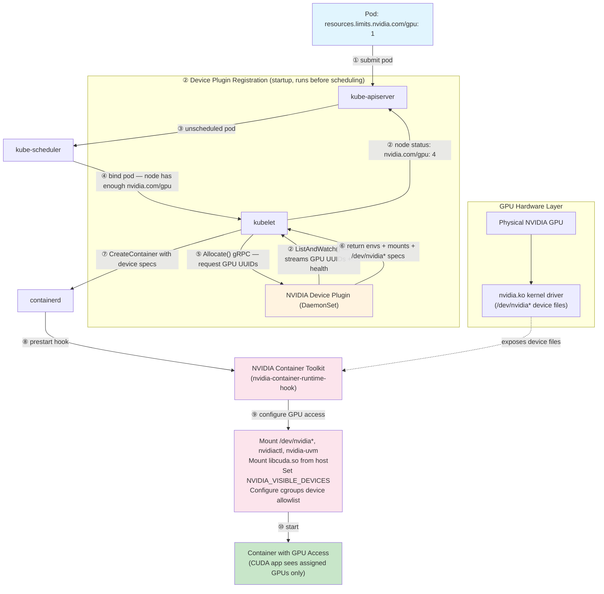
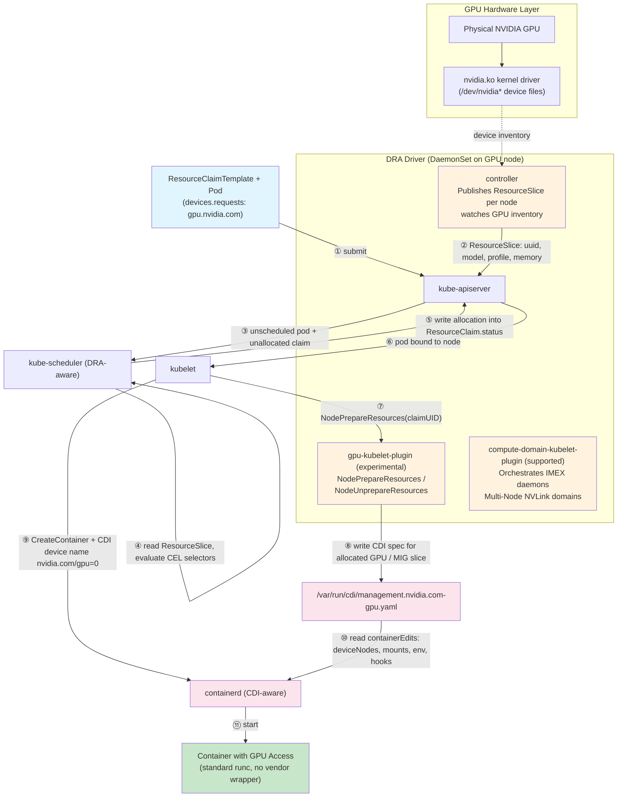

*Part 3 of a 3-part series on how Kubernetes makes GPUs accessible to containers — the final part covers the
Container Device Interface, Dynamic Resource Allocation, and running GPUs reliably in production.*

---

## Introduction

This is the final part of a 3-part series. **[Part 1](https://hrishi.dev/cuda/gpu/nvidia/2025/10/23/nvidia-cuda-gpu-on-kube.html)** covered GPU provisioning from silicon to a
scheduled pod; **[Part 2](https://hrishi.dev/cuda/gpu/nvidia/2025/10/24/nvidia-cuda-gpu-on-kube-2.html)** covered splitting a physical GPU across workloads with time-slicing, MPS,
MIG, HAMi, and vGPU. This part covers the standard those sharing mechanisms — and Kubernetes GPU scheduling
itself — are moving to, and what it takes to operate it.

## Table of Contents

**Next Container Technologies**

1. [The Container Device Interface (CDI) Revolution](#the-container-device-interface-cdi-revolution)
2. [Dynamic Resource Allocation (DRA): Next-Generation GPU Scheduling](#dynamic-resource-allocation-dra-next-generation-gpu-scheduling)

**Operations**

3. [GPU Operator Troubleshooting](#gpu-operator-troubleshooting)
4. [Installing the NVIDIA DRA Driver via Helm](#installing-the-nvidia-dra-driver-via-helm)
5. [GPU Fleet Reliability: Day 1, Day 2, Observability](#gpu-fleet-reliability-day-1-day-2-observability)

---

## The Container Device Interface (CDI) Revolution

In 2023-2024, the container ecosystem began transitioning to the **Container Device Interface (CDI)** — 
a standardized specification that fundamentally changes how devices are exposed to containers.

### The Problem CDI Solves

#### The Old Way: Vendor-Specific Runtime Hooks

Before CDI, each hardware vendor needed custom integration:
```
┌─────────────────────────────────────────┐
│   Container Runtime (containerd)        │
└─────────────┬───────────────────────────┘
              │
              ↓
┌─────────────────────────────────────────┐
│   nvidia-container-runtime (wrapper)    │  ← NVIDIA-specific
└─────────────┬───────────────────────────┘
              │
              ↓
┌─────────────────────────────────────────┐
│   nvidia-container-runtime-hook         │  ← Vendor logic
└─────────────┬───────────────────────────┘
              │
              ↓
┌─────────────────────────────────────────┐
│   nvidia-container-cli                  │  ← Device provisioning
└─────────────────────────────────────────┘
```

Problems:

Vendor Lock-in: AMD needed rocm-container-runtime, Intel their own
Runtime Coupling: Required wrapping or modifying the container runtime
Complex Integration: Each vendor's device plugin needed runtime-specific knowledge
No Standardization: Every vendor solved the problem differently

#### The New Way: Declarative Device Specifications

Instead of runtime hooks, CDI uses a static YAML (or JSON) file on each node that declaratively describes everything a runtime needs to inject a device into a container: device nodes, library mounts, environment variables, and hooks. The NVIDIA Container Toolkit generates these files once via `nvidia-ctk cdi generate`; the NVIDIA DRA driver generates them dynamically at allocation time.

The container runtime reads this file at container creation time and applies the edits directly to the OCI spec — no vendor wrapper required.

### CDI Architecture

```
┌──────────────────────────────────────────┐
│   Container Orchestrator                 │
│   (Kubernetes, Podman, Docker)           │
└─────────────┬────────────────────────────┘
              │ Request: "nvidia.com/gpu=0"
              ↓
┌──────────────────────────────────────────┐
│   Container Runtime                      │
│   (containerd, CRI-O, Docker)            │
│   + Native CDI Support                   │
└─────────────┬────────────────────────────┘
              │ Reads CDI specs from disk
              ↓
┌──────────────────────────────────────────┐
│   CDI Specification Files (YAML or JSON) │
│   /etc/cdi/*.yaml   ← static, admin-gen │
│   /var/run/cdi/*.yaml ← dynamic, runtime│
└─────────────┬────────────────────────────┘
              │ Describes device configuration
              ↓
┌──────────────────────────────────────────┐
│   Host System Resources                  │
│   - Device nodes (/dev/nvidia*)          │
│   - Libraries (libcuda.so, etc.)         │
│   - Utilities (nvidia-smi)               │
└──────────────────────────────────────────┘
```

A CDI spec file (`/etc/cdi/nvidia.yaml`) is generated once by `nvidia-ctk` and contains three main sections:

```yaml
# /etc/cdi/nvidia.yaml
cdiVersion: "0.6.0"          # CDI specification version
kind: nvidia.com/gpu          # Fully-qualified device kind (vendor.com/type)
                              # Prevents collisions: nvidia.com/gpu, amd.com/gpu, intel.com/gpu
devices:
  - name: "0"
    containerEdits:           # Everything to inject for this device
      deviceNodes:
        - path: /dev/nvidia0
          type: c
          major: 195
          minor: 0
        - path: /dev/nvidiactl
          type: c
          major: 195
          minor: 255
        - path: /dev/nvidia-uvm
          type: c
          major: 511  # dynamically assigned by kernel — verify with `ls -l /dev/nvidia-uvm`
          minor: 0
      mounts:
        - hostPath: /usr/lib/x86_64-linux-gnu/libcuda.so.535.104.05
          containerPath: /usr/lib/x86_64-linux-gnu/libcuda.so.1
          options: ["ro", "nosuid", "nodev", "bind"]
        - hostPath: /usr/lib/x86_64-linux-gnu/libnvidia-ml.so.535.104.05
          containerPath: /usr/lib/x86_64-linux-gnu/libnvidia-ml.so.1
          options: ["ro", "nosuid", "nodev", "bind"]
        - hostPath: /usr/bin/nvidia-smi
          containerPath: /usr/bin/nvidia-smi
          options: ["ro", "nosuid", "nodev", "bind"]
      env:
        - "NVIDIA_VISIBLE_DEVICES=0"
        - "NVIDIA_DRIVER_CAPABILITIES=compute,utility"
      hooks:
        - hookName: createContainer
          path: /usr/bin/nvidia-ctk
          args: ["hook", "update-ldcache"]

  - name: "1"
    containerEdits:
      deviceNodes:
        - path: /dev/nvidia1
          type: c
          major: 195
          minor: 1
        - path: /dev/nvidiactl
          type: c
          major: 195
          minor: 255
        - path: /dev/nvidia-uvm
          type: c
          major: 511  # dynamically assigned by kernel — verify with `ls -l /dev/nvidia-uvm`
          minor: 0
      mounts:
        # ... same libraries as device "0" ...
      env:
        - "NVIDIA_VISIBLE_DEVICES=1"
        - "NVIDIA_DRIVER_CAPABILITIES=compute,utility"
```

> **What real `nvidia-ctk cdi generate` output looks like**: the `mounts`/`hostPath` pairing above is simplified for
> readability. Current toolkit versions (e.g. driver 580.173.02) instead bind-mount the versioned host libraries once and
> use a dedicated `createContainer` hook, `nvidia-cdi-hook create-symlinks`, to build every `.so` → `.so.1`/`.so.N` symlink
> a container needs — `libcuda.so.1`, `libnvidia-ml.so.1`, `libnvcuvid.so.1`, `libnvidia-opencl.so.1`, and more, each
> passed as a `--link target::linkname` argument. This avoids baking exact driver-version filenames into every mount and
> keeps symlink creation as an explicit, inspectable step rather than an implicit side effect of the bind mount.

### CDI vs Traditional Flow Comparison

#### Traditional NVIDIA Container Toolkit Flow

```
1. User runs container:
   docker run --gpus all nvidia/cuda
         ↓
2. Docker daemon calls nvidia-container-runtime
         ↓
3. nvidia-container-runtime wraps runc
         ↓
4. Prestart hook executes: nvidia-container-runtime-hook
         ↓
5. Hook reads --gpus flag and NVIDIA_VISIBLE_DEVICES
         ↓
6. nvidia-container-cli dynamically queries nvidia-smi
         ↓
7. Determines required devices, libraries, mounts
         ↓
8. Modifies OCI spec on-the-fly (adds devices, mounts, env)
         ↓
9. runc creates container with GPU access
```

**Characteristics:**
- Dynamic device discovery at container start
- Runtime wrapper required
- Vendor-specific magic in environment variables
- Black box: hard to inspect what's being configured

#### CDI-Based Flow

```
1. One-time setup (on node):
   nvidia-ctk cdi generate --output=/etc/cdi/nvidia.yaml
         ↓
2. User runs container:
   docker run --device nvidia.com/gpu=0 nvidia/cuda
         ↓
3. containerd (with native CDI support) receives request
         ↓
4. Parses CDI device name: "nvidia.com/gpu=0"
         ↓
5. Looks up device in /etc/cdi/nvidia.yaml
         ↓
6. Reads containerEdits for device "0"
         ↓
7. Applies edits to OCI spec:
   - Adds device nodes
   - Adds mounts
   - Sets environment variables
   - Registers hooks
         ↓
8. runc creates container with GPU access
```

**Characteristics:**

- Static device specification (generated once)
- No runtime wrapper needed
- Standard OCI runtime (runc) works unmodified
- Transparent: inspect CDI specs to see exact configuration
- Vendor provides only CDI spec generator

### CDI in Kubernetes
Device Plugin is responsible to adher CDI

#### Pre-CDI Device Plugin
```go
func (m *NvidiaDevicePlugin) Allocate(
    req *pluginapi.AllocateRequest,
) (*pluginapi.AllocateResponse, error) {
    responses := pluginapi.AllocateResponse{}
    
    for _, request := range req.ContainerRequests {
        // Device plugin must know HOW to provision GPU
        response := pluginapi.ContainerAllocateResponse{
            Envs: map[string]string{
                "NVIDIA_VISIBLE_DEVICES": "GPU-uuid-1234",
            },
            Mounts: []*pluginapi.Mount{
                {
                    HostPath: "/usr/lib/x86_64-linux-gnu/libcuda.so",
                    ContainerPath: "/usr/lib/x86_64-linux-gnu/libcuda.so",
                    ReadOnly: true,
                },
                // ... many more mounts ...
            },
            Devices: []*pluginapi.DeviceSpec{
                {
                    HostPath: "/dev/nvidia0",
                    ContainerPath: "/dev/nvidia0",
                    Permissions: "rwm",
                },
                {
                    HostPath: "/dev/nvidiactl",
                    ContainerPath: "/dev/nvidiactl",
                    Permissions: "rwm",
                },
                // ... more devices ...
            },
        }
        responses.ContainerResponses = append(
            responses.ContainerResponses, 
            &response,
        )
    }
    
    return &responses, nil
}
```

#### Post-CDI Device Plugin
```go
func (m *NvidiaDevicePlugin) Allocate(
    req *pluginapi.AllocateRequest,
) (*pluginapi.AllocateResponse, error) {
    responses := pluginapi.AllocateResponse{}
    
    for _, request := range req.ContainerRequests {
        // Device plugin just returns CDI device names!
        var cdiDevices []string
        for _, deviceID := range request.DevicesIDs {
            cdiDevices = append(
                cdiDevices,
                fmt.Sprintf("nvidia.com/gpu=%s", deviceID),
            )
        }
        
        response := pluginapi.ContainerAllocateResponse{
            CDIDevices: cdiDevices,  // That's it!
        }
        responses.ContainerResponses = append(
            responses.ContainerResponses,
            &response,
        )
    }
    
    return &responses, nil
}
```

**Key simplification:** The device plugin no longer needs vendor-specific knowledge about mounts, device nodes, or environment variables. 
It simply returns CDI device identifiers.

#### Container Runtime Integration

When kubelet creates a container with CDI devices:

```
kubelet receives CDI device names from device plugin:
  ["nvidia.com/gpu=0", "nvidia.com/gpu=1"]
         ↓
kubelet adds CDI annotation to container config:
  annotations: {
    "cdi.k8s.io/devices": "nvidia.com/gpu=0,nvidia.com/gpu=1"
  }
         ↓
kubelet → containerd CRI: CreateContainer
         ↓
containerd reads CDI annotation
         ↓
containerd loads CDI registry from /etc/cdi/*.yaml and /var/run/cdi/*.yaml
         ↓
For each CDI device:
  registry.GetDevice("nvidia.com/gpu=0")
  registry.GetDevice("nvidia.com/gpu=1")
         ↓
Applies container edits to OCI spec:
  - Merges all device nodes
  - Merges all mounts
  - Merges all environment variables
  - Collects all hooks
         ↓
Creates final OCI spec and calls runc
```
#### Generating CDI Specifications
**NVIDIA Container Toolkit**

```bash
# Basic generation
nvidia-ctk cdi generate --output=/etc/cdi/nvidia.yaml

# With custom options
nvidia-ctk cdi generate \
  --output=/etc/cdi/nvidia.yaml \
  --format=yaml \
  --device-name-strategy=index \
  --driver-root=/ \
  --nvidia-ctk-path=/usr/bin/nvidia-ctk \
  --ldcache-path=/etc/ld.so.cache
```
**AMD ROCm**
```bash
rocm-smi --showdriverversion
rocm-cdi-generator --output=/etc/cdi/amd.yaml
```

---

### Dynamic Resource Allocation (DRA): Next-Generation GPU Scheduling

The **[Device Plugin](https://hrishi.dev/cuda/gpu/nvidia/2025/10/23/nvidia-cuda-gpu-on-kube.html#kubernetes-gpu-scheduling)** framework (Part 1) works well for simple whole-GPU assignment, but it has fundamental limitations
when workloads need fine-grained control — specific MIG profiles, multi-node NVLink topology, shared resources, or
per-claim lifecycle management. Kubernetes **Dynamic Resource Allocation (DRA)**, stabilised in `resource.k8s.io/v1`
from Kubernetes 1.32, addresses these limitations by replacing the opaque device plugin gRPC API with a structured,
declarative model visible to the scheduler.

The official DRA driver for NVIDIA GPUs is maintained at
**[github.com/kubernetes-sigs/dra-driver-nvidia-gpu](https://github.com/kubernetes-sigs/dra-driver-nvidia-gpu)** under the `kubernetes-sigs` organisation.

#### Why Device Plugin Falls Short

| Limitation | Device Plugin Behaviour |
|---|---|
| Resource granularity | Allocates whole devices; MIG is bolted on via separate resource names |
| Topology awareness | Scheduler has no visibility into NVLink or NUMA topology |
| Shared resources | No first-class concept; time-slicing is a plugin-level workaround |
| Lifecycle | GPU bound to pod at creation; cannot be pre-allocated or shared across pods |
| Introspection | Allocation decisions are a black box to the control plane |

#### DRA Core Concepts

DRA replaces the device plugin gRPC interface with three Kubernetes API objects.

##### ResourceSlice — Driver Advertises Devices

A DRA driver publishes `ResourceSlice` objects (one per node) instead of calling `ListAndWatch()`.
Each slice describes the devices on that node with structured, queryable attributes:

```yaml
apiVersion: resource.k8s.io/v1
kind: ResourceSlice
metadata:
  name: node-gpu-01-nvidia-gpus
spec:
  driver: gpu.nvidia.com
  pool:
    name: node-gpu-01
    resourceSliceCount: 1
  nodeName: node-gpu-01
  devices:
  - name: gpu-0
    basic:
      attributes:
        uuid:        { string: "GPU-a4f8c2d1-e5f6-7a8b-9c0d-1e2f3a4b5c6d" }
        model:       { string: "NVIDIA H100 SXM5 80GB" }
        profile:     { string: "3g.20gb" }        # populated for MIG slices
        parentUUID:  { string: "GPU-a4f8c2d1..." } # used for co-location constraints
      capacity:
        memory: 80Gi
```

##### DeviceClass — Cluster Policy for a Device Type

`DeviceClass` is a cluster-scoped object set by administrators. The NVIDIA DRA driver registers two
device classes out of the box:

- `gpu.nvidia.com` — whole GPU devices
- `mig.nvidia.com` — MIG (Multi-Instance GPU) slices

##### ResourceClaim — User Requests Devices

Instead of `resources.limits.nvidia.com/gpu: 1`, a workload creates a `ResourceClaim`.
The `exactly:` stanza specifies how many devices are required and optional CEL selectors:

```yaml
# Two pods, each getting their own single GPU
apiVersion: resource.k8s.io/v1
kind: ResourceClaimTemplate       # per-pod claims for Jobs / Deployments
metadata:
  namespace: gpu-test1
  name: single-gpu
spec:
  spec:
    devices:
      requests:
      - name: gpu
        exactly:
          deviceClassName: gpu.nvidia.com
---
apiVersion: v1
kind: Pod
metadata:
  namespace: gpu-test1
  name: pod1
spec:
  resourceClaims:
  - name: gpu
    resourceClaimTemplateName: single-gpu
  containers:
  - name: ctr
    image: ubuntu:22.04
    command: ["bash", "-c"]
    args: ["nvidia-smi -L; trap 'exit 0' TERM; sleep 9999 & wait"]
    resources:
      claims:
      - name: gpu
  tolerations:
  - key: "nvidia.com/gpu"
    operator: "Exists"
    effect: "NoSchedule"
```

Two containers in the **same pod** can share one GPU claim by both referencing the same entry:

```yaml
# One pod, two containers sharing one GPU
apiVersion: resource.k8s.io/v1
kind: ResourceClaimTemplate
metadata:
  namespace: gpu-test2
  name: single-gpu
spec:
  spec:
    devices:
      requests:
      - name: gpu
        exactly:
          deviceClassName: gpu.nvidia.com
---
apiVersion: v1
kind: Pod
metadata:
  namespace: gpu-test2
  name: shared-gpu-pod
spec:
  resourceClaims:
  - name: shared-gpu
    resourceClaimTemplateName: single-gpu
  containers:
  - name: ctr0
    image: ubuntu:22.04
    command: ["bash", "-c"]
    args: ["nvidia-smi -L; trap 'exit 0' TERM; sleep 9999 & wait"]
    resources:
      claims:
      - name: shared-gpu   # both containers reference the same claim
  - name: ctr1
    image: ubuntu:22.04
    command: ["bash", "-c"]
    args: ["nvidia-smi -L; trap 'exit 0' TERM; sleep 9999 & wait"]
    resources:
      claims:
      - name: shared-gpu
  tolerations:
  - key: "nvidia.com/gpu"
    operator: "Exists"
    effect: "NoSchedule"
```

#### NVIDIA DRA Driver (`dra-driver-nvidia-gpu`)

The driver is maintained at **[github.com/kubernetes-sigs/dra-driver-nvidia-gpu](https://github.com/kubernetes-sigs/dra-driver-nvidia-gpu)** and ships two
kubelet plugins:

| Plugin | Status | Purpose |
|---|---|---|
| `gpu-kubelet-plugin` | Experimental | Whole-GPU and MIG device allocation |
| `compute-domain-kubelet-plugin` | Officially supported | Multi-Node NVLink / ComputeDomain orchestration |

##### Architecture

```
┌────────────────────────────────────────────────────┐
│   kube-apiserver                                   │
│   ResourceSlice, ResourceClaim, DeviceClass        │
└─────────────┬──────────────────────────────────────┘
              │
              ↓
┌────────────────────────────────────────────────────┐
│   kube-scheduler (DRA-aware)                       │
│   Reads ResourceSlice attributes via CEL           │
│   Writes allocation into ResourceClaim.status      │
└─────────────┬──────────────────────────────────────┘
              │
              ↓
┌────────────────────────────────────────────────────┐
│   kubelet                                          │
│   Calls DRA plugin NodePrepareResources() gRPC     │
└─────────────┬──────────────────────────────────────┘
              │
              ↓
┌────────────────────────────────────────────────────────────┐
│  dra-driver-nvidia-gpu (DaemonSet on every GPU node)       │
│  ┌─────────────────────────────────────────────────────┐   │
│  │  gpu-kubelet-plugin  (experimental)                 │   │
│  │  - NodePrepareResources / NodeUnprepareResources    │   │
│  │  - Writes CDI spec for the allocated GPU/MIG slice  │   │
│  └─────────────────────────────────────────────────────┘   │
│  ┌─────────────────────────────────────────────────────┐   │
│  │  compute-domain-kubelet-plugin  (supported)         │   │
│  │  - Orchestrates IMEX daemons, domains, channels     │   │
│  │  - Guarantees NVLink-reachability across nodes      │   │
│  └─────────────────────────────────────────────────────┘   │
│  ┌─────────────────────────────────────────────────────┐   │
│  │  controller (Deployment on control-plane)           │   │
│  │  - Publishes ResourceSlice objects per node         │   │
│  │  - Watches GPU inventory changes                    │   │
│  └─────────────────────────────────────────────────────┘   │
└────────────────┬───────────────────────────────────────────┘
                 │  CDI device name
                 ↓
┌────────────────────────────────────────────────────┐
│   containerd (CDI-aware)                           │
│   Reads CDI spec, injects devices/libs/env         │
└────────────────────────────────────────────────────┘
```

##### MIG Allocation via DRA

DRA makes MIG allocation first-class. The `mig.nvidia.com` DeviceClass exposes individual MIG slices
as devices in `ResourceSlice`. CEL selectors on the `profile` attribute replace the separate
`nvidia.com/mig-3g.20gb` resource names used by the device plugin.

The `matchAttribute` constraint ensures all requested slices come from the **same physical GPU**:

```yaml
apiVersion: resource.k8s.io/v1
kind: ResourceSlice
metadata:
  name: computeinstance-e00xn5mewbsmgdd98v-gpu.nvidia.com-pjtvh
spec:
  devices:
  - attributes:
      parentUUID:
        string: GPU-8ce1d817-8c25-50db-af0c-242b5437297f
      productName:
        string: NVIDIA H100 80GB HBM3
      profile:
        string: 4g.40gb
    capacity:
      memory:
        value: 40448Mi
      multiprocessors:
        value: "64"
    name: gpu-0-mig-4g40gb-5-0
  - attributes:
      parentUUID:
        string: GPU-8ce1d817-8c25-50db-af0c-242b5437297f
      productName:
        string: NVIDIA H100 80GB HBM3
      profile:
        string: 3g.40gb
    capacity:
      memory:
        value: 40448Mi
      multiprocessors:
        value: "60"
    name: gpu-0-mig-3g40gb-9-4
```

```yaml
apiVersion: resource.k8s.io/v1
kind: ResourceClaimTemplate
metadata:
  name: vllm-gpu
spec:
  spec:
    devices:
      requests:
      - name: gpu
        exactly:
          deviceClassName: mig.nvidia.com
          selectors:
          - cel:
              expression: "device.attributes['gpu.nvidia.com'].profile == '4g.40gb' || device.attributes['gpu.nvidia.com'].profile == '3g.40gb'"
      constraints:
      - requests: []
        matchAttribute: "gpu.nvidia.com/parentUUID"  # all slices from one GPU
```

The driver handles MIG instance creation and teardown as part of the claim lifecycle — no manual
`nvidia-smi mig` commands needed.

##### ComputeDomains — Multi-Node NVLink (Officially Supported)

A **ComputeDomain** is an abstraction for robust, secure Multi-Node NVLink (MNNVL) connectivity — the kind of
setup that turns a rack of GB200 NVL72-class nodes into what's effectively one supercomputer, with chip-to-chip
bandwidth around 1.8 TB/s. Without ComputeDomains, wiring that up means hand-managing the low-level NVLink fabric
topology yourself; the driver instead gives you a Kubernetes object and does the orchestration underneath it.

It guarantees two things for pods inside the domain: MNNVL-reachability between them, and isolation from pods
outside it. That isolation is implemented via **IMEX (Internode Memory Exchange)** — the driver launches and
configures the IMEX daemons, domains, and channels for you, rather than requiring a manually managed IMEX
deployment alongside the workload.

```yaml
apiVersion: resource.k8s.io/v1
kind: ResourceClaimTemplate
metadata:
  name: compute-domain
spec:
  spec:
    devices:
      requests:
      - name: domain
        exactly:
          deviceClassName: computedomain.nvidia.com
```

Unlike the experimental GPU plugin, ComputeDomain support is officially maintained and production-ready — but two
details matter before you treat it as a hard multi-tenancy boundary:

- **The isolation guarantee is scoped to namespaces, not workloads.** A job in namespace A can never join a
  ComputeDomain created for namespace B, but two workloads *sharing a namespace* aren't protected from each other
  the same way — same-namespace actors have enough access to the IMEX primitives to interfere with one another.
  Treat "one ComputeDomain, one namespace, one tenant" as the safe default, not an incidental detail.
- **ComputeDomains are ephemeral, tied to the workload's lifetime.** The domain forms around the pods as they're
  scheduled and tears down when the job completes — there's no long-lived, pre-provisioned domain sitting idle
  waiting for work the way a MIG slice can.

Above the DRA layer, NCCL 2.25+ is the minimum version with MNNVL support — an older NCCL in your training image
will simply not use the NVLink fabric a ComputeDomain gives it, silently falling back to slower interconnects
instead of failing outright.

#### DRA Scheduling Flow

```
User creates ResourceClaim (status: unallocated)
         ↓
kube-scheduler reads ResourceSlice objects from all nodes
         ↓
Evaluates CEL selectors against device attributes
         ↓
Scores and selects the best matching node
         ↓
Scheduler writes result into ResourceClaim.status.allocation:
  {
    "devices": { "results": [
      { "driver": "gpu.nvidia.com", "pool": "node-gpu-01", "device": "gpu-0", "request": "gpu" }
    ]}
  }
         ↓
kubelet on node-gpu-01 sees the bound claim
         ↓
kubelet calls: gpu-kubelet-plugin.NodePrepareResources(claimUID)
         ↓
Driver writes CDI spec for the allocated device
         ↓
kubelet passes CDI device name to containerd
         ↓
containerd applies CDI spec → container starts with GPU access
```

The key difference from the device plugin flow: **the scheduler has full visibility into device
attributes and makes the allocation decision**, rather than the plugin deciding inside an opaque
gRPC call at pod start.

#### DRA vs Device Plugin Comparison

| Aspect | Device Plugin | DRA Driver |
|---|---|---|
| Resource discovery | gRPC `ListAndWatch()` | `ResourceSlice` Kubernetes objects |
| Resource request | `resources.limits` | `ResourceClaim` / `ResourceClaimTemplate` |
| Scheduler visibility | Opaque count only | Full attributes queryable via CEL |
| Allocation decision | Plugin at pod start | Scheduler at scheduling time |
| MIG support | Separate resource names per profile | CEL selectors on `profile` attribute |
| Multi-node NVLink | Not supported | ComputeDomain plugin (officially supported) |
| Shared GPU between containers | Not supported | Supported via shared `ResourceClaim` |
| Kubernetes version | Stable since 1.10 | GA (`v1`) from Kubernetes 1.32 |

---


## Operations

Operating GPUs at scale — keeping the GPU Operator's DaemonSets (and the MIG layouts they manage) healthy on real
clusters, and Dynamic Resource Allocation (DRA), the next generation of GPU scheduling that succeeds the device
plugin framework for fine-grained, topology-aware device allocation.

### GPU Operator Troubleshooting

The GPU Operator and its MIG Manager (introduced in [Who Actually Stands MIG Up](https://hrishi.dev/cuda/gpu/nvidia/2025/10/24/nvidia-cuda-gpu-on-kube-2.html#who-actually-stands-mig-up) in Part 2)
do most of the day-to-day work of running MIG on a cluster, but the automation has sharp edges. Worth budgeting
time for when you're standing up a MIG-enabled node:

- **The MIG Manager treats "no label" as "no MIG."** If a node has no `nvidia.com/mig.config` label at all, the
  manager's default reconciliation target is `all-disabled` — which will tear down any instances you carved by
  hand the moment the manager starts watching that node. Label the node *before* you touch `nvidia-smi mig`, not
  after.
- **The manager only reacts to Kubernetes events, not hardware state.** If you SSH in and change the MIG layout
  directly with `nvidia-smi`, the operator has no way to notice — its controller loop is driven by label
  watches, not a poll of `nvidia-smi mig -lgi`. A stuck reconciliation usually means restarting the
  `nvidia-mig-manager` DaemonSet or toggling the label off and back on to force a re-evaluation.
- **The GI/CI hierarchy is enforced, not advisory.** Attempting to delete a GPU Instance while a Compute Instance
  still lives inside it fails outright ("In use by another client"), and a slice with a running pod on it can't
  be destroyed until that pod is evicted.
- **New architectures need new container images.** Blackwell-class cards need a CUDA toolkit and PyTorch/TensorFlow
  build compiled for that compute capability — an older NGC image will schedule fine and then fail at the first
  kernel launch with an "unsupported" error that has nothing to do with Kubernetes.
- **You can't see inside a slice from the outside.** Because isolation is hardware-enforced, standard cluster
  GPU dashboards need per-slice telemetry (the DCGM exporter plus a MIG-aware Grafana dashboard) — whole-GPU
  utilization graphs will just show the parent card and hide how the individual slices are actually being used.

##### Containerd: CDI vs `runtimeClassName` vs non-kube containerd instance

On a cluster running the [DRA driver](#dynamic-resource-allocation-dra-next-generation-gpu-scheduling)
rather than the classic device plugin, the containerd drop-in that the GPU Operator's toolkit generates
(`/etc/containerd/conf.d/99-nvidia.toml`, or wherever `CONTAINERD_CONFIG` actually points) has three key
points worth reading before you go looking for a runtime-selection problem:

```toml
version = 3

[plugins]

  [plugins."io.containerd.cri.v1.runtime"]
    cdi_spec_dirs = ["/etc/cdi", "/var/run/cdi"]
    device_ownership_from_security_context = false
    disable_apparmor = false
    .....
    enable_cdi = true

  [plugins."io.containerd.cri.v1.runtime".containerd]
      default_runtime_name = "runc"
      ignore_blockio_not_enabled_errors = false
      ignore_rdt_not_enabled_errors = false

      [plugins."io.containerd.cri.v1.runtime".containerd.runtimes]

        [plugins."io.containerd.cri.v1.runtime".containerd.runtimes.nvidia]
          ...
          [plugins."io.containerd.cri.v1.runtime".containerd.runtimes.nvidia.options]
            BinaryName = "/usr/local/nvidia/toolkit/nvidia-container-runtime"
            ...

      [plugins."io.containerd.cri.v1.runtime".containerd.runtimes.nvidia-cdi]
          [plugins."io.containerd.cri.v1.runtime".containerd.runtimes.nvidia-cdi.options]
            BinaryName = "/usr/local/nvidia/toolkit/nvidia-container-runtime.cdi"
            ...
```

- `default_runtime_name = "runc"` — plain `runc` stays the default; nothing needs `runtimeClassName: nvidia` set
  explicitly.
- `enable_cdi = true`, `cdi_spec_dirs = ["/etc/cdi", "/var/run/cdi"]` — this is what actually matters in a
  DRA+CDI setup: since containers get GPUs via CDI device injection (driven by the DRA driver, not by selecting a
  special runtime), a plain runc-launched pod still gets GPU access as long as CDI specs are present in one of
  those directories.
- Three NVIDIA runtimes are registered anyway (`nvidia`, `nvidia-cdi`, `nvidia-legacy`), each pointing at a
  different binary under `/usr/local/nvidia/toolkit/` — available for pods that opt in via `runtimeClassName`, but
  not required.

Tracing one real pod (`vllm qwen pod`) through this confirmed all three points:

1. **No runtime class used.** `qwen`'s pod spec has `runtimeClassName` empty — it runs under plain `runc`, not
   `nvidia`/`nvidia-cdi`/`nvidia-legacy`.
2. Howeer older device plugin which may not be using the CDI or if pod with `runtimeClass: nvidia`, could be relaying on the container, hook
   as discussed earlier. Nvidial operator container toolkit, update the the right container contanerd config to add these `runtimes`
   in containerd configuratoin. With some Kubernetes providers MicroK8s, RKE use difference contaienrd instance running on the system, hence containerd's config path isn't universal. So sometime malcontainerd configuration fails provisoin the GPU resources.

   **FIX**: Passing the right containerd configuration to Nvidia GPU oprator chart

   ```yaml
      toolkit:
        enabled: true
        env:
        - name: CONTAINERD_CONFIG
          value: /var/lib/k8s-containerd/k8s-containerd/etc/containerd/config.toml
        - name: CONTAINERD_SOCKET
          value: /var/lib/k8s-containerd/k8s-containerd/run/containerd/containerd.sock
        - name: CONTAINERD_RUNTIME_CLASS
          value: nvidia
   ```

### Installing the NVIDIA DRA Driver via Helm

The chart image for the [DRA driver](#dynamic-resource-allocation-dra-next-generation-gpu-scheduling) is served
from `registry.k8s.io/dra-driver-nvidia/dra-driver-nvidia-gpu`. GPU allocation is gated behind
`gpuResourcesEnabledOverride=true` because it is still experimental — the upstream README is explicit that "GPU
allocation features can be tried out" but "are not yet officially supported," which is why the Helm chart leaves
the GPU kubelet plugin disabled unless you opt in.

```bash
helm upgrade -i \
  --create-namespace \
  --namespace gpu-operator \
  dra-driver-nvidia-gpu \
  oci://registry.k8s.io/dra-driver-nvidia/dra-driver-nvidia-gpu \
  --set gpuResourcesEnabledOverride=true \
  --wait

# Verify — each GPU node should show a 2-container pod
kubectl -n gpu-operator get pods | grep dra
nvidia-dra-driver-gpu-controller-699474f64f-h7ppr                 1/1     Running     0               4h17m
nvidia-dra-driver-gpu-kubelet-plugin-gps66                        2/2     Running     0               42m

```

Requires Kubernetes 1.32+ with the `DynamicResourceAllocation` feature gate enabled.

**A second, more opinionated install path** runs through the NVIDIA GPU Operator itself (v26.3.3+ ships DRA
support as a documented install target rather than a bare Helm chart) — that route is worth knowing about because
its prerequisites are noticeably stricter than "1.32+ with the feature gate on":

- Kubernetes v1.34.2+ (bump to v1.36.0+ if you intend to mix traditional `resources.limits.nvidia.com/gpu`
  requests with DRA claims on the same cluster)
- GPU driver 580+, with CDI enabled in the container runtime
- Node Feature Discovery and GPU Feature Discovery already deployed
- GPU nodes labeled `nvidia.com/dra-kubelet-plugin=true`, and the traditional NVIDIA Device Plugin disabled on
  those nodes — the two allocation paths aren't meant to run against the same GPUs at once

Two operational rough edges are worth planning around before you rely on this in a real cluster:

- **The NVIDIA Driver Manager doesn't cleanly evict the DRA kubelet plugin** when it needs to reload the driver —
  the documented workaround is to pass the DRA node labels through `driver.manager.env` so the manager knows to
  drain it first.
- **A100 MIG reconfiguration doesn't auto-propagate to the DRA plugin.** After changing a MIG layout on an A100,
  the `gpu-kubelet-plugin` needs a manual restart to pick up the new `ResourceSlice` shape — it won't notice on
  its own the way [the MIG Manager does for the device-plugin path](https://hrishi.dev/cuda/gpu/nvidia/2025/10/24/nvidia-cuda-gpu-on-kube-2.html#who-actually-stands-mig-up) (Part 2).

And if you're upgrading an existing install from the pre-`v0.4.0` chart generation, set `nameOverride=nvidia-dra-driver-gpu`
explicitly — omitting it produces duplicate manifests alongside the old release instead of replacing it.
Downgrading back past `v0.4.0` isn't supported once you've moved forward.

---

### GPU Fleet Reliability: Day 1, Day 2, Observability

A throttling GPU, a torn-down MIG slice nobody noticed, a `ResourceClaim` stuck unallocated — all look fine from
`kubectl get pods`. Three tables: what to set up once, what to do when it breaks, what to check first.

#### Day 1

| Do | Verify |
|---|---|
| `devicePlugin.enabled: false` + `gpuResourcesEnabledOverride: true` — never both allocation paths on one GPU | `status.allocatable` has no `nvidia.com/gpu`; `kubectl get resourceslices` lists devices instead |
| `driver.manager.env` sets `NODE_LABEL_FOR_GPU_POD_EVICTION`, same label as the DRA `kubeletPlugin.nodeSelector` | Env var present on the driver DaemonSet; node carries the label |
| Pick MIG geometry on purpose | `nvidia-smi -L` — `all-4g.40gb` on an 80GB H100 fits exactly 1 instance and leaves the rest unpartitioned, not idle |
| GPU node labels (`mig.config`, `dra-kubelet-plugin`) live in node-group IaC, not `kubectl label` | Label is in the git-tracked config — a preemptible node replacement won't carry a hand-applied one |
| `strategy: { type: Recreate }` on any Deployment pinned to a single GPU/MIG instance | `RollingUpdate` deadlocks trying to claim the new pod's device before freeing the old one's |
| `dcgmExporter.config.name` → custom `dcgm-metrics.csv` with XID/ECC/violation fields | Chart default (`dcp-metrics-included.csv`) omits all of them — diff live `/metrics` against what you need |
| Serving framework's OTLP endpoint set | A trace actually lands in Tempo, checked before go-live |

#### Day 2 Runbook

| Trigger | Check | Fix |
|---|---|---|
| Driver version bump | `kubectl get pods -n gpu-operator \| grep -E "dcgm\|toolkit\|mig-manager\|kubelet-plugin"` | All `Running` → still restart the DRA kubelet-plugin anyway; a driver reload stales its `ResourceSlice` cache with zero failure signal |
| MIG relabel | `kubectl get node <n> -o jsonpath='{.metadata.labels.nvidia\.com/mig\.config\.state}'` | `failed` → scale the GPU workload to 0 first (MIG Manager won't evict DRA pods), relabel again |
| MIG relabel succeeded, scheduling still fails | `kubectl get resourceslice <name> -o yaml \| grep profile` | Still shows old shape → restart DRA kubelet-plugin (NVML only re-enumerates at startup) |
| Node replaced (preemptible) | `kubectl get node <new> --show-labels \| grep mig.config` | Missing/wrong → fix node-group IaC, not the live node |
| Pod `Pending`, `cannot allocate all claims` | `nvidia-smi -L` — device actually free? | Free → `kubectl delete pod <stuck>`, stale scheduler cache not a real conflict |
| GPU rollout hangs | `kubectl rollout status` not progressing | `strategy: RollingUpdate` on scarce GPU deadlocks by design → `Recreate` |
| Pod survived a driver-daemonset rollout in place | `kube_pod_start_time` unchanged across the rollout window | `NODE_LABEL_FOR_GPU_POD_EVICTION` missing/wrong — fix it, then manually cycle the pod |
| Utilization graphs fine, capacity feels short | `ResourceSlice` device count vs `nvidia-smi -L` instance count | Homogeneous `all-<profile>` fragmenting the card → custom heterogeneous `mig-parted` config |

#### Check in This Order

1. **State fields** — `mig.config.state`, `ResourceClaim.status.allocation` populated or not. Every row above
   was diagnosed here, not in Grafana.
2. **DCGM** — per-slice (`GPU_I_ID`/`GPU_I_PROFILE`) works by default; fault fields need the Day 1 custom config.
   Per-*pod* attribution (`enablePodLabels`) doesn't work under DRA — verified live, env var confirmed set,
   no pod/namespace label ever appears, because it depends on the kubelet `podresources` API and DRA claims
   don't populate it.
3. **Traces** — vLLM's own spans (queue time, TTFT, prefill/decode) for per-request latency; a separate
   lifecycle tracer (`scheduled → image-pull → container-start → model-ready`) for cold-start latency. Different
   questions, neither substitutes for the other.

---

## Conclusion

Lets summerize the GPU Container Enablement Flow

### Architecture Components
1. **Kubernetes Scheduler** - Selects nodes with GPU resources
2. **NVIDIA Device Plugin** - Discovers and advertises GPU devices (traditional path)
3. **NVIDIA DRA Driver** - Publishes ResourceSlice objects and prepares devices (modern path)
4. **Kubelet** - Manages pod lifecycle
5. **Container Runtime (containerd)** - Creates containers
6. **NVIDIA Container Toolkit / CDI** - Provides GPU access hooks and declarative device specs
7. **GPU Hardware Layer** - Physical NVIDIA GPUs and drivers

### Device Plugin Flow



### DRA Flow



### Key Components

#### GPU Device Plugin (Traditional Path)
- Discovers GPU resources and advertises to Kubernetes via gRPC `ListAndWatch`
- Manages GPU allocation to pods (DaemonSet)

#### NVIDIA DRA Driver (Modern Path) — `kubernetes-sigs/dra-driver-nvidia-gpu`
- Publishes structured `ResourceSlice` objects describing each GPU's attributes (`gpu.nvidia.com`) and MIG slices (`mig.nvidia.com`)
- Implements `NodePrepareResources` so kubelet can activate allocated devices via CDI
- `gpu-kubelet-plugin` (experimental): CEL-based GPU/MIG selection and lifecycle management
- `compute-domain-kubelet-plugin` (supported): Multi-Node NVLink / ComputeDomain orchestration
- Requires Kubernetes 1.32+ with `DynamicResourceAllocation` feature gate

#### Kubelet
- Node agent managing pod lifecycle
- Communicates with device plugins (traditional) or DRA driver plugins (DRA path) and container runtime

#### Container Runtime (containerd)
- Creates containers and integrates with NVIDIA Container Toolkit or CDI
- Mounts GPU devices into containers

#### NVIDIA Container Toolkit / CDI
- Runtime hook for GPU container creation (legacy path)
- CDI: declarative YAML specs for vendor-neutral device injection (modern path used by DRA driver); specs are written to `/etc/cdi/` (static, admin-generated) or `/var/run/cdi/` (dynamic, runtime-generated by the DRA driver)


---

This wraps up the series: **[Part 1](https://hrishi.dev/cuda/gpu/nvidia/2025/10/23/nvidia-cuda-gpu-on-kube.html)** (provisioning), **[Part 2](https://hrishi.dev/cuda/gpu/nvidia/2025/10/24/nvidia-cuda-gpu-on-kube-2.html)** (sharing), and this
post (CDI, DRA, and operations) together trace the full path from silicon to a running CUDA workload on
Kubernetes — and what it takes to keep it running.
