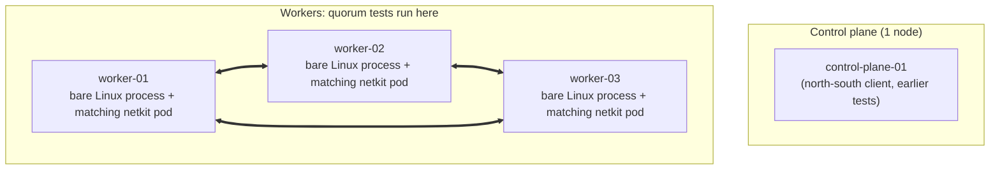

*Six workloads, one self-managed cluster, and a question I kept getting wrong until I measured it: does the extra hop through a container's CNI add real network overhead versus the same binary running as a plain Linux process on the bare host, or does Cilium's netkit datapath actually eliminate that bottleneck?*

netkit, for anyone new to it: a Linux kernel network device type, merged into mainline Linux 6.7, contributed largely by Cilium/Isovalent engineers and currently used as Cilium's container networking datapath. No `veth` pair, no virtual switch in the middle, just a lightweight in-kernel construct with eBPF hooks (`netkit/primary` and `netkit/peer`) on the send and receive path. The intent of this post is to observe netkit's benefits for clustered or distributed applications, especially databases and RAFT-based systems, something I'd always wanted to check since [building a stock exchange in the cloud](https://hrishi.dev/cloud/aws/trading/low-latency/distributed%20systems/2025/11/09/building-stock-exchange-in-the-cloud.html), where RAFT-style consensus latency is exactly the kind of thing that matters.

## The setup

A self-managed Kubernetes cluster on a small cloud VM instance type throughout (4 vCPUs, ~8GB RAM, ~8GB disk per node, Ubuntu 26.04 LTS, kernel 7.0.0-14-generic), Cilium in **native routing** mode (no VXLAN, no encapsulation overhead) with `bpf.datapathMode=netkit` and `loadBalancer.mode=dsr`. Every test below runs the *same binary* two ways: as a **bare Linux process** on the node (a normal `systemd`-managed process in the node's own network namespace, no container, no CNI, no `netkit` in the path at all) and as a **container behind Cilium's `netkit` device**, the same node, the same kernel, just routed through Cilium's datapath instead of a plain socket. "Bare host" here means bare of any container runtime and CNI, not bare-metal hardware: every node is a cloud VM, so both sides of every comparison share the same hypervisor-level virtualization; the variable under test is strictly the Linux networking path from that point down, host netns vs. `netkit`. No test ever uses `hostNetwork: true` to fake that comparison. Where a test involves two nodes, the host side talks over the cloud provider's private network and the container side talks over Cilium's pod network, both real, both production-shaped.

One cluster ran every test in this post: 1 control-plane node plus 3 workers (4 nodes total), same instance type throughout. The control-plane node doubles as the north-south client for the one test that needs an external caller; the three workers carry every host-vs-container comparison, including the quorum-based tests (etcd, PostgreSQL, Kafka) and the MPI ping-pong, which needs all three to isolate the Slurm controller (`worker-01`) from the two nodes actually carrying MPI traffic.



Every quorum result compares the same three workers: a bare Linux process on each versus a netkit-backed pod on each, never a mix.

Almost everything below is **east-west** traffic: pod-to-pod (or host-to-host) inside the cluster, the shape most inter-service and database traffic actually takes. There's one **north-south** data point too: an external client (`control-plane-01`, itself a plain host, no Kubernetes networking on its own side) hitting the worker directly for the host case, and hitting the same worker's Service `ClusterIP` (resolved via Cilium's host-reachable-services, an eBPF hook at the client's own socket layer, no `kube-proxy` involved) for the container case. Worth keeping separate: it's a different traffic shape from the paired host-vs-host / pod-vs-pod comparisons everywhere else in this post.

Three things worth keeping in mind while reading:

- **Nothing here is tuned.** Every system runs its distribution's default configuration: default `sysctl` values, default TCP buffer sizes, no CPU pinning or NUMA tuning, no custom kernel parameters, stock package configs for Redis/PostgreSQL/Kafka/etcd beyond the minimum needed to get replication or clustering working at all, deliberately, on both sides. That's a real limitation, not just a methodology note: an untuned host isn't the host's best case, and kernel-parameter tuning (`sysctl` buffer sizes, IRQ/CPU affinity, NUMA pinning) is exactly what a latency-sensitive production deployment would actually do, work that could move the host-side numbers enough to flip some of the closer results. This post answers what happens to an unmodified deployment, not whether a tuned bare-metal host would still lose to netkit.
- **Not every "container wins" result is actually about eBPF + `netkit`.** An early `iperf3` throughput test showed container traffic 2.4x faster than host-to-host, until holding the network path constant (private network on both sides) showed the *host* hitting the identical ceiling: 1,270 Mbit/s either way. That gap was the cloud provider's private network having a higher bandwidth ceiling than its public network, nothing to do with the CNI. Every result below has had that kind of confound checked for.
- **The container path is never `netkit` in isolation.** It always runs through Cilium's full eBPF stack, `netkit` plus Cilium's other eBPF host optimizations (host-reachable services, host routing) together. So every "container wins by Nx" number below is really "netkit + Cilium's other eBPF machinery" versus a plain, unmodified host. Separating netkit's specific contribution would need a third baseline this post doesn't include: the same Cilium eBPF stack, but with a `veth` pair standing in for `netkit` as the container device, holding everything else (host-reachable services, host routing) constant. That comparison, Cilium-with-`veth` versus Cilium-with-`netkit`, is what would isolate netkit's own marginal effect from the rest of Cilium's eBPF machinery. Worth running as a follow-up.

## Where the container with netkit wins: concurrent, dispatch-bound traffic

First, east-west: `wrk` (20 connections) runs on `worker-02` and hits the identical `whoami` binary on `worker-01`, two ways. Host case: a direct socket connection, no container, no CNI. Container case: through the `whoami` Service's `ClusterIP` (Cilium's DSR path), not bypassed to the pod IP directly:

<figure class="blog-chart">
<svg viewBox="0 0 560 380" style="max-width: 100%; height: auto; font-family: 'Inter', system-ui, sans-serif; --chart-muted: #4b5563;" role="img" aria-labelledby="http-throughput-host-vs-container-wrk-20-connections-title http-throughput-host-vs-container-wrk-20-connections-desc">
  <style>
    @media (prefers-color-scheme: dark) { svg { --chart-muted: #d1d5db; } }
    @media (prefers-reduced-motion: reduce) { * { animation: none !important; transition: none !important; } }
  </style>
  <title id="http-throughput-host-vs-container-wrk-20-connections-title">HTTP throughput, host vs container (wrk, 20 connections)</title>
  <desc id="http-throughput-host-vs-container-wrk-20-connections-desc">HTTP throughput, host vs container (wrk, 20 connections). grouped bar data: Requests/sec: Host 3014, Container 14582.Source: Author benchmark, whoami on Cilium netkit, 2026 .</desc>
  <text x="280.0" y="29" text-anchor="middle" font-size="18" font-weight="800" fill="currentColor">HTTP throughput, host vs container (wrk, 20 connections)</text>

  <line x1="72" y1="277.0" x2="492" y2="277.0" stroke="currentColor" opacity="0.08" />
<line x1="72" y1="230.8" x2="492" y2="230.8" stroke="currentColor" opacity="0.08" />
<line x1="72" y1="184.5" x2="492" y2="184.5" stroke="currentColor" opacity="0.08" />
<line x1="72" y1="138.2" x2="492" y2="138.2" stroke="currentColor" opacity="0.08" />
<line x1="72" y1="92.0" x2="492" y2="92.0" stroke="currentColor" opacity="0.08" />
<rect x="72" y="62" width="10" height="10" fill="#f97316" />
<text x="87" y="71" font-size="11" fill="currentColor">Host</text>
<rect x="177" y="62" width="10" height="10" fill="#38bdf8" />
<text x="192" y="71" font-size="11" fill="currentColor">Container</text>
<rect x="264.0" y="238.8" width="16.0" height="38.2" fill="#f97316" />
<text x="272.0" y="234.8" text-anchor="middle" font-size="10" fill="currentColor">3,014</text>
<rect x="282.0" y="92.0" width="16.0" height="185.0" fill="#38bdf8" />
<text x="290.0" y="88.0" text-anchor="middle" font-size="10" fill="currentColor">14,582</text>
<text x="282.0" y="295.0" text-anchor="middle" font-size="10" fill="currentColor" opacity="0.8"><tspan x="282.0" dy="0">Requests/sec</tspan></text>
  <text x="280.0" y="366" text-anchor="middle" font-size="10" fill="var(--chart-muted, currentColor)">Source: Author benchmark, whoami on Cilium netkit, 2026</text>
</svg>
</figure>

4.8x. I didn't trust that number until I isolated it: swapping which side (client or server) ran in a container, holding the other constant, showed client location barely moved the result: the win is entirely server-side. `mpstat` during the load test confirmed why:

<figure class="blog-chart">
<svg viewBox="0 0 560 380" style="max-width: 100%; height: auto; font-family: 'Inter', system-ui, sans-serif; --chart-muted: #4b5563;" role="img" aria-labelledby="cpu-time-per-http-request-ms-title cpu-time-per-http-request-ms-desc">
  <style>
    @media (prefers-color-scheme: dark) { svg { --chart-muted: #d1d5db; } }
    @media (prefers-reduced-motion: reduce) { * { animation: none !important; transition: none !important; } }
  </style>
  <title id="cpu-time-per-http-request-ms-title">CPU time per HTTP request (ms)</title>
  <desc id="cpu-time-per-http-request-ms-desc">CPU time per HTTP request (ms). horizontal bar data: Host (plain socket) 1.1; Container (netkit) 0.23.Source: Author benchmark, mpstat under wrk load, 2026 .</desc>
  <text x="280.0" y="29" text-anchor="middle" font-size="18" font-weight="800" fill="currentColor">CPU time per HTTP request (ms)</text>

  <line x1="145" y1="298.0" x2="510" y2="298.0" stroke="currentColor" opacity="0.08" />
<line x1="145" y1="243.0" x2="510" y2="243.0" stroke="currentColor" opacity="0.08" />
<line x1="145" y1="188.0" x2="510" y2="188.0" stroke="currentColor" opacity="0.08" />
<line x1="145" y1="133.0" x2="510" y2="133.0" stroke="currentColor" opacity="0.08" />
<line x1="145" y1="78.0" x2="510" y2="78.0" stroke="currentColor" opacity="0.08" />
<text x="136.0" y="146.9" text-anchor="end" font-size="11" fill="currentColor" opacity="0.8"><tspan x="136.0" dy="0">Host (plain</tspan><tspan x="136.0" dy="12">socket)</tspan></text>
<rect x="145" y="78.0" width="365.0" height="106.0" rx="4" fill="#f97316" />
<text x="518.0" y="146.9" font-size="11" fill="currentColor">1.1</text>
<text x="136.0" y="260.9" text-anchor="end" font-size="11" fill="currentColor" opacity="0.8"><tspan x="136.0" dy="0">Container</tspan><tspan x="136.0" dy="12">(netkit)</tspan></text>
<rect x="145" y="192.0" width="76.3" height="106.0" rx="4" fill="#38bdf8" />
<text x="229.3" y="260.9" font-size="11" fill="currentColor">0.23</text>
  <text x="280.0" y="366" text-anchor="middle" font-size="10" fill="var(--chart-muted, currentColor)">Source: Author benchmark, mpstat under wrk load, 2026</text>
</svg>
</figure>

The `mpstat` summary lines behind that chart, captured on `worker-01` (4 vCPUs) while `wrk` was running:

```
# server = host (whoami-host, plain socket), 3,014 req/s
Average:     CPU    %usr   %nice    %sys %iowait    %irq   %soft  %steal  %guest  %gnice   %idle
Average:     all   23.20    0.00   57.31    0.00    0.00    2.26    0.00    0.00    0.00   17.06

# server = container (whoami via Service, netkit), 15,588 req/s
Average:     CPU    %usr   %nice    %sys %iowait    %irq   %soft  %steal  %guest  %gnice   %idle
Average:     all   25.64    0.00   49.02    0.00    0.00   14.12    0.00    0.00    0.00   10.88
```

Converting busy-% into CPU-time per request: `4 × (1 − 0.1706) = 3.32` CPUs busy ÷ 3,014 req/s = **1.10ms** on the host; `4 × (1 − 0.1088) = 3.56` CPUs busy ÷ 15,588 req/s = **0.23ms** in the container. 4.81x more CPU per request on the host path, almost exactly matching the throughput gap. The mechanism, per [Isovalent's own writeup on netkit](https://isovalent.com/blog/post/cilium-netkit-a-new-container-networking-paradigm-for-the-ai-era/): pod egress traffic is redirected straight to the physical device from a BPF program running on the netkit device itself, **skipping the per-CPU backlog queue** (the same queue a `veth`-based pod would have to cross via a full namespace hop), plus `netkit` defaults to L3 (L2 is a supported option, just not the default), removing ARP overhead in that default mode. That's the documented source of the saving.

Worth being precise here:

1. Isovalent's design goal for netkit: make container (pod) networking as fast as bare host networking, reaching **parity**, not exceeding it.
2. ByteDance/Meta reports: netkit gets container networking close to host performance (ByteDance: 12% CPS gain over `veth` in a proof-of-concept, with plans to roll out in production; Meta: softirq load indistinguishable from host, measured on live production traffic). Both describe netkit closing the gap up to host from below, the historical `veth` overhead shrinking toward zero.
3. My result is different in kind, not degree: I'm not reporting netkit narrowing a gap, I'm reporting the container path outright beating the host path by 4.8x. That's a stronger, less common claim than what any vendor number here supports.
4. My hedge: I don't have a clean explanation for that inversion, but my best guess is the comparison isn't apples-to-apples. My "host" baseline is a bare `systemd` process with none of Cilium's host-side accelerations (eBPF kube-proxy replacement, host routing), because it isn't running through Cilium at all. So my host baseline is closer to the unoptimized baseline vendors compare netkit against, not the optimized host baseline they compare netkit to (i.e. parity with).

In short: my 4.8x might be an artifact of comparing accelerated-container vs. unaccelerated-host, rather than genuine evidence that containers can outrun host networking.


A 3-node etcd Raft cluster (the real quorum shape, 2-of-3 majority) showed the same underlying mechanism: a quorum-committing `PUT` sends `AppendEntries` to two followers and waits for the faster one to ack: trivial per-request CPU work, cost dominated by dispatch.

<figure class="blog-chart">
<svg viewBox="0 0 560 380" style="max-width: 100%; height: auto; font-family: 'Inter', system-ui, sans-serif; --chart-muted: #4b5563;" role="img" aria-labelledby="etcd-raft-commit-latency-ms-title etcd-raft-commit-latency-ms-desc">
  <style>
    @media (prefers-color-scheme: dark) { svg { --chart-muted: #d1d5db; } }
    @media (prefers-reduced-motion: reduce) { * { animation: none !important; transition: none !important; } }
  </style>
  <title id="etcd-raft-commit-latency-ms-title">etcd Raft commit latency (ms)</title>
  <desc id="etcd-raft-commit-latency-ms-desc">etcd Raft commit latency (ms). grouped bar data: Host 18.4, Container 12.44.Source: Author benchmark, 100 sequential quorum-committing PUTs, 2026 .</desc>
  <text x="280.0" y="29" text-anchor="middle" font-size="18" font-weight="800" fill="currentColor">etcd Raft commit latency (ms)</text>

  <line x1="72" y1="277.0" x2="492" y2="277.0" stroke="currentColor" opacity="0.08" />
<line x1="72" y1="230.8" x2="492" y2="230.8" stroke="currentColor" opacity="0.08" />
<line x1="72" y1="184.5" x2="492" y2="184.5" stroke="currentColor" opacity="0.08" />
<line x1="72" y1="138.2" x2="492" y2="138.2" stroke="currentColor" opacity="0.08" />
<line x1="72" y1="92.0" x2="492" y2="92.0" stroke="currentColor" opacity="0.08" />
<rect x="72" y="62" width="10" height="10" fill="#f97316" />
<text x="87" y="71" font-size="11" fill="currentColor">Host</text>
<rect x="177" y="62" width="10" height="10" fill="#38bdf8" />
<text x="192" y="71" font-size="11" fill="currentColor">Container</text>
<rect x="264.0" y="92.0" width="16.0" height="185.0" fill="#f97316" />
<text x="272.0" y="88.0" text-anchor="middle" font-size="10" fill="currentColor">18.40</text>
<rect x="282.0" y="152.0" width="16.0" height="125.0" fill="#38bdf8" />
<text x="290.0" y="148.0" text-anchor="middle" font-size="10" fill="currentColor">12.44</text>
<text x="282.0" y="295.0" text-anchor="middle" font-size="10" fill="currentColor" opacity="0.8"><tspan x="282.0" dy="0">Quorum commit</tspan></text>
  <text x="280.0" y="366" text-anchor="middle" font-size="10" fill="var(--chart-muted, currentColor)">Source: Author benchmark, 100 sequential quorum-committing PUTs, 2026</text>
</svg>
</figure>

Container: 12.44ms average. Host: 18.40ms. **1.48x**, same dispatch-cost mechanism as `wrk`. The leader fans `AppendEntries` out to two followers and waits for the faster ack; that extra dispatch work lands harder on the host's more expensive per-packet path than on the container's, which barely moves.

The north-south data point is the odd one out, and worth stating plainly rather than forcing it into the concurrency story: 30 *serial* plain-HTTP requests from `control-plane-01`, no DNS, no TLS, one at a time, and the container path still won, 1.379ms average versus 1.894ms for the host, ~27% lower, with zero concurrency in play. That doesn't fit "needs concurrent load" the way the MPI result later in this post does, and I'm not claiming it does. The likely reason is architectural, not load-related: the container path here goes through a single cheap eBPF socket-layer redirect on the *client's own kernel*, not a full pod-to-pod round trip, a different mechanism from the "many requests queued on a netkit device" story above. Filed as a real result, not a proven mechanism.

## Where the bare host wins: work netkit can't touch

Redis, `-c 20 -n 100000`:

<figure class="blog-chart">
<svg viewBox="0 0 560 380" style="max-width: 100%; height: auto; font-family: 'Inter', system-ui, sans-serif; --chart-muted: #4b5563;" role="img" aria-labelledby="redis-throughput-host-vs-container-title redis-throughput-host-vs-container-desc">
  <style>
    @media (prefers-color-scheme: dark) { svg { --chart-muted: #d1d5db; } }
    @media (prefers-reduced-motion: reduce) { * { animation: none !important; transition: none !important; } }
  </style>
  <title id="redis-throughput-host-vs-container-title">Redis throughput, host vs container</title>
  <desc id="redis-throughput-host-vs-container-desc">Redis throughput, host vs container. grouped bar data: SET: Host 39017, Container 35174; GET: Host 38447, Container 32248.Source: Author benchmark, redis-benchmark -c 20 -n 100000, 2026 .</desc>
  <text x="280.0" y="29" text-anchor="middle" font-size="18" font-weight="800" fill="currentColor">Redis throughput, host vs container</text>

  <line x1="72" y1="277.0" x2="492" y2="277.0" stroke="currentColor" opacity="0.08" />
<line x1="72" y1="230.8" x2="492" y2="230.8" stroke="currentColor" opacity="0.08" />
<line x1="72" y1="184.5" x2="492" y2="184.5" stroke="currentColor" opacity="0.08" />
<line x1="72" y1="138.2" x2="492" y2="138.2" stroke="currentColor" opacity="0.08" />
<line x1="72" y1="92.0" x2="492" y2="92.0" stroke="currentColor" opacity="0.08" />
<rect x="72" y="62" width="10" height="10" fill="#f97316" />
<text x="87" y="71" font-size="11" fill="currentColor">Host</text>
<rect x="177" y="62" width="10" height="10" fill="#38bdf8" />
<text x="192" y="71" font-size="11" fill="currentColor">Container</text>
<rect x="159.0" y="92.0" width="16.0" height="185.0" fill="#f97316" />
<text x="167.0" y="88.0" text-anchor="middle" font-size="9" fill="currentColor">39,017</text>
<rect x="177.0" y="110.2" width="16.0" height="166.8" fill="#38bdf8" />
<text x="185.0" y="106.2" text-anchor="middle" font-size="9" fill="currentColor">35,174</text>
<text x="177.0" y="295.0" text-anchor="middle" font-size="10" fill="currentColor" opacity="0.8"><tspan x="177.0" dy="0">SET</tspan></text>
<rect x="369.0" y="94.7" width="16.0" height="182.3" fill="#f97316" />
<text x="377.0" y="90.7" text-anchor="middle" font-size="9" fill="currentColor">38,447</text>
<rect x="387.0" y="124.1" width="16.0" height="152.9" fill="#38bdf8" />
<text x="395.0" y="120.1" text-anchor="middle" font-size="9" fill="currentColor">32,248</text>
<text x="387.0" y="295.0" text-anchor="middle" font-size="10" fill="currentColor" opacity="0.8"><tspan x="387.0" dy="0">GET</tspan></text>
  <text x="280.0" y="366" text-anchor="middle" font-size="10" fill="var(--chart-muted, currentColor)">Source: Author benchmark, redis-benchmark -c 20 -n 100000, 2026</text>
</svg>
</figure>

Host ahead by 11-19% (SET 39,017 vs 35,174, GET 38,447 vs 32,248). Redis's single-threaded command loop is the bottleneck here, not the network: one core processes `SET`/`GET` sequentially no matter which datapath delivered the packet, so netkit's CPU saving has nothing to attach to. Whatever small overhead the container path adds on top now shows through directly as lost throughput, instead of being hidden behind a bigger saving elsewhere.

PostgreSQL tells the same story, with a twist. Standalone `pgbench` (async commit, scale factor 2; TPC-B row-locks a single `pgbench_branches`/`pgbench_tellers` row per transaction, a server-side serialization bottleneck):

<figure class="blog-chart">
<svg viewBox="0 0 560 380" style="max-width: 100%; height: auto; font-family: 'Inter', system-ui, sans-serif; --chart-muted: #4b5563;" role="img" aria-labelledby="postgresql-throughput-standalone-vs-sync-replication-tps-title postgresql-throughput-standalone-vs-sync-replication-tps-desc">
  <style>
    @media (prefers-color-scheme: dark) { svg { --chart-muted: #d1d5db; } }
    @media (prefers-reduced-motion: reduce) { * { animation: none !important; transition: none !important; } }
  </style>
  <title id="postgresql-throughput-standalone-vs-sync-replication-tps-title">PostgreSQL throughput: standalone vs sync replication (TPS)</title>
  <desc id="postgresql-throughput-standalone-vs-sync-replication-tps-desc">PostgreSQL throughput, standalone vs sync replication (TPS). grouped bar data: Standalone: Host 700.98, Container 667.98; Sync replication: Host 697.70, Container 649.96.Source: Author benchmark, pgbench -c 20 -T 30, 2026 .</desc>
  <text x="280.0" y="29" text-anchor="middle" font-size="18" font-weight="800" fill="currentColor">PostgreSQL throughput: standalone vs sync replication (TPS)</text>

  <line x1="72" y1="277.0" x2="492" y2="277.0" stroke="currentColor" opacity="0.08" />
<line x1="72" y1="230.8" x2="492" y2="230.8" stroke="currentColor" opacity="0.08" />
<line x1="72" y1="184.5" x2="492" y2="184.5" stroke="currentColor" opacity="0.08" />
<line x1="72" y1="138.2" x2="492" y2="138.2" stroke="currentColor" opacity="0.08" />
<line x1="72" y1="92.0" x2="492" y2="92.0" stroke="currentColor" opacity="0.08" />
<rect x="72" y="62" width="10" height="10" fill="#f97316" />
<text x="87" y="71" font-size="11" fill="currentColor">Host</text>
<rect x="177" y="62" width="10" height="10" fill="#38bdf8" />
<text x="192" y="71" font-size="11" fill="currentColor">Container</text>
<rect x="159.0" y="92.0" width="16.0" height="185.0" fill="#f97316" />
<text x="167.0" y="88.0" text-anchor="middle" font-size="9" fill="currentColor">700.98</text>
<rect x="177.0" y="100.7" width="16.0" height="176.3" fill="#38bdf8" />
<text x="185.0" y="96.7" text-anchor="middle" font-size="9" fill="currentColor">667.98</text>
<text x="177.0" y="295.0" text-anchor="middle" font-size="10" fill="currentColor" opacity="0.8"><tspan x="177.0" dy="0">Standalone</tspan></text>
<rect x="369.0" y="92.9" width="16.0" height="184.1" fill="#f97316" />
<text x="377.0" y="88.9" text-anchor="middle" font-size="9" fill="currentColor">697.70</text>
<rect x="387.0" y="105.5" width="16.0" height="171.5" fill="#38bdf8" />
<text x="395.0" y="101.5" text-anchor="middle" font-size="9" fill="currentColor">649.96</text>
<text x="387.0" y="295.0" text-anchor="middle" font-size="10" fill="currentColor" opacity="0.8"><tspan x="387.0" dy="0">Sync</tspan><tspan x="387.0" dy="11">replication</tspan></text>
  <text x="280.0" y="366" text-anchor="middle" font-size="10" fill="var(--chart-muted, currentColor)">Source: Author benchmark, pgbench -c 20 -T 30, 2026</text>
</svg>
</figure>

Standalone: host ahead ~5% (701 vs 668 TPS), same lock-contention story as Redis, no replication involved. Turning synchronous replication on changes the picture: `synchronous_standby_names = 'ANY 1 (standby2, standby3)'` (primary plus two standbys) waits for whichever standby acks first, the shape a production quorum-commit deployment actually runs.

<figure class="blog-chart">
<svg viewBox="0 0 560 380" style="max-width: 100%; height: auto; font-family: 'Inter', system-ui, sans-serif; --chart-muted: #4b5563;" role="img" aria-labelledby="postgresql-marginal-cost-of-synchronous-replication-title postgresql-marginal-cost-of-synchronous-replication-desc">
  <style>
    @media (prefers-color-scheme: dark) { svg { --chart-muted: #d1d5db; } }
    @media (prefers-reduced-motion: reduce) { * { animation: none !important; transition: none !important; } }
  </style>
  <title id="postgresql-marginal-cost-of-synchronous-replication-title">PostgreSQL: cost of sync replication (%)</title>
  <desc id="postgresql-marginal-cost-of-synchronous-replication-desc">PostgreSQL: cost of sync replication (%). grouped bar data: Host 0.5, Container 2.7.Source: Author benchmark, pgbench -c 20 -T 30, standalone vs sync-commit throughput delta, 2026 .</desc>
  <text x="280.0" y="29" text-anchor="middle" font-size="18" font-weight="800" fill="currentColor">PostgreSQL: cost of sync replication (%)</text>

  <line x1="72" y1="277.0" x2="492" y2="277.0" stroke="currentColor" opacity="0.08" />
<line x1="72" y1="230.8" x2="492" y2="230.8" stroke="currentColor" opacity="0.08" />
<line x1="72" y1="184.5" x2="492" y2="184.5" stroke="currentColor" opacity="0.08" />
<line x1="72" y1="138.2" x2="492" y2="138.2" stroke="currentColor" opacity="0.08" />
<line x1="72" y1="92.0" x2="492" y2="92.0" stroke="currentColor" opacity="0.08" />
<rect x="72" y="62" width="10" height="10" fill="#f97316" />
<text x="87" y="71" font-size="11" fill="currentColor">Host</text>
<rect x="177" y="62" width="10" height="10" fill="#38bdf8" />
<text x="192" y="71" font-size="11" fill="currentColor">Container</text>
<rect x="264.0" y="242.7" width="16.0" height="34.3" fill="#f97316" />
<text x="272.0" y="238.7" text-anchor="middle" font-size="10" fill="currentColor">0.5%</text>
<rect x="282.0" y="92.0" width="16.0" height="185.0" fill="#38bdf8" />
<text x="290.0" y="88.0" text-anchor="middle" font-size="10" fill="currentColor">2.7%</text>
<text x="282.0" y="295.0" text-anchor="middle" font-size="10" fill="currentColor" opacity="0.8"><tspan x="282.0" dy="0">Cost of sync</tspan></text>
  <text x="280.0" y="366" text-anchor="middle" font-size="10" fill="var(--chart-muted, currentColor)">Source: Author benchmark, pgbench -c 20 -T 30, standalone vs sync-commit throughput delta, 2026</text>
</svg>
</figure>

Turning synchronous replication on cost the host **0.5%** throughput. Essentially free: with a real majority to wait for, the leader races the faster of two standbys instead of paying a full round trip every time. The container's marginal cost was higher in relative terms (2.7%), though still small in absolute terms, because its per-packet dispatch cost was already cheap enough that a full round trip barely registered in the first place. Sequential commit latency (confound-controlled, same Alpine/musl `psql` client both sides) tells the same story at smaller scale: container 14.24ms vs host 20.86ms, a 1.46x gap. Two different questions, two different winners: on the %-cost of turning replication on, the host is "cheaper" because a nearly-free round trip barely dents its throughput; on the commit itself, the container is faster in absolute terms, 1.46x on latency, the direct measurement to trust here.

## Kafka: pull-based replication favors the host

Same "wait for the other replica" shape as Raft and Postgres, on paper. Kafka answered differently:

<figure class="blog-chart">
<svg viewBox="0 0 560 380" style="max-width: 100%; height: auto; font-family: 'Inter', system-ui, sans-serif; --chart-muted: #4b5563;" role="img" aria-labelledby="kafka-produce-latency-leader-ack-vs-quorum-write-ms-title kafka-produce-latency-leader-ack-vs-quorum-write-ms-desc">
  <style>
    @media (prefers-color-scheme: dark) { svg { --chart-muted: #d1d5db; } }
    @media (prefers-reduced-motion: reduce) { * { animation: none !important; transition: none !important; } }
  </style>
  <title id="kafka-produce-latency-leader-ack-vs-quorum-write-ms-title">Kafka produce latency: leader-ack vs quorum write (ms)</title>
  <desc id="kafka-produce-latency-leader-ack-vs-quorum-write-ms-desc">Kafka produce latency: leader-ack vs quorum write (ms). grouped bar data: acks=1: Host 40.26, Container 69.08; acks=all: Host 98.75, Container 374.39.Source: Author benchmark, kafka-producer-perf-test, 2026 .</desc>
  <text x="280.0" y="29" text-anchor="middle" font-size="18" font-weight="800" fill="currentColor">Kafka produce latency: leader-ack vs quorum write (ms)</text>

  <line x1="72" y1="277.0" x2="492" y2="277.0" stroke="currentColor" opacity="0.08" />
<line x1="72" y1="230.8" x2="492" y2="230.8" stroke="currentColor" opacity="0.08" />
<line x1="72" y1="184.5" x2="492" y2="184.5" stroke="currentColor" opacity="0.08" />
<line x1="72" y1="138.2" x2="492" y2="138.2" stroke="currentColor" opacity="0.08" />
<line x1="72" y1="92.0" x2="492" y2="92.0" stroke="currentColor" opacity="0.08" />
<rect x="72" y="62" width="10" height="10" fill="#f97316" />
<text x="87" y="71" font-size="11" fill="currentColor">Host</text>
<rect x="177" y="62" width="10" height="10" fill="#38bdf8" />
<text x="192" y="71" font-size="11" fill="currentColor">Container</text>
<rect x="159.0" y="169.2" width="16.0" height="107.8" fill="#f97316" />
<text x="167.0" y="165.2" text-anchor="middle" font-size="9" fill="currentColor">40.3</text>
<rect x="177.0" y="92.0" width="16.0" height="185.0" fill="#38bdf8" />
<text x="185.0" y="88.0" text-anchor="middle" font-size="9" fill="currentColor">69.1</text>
<text x="177.0" y="295.0" text-anchor="middle" font-size="10" fill="currentColor" opacity="0.8"><tspan x="177.0" dy="0">acks=1</tspan></text>
<rect x="369.0" y="228.2" width="16.0" height="48.8" fill="#f97316" />
<text x="377.0" y="224.2" text-anchor="middle" font-size="9" fill="currentColor">98.75</text>
<rect x="387.0" y="92.0" width="16.0" height="185.0" fill="#38bdf8" />
<text x="395.0" y="88.0" text-anchor="middle" font-size="9" fill="currentColor">374.4</text>
<text x="387.0" y="295.0" text-anchor="middle" font-size="10" fill="currentColor" opacity="0.8"><tspan x="387.0" dy="0">acks=all</tspan></text>
  <text x="280.0" y="366" text-anchor="middle" font-size="10" fill="var(--chart-muted, currentColor)">Source: Author benchmark, kafka-producer-perf-test, 2026</text>
</svg>
</figure>

Host wins both modes. `acks=all` + `min.insync.replicas=2` is the genuine quorum write, and there the host wins by nearly 4x (98.75ms vs 374.39ms). The likely reason: Raft's `AppendEntries` and Postgres's WAL streaming are the leader *pushing* to a follower and waiting for one ack, a single dispatch round trip. Kafka's followers instead run a continuous *fetch* loop against the leader (`replica.fetch.wait.max.ms`, default 500ms); `acks=all` completion depends on that poll loop noticing the new record, not a dedicated round trip triggered by the write, a fixed poll-cycle cost that dispatch efficiency doesn't touch. Not independently confirmed with the same CPU-profiling rigor as the `wrk` result, so I'm stating it as the likely mechanism, not a proven one.

`acks=1` (leader-ack only, not a quorum vote at all) is the more surprising one: there's no fan-out cost to explain a host win the way there is for `acks=all`, and it still lands well outside the concurrency-favors-container pattern established by HTTP and etcd. Flagged as an open anomaly rather than forced into a story I haven't verified.

## MPI: no concurrency, no advantage

A real 2-rank MPI ping-pong (`mpicc`-compiled, launched through a hand-rolled Slurm cluster, mirrored topology on host and Kubernetes), as close to a raw TCP round trip as this series gets. Same layout both sides, deliberately, and with the controller kept off the compute path so its numbers aren't diluted by controller overhead: one node runs `slurmctld` only, the other two run `slurmd` and actually carry the two MPI ranks. `sbatch` on the controller node wraps `mpirun` to launch the two ranks over `ssh`.

```
HOST (bare processes)
  worker-01: slurmctld only, sbatch submitted here
      |
      |  mpirun, ssh launcher, private network
      v
  worker-02: slurmd, MPI rank 0  <--->  worker-03: slurmd, MPI rank 1
```

```
CONTAINER (same topology, as pods)
  slurm-ctl pod (worker-01): slurmctld only, sbatch submitted here
      |
      |  mpirun, ssh launcher, Cilium netkit
      v
  slurm-worker pod (worker-02): slurmd, rank 0  <--->  slurm-worker-2 pod (worker-03): slurmd, rank 1
```

No `hostNetwork` on the container side here either. `munge` (shared auth key) and `sshd` are installed identically on both container pods purely so the launch mechanism matches the host's `ssh`-based `mpirun` launcher exactly, not to introduce a variable that isn't on the host side too.

<figure class="blog-chart">
<svg viewBox="0 0 560 380" style="max-width: 100%; height: auto; font-family: 'Inter', system-ui, sans-serif; --chart-muted: #4b5563;" role="img" aria-labelledby="mpi-ping-pong-round-trip-latency-s-title mpi-ping-pong-round-trip-latency-s-desc">
  <style>
    @media (prefers-color-scheme: dark) { svg { --chart-muted: #d1d5db; } }
    @media (prefers-reduced-motion: reduce) { * { animation: none !important; transition: none !important; } }
  </style>
  <title id="mpi-ping-pong-round-trip-latency-s-title">MPI ping-pong round-trip latency (µs)</title>
  <desc id="mpi-ping-pong-round-trip-latency-s-desc">MPI ping-pong round-trip latency (µs). grouped bar data: 0-byte round trip: Host 122.74, Container 131.37.Source: Author benchmark, 2-rank MPI ping-pong over Slurm, 2026 .</desc>
  <text x="280.0" y="29" text-anchor="middle" font-size="18" font-weight="800" fill="currentColor">MPI ping-pong round-trip latency (µs)</text>

  <line x1="72" y1="277.0" x2="492" y2="277.0" stroke="currentColor" opacity="0.08" />
<line x1="72" y1="230.8" x2="492" y2="230.8" stroke="currentColor" opacity="0.08" />
<line x1="72" y1="184.5" x2="492" y2="184.5" stroke="currentColor" opacity="0.08" />
<line x1="72" y1="138.2" x2="492" y2="138.2" stroke="currentColor" opacity="0.08" />
<line x1="72" y1="92.0" x2="492" y2="92.0" stroke="currentColor" opacity="0.08" />
<rect x="72" y="62" width="10" height="10" fill="#f97316" />
<text x="87" y="71" font-size="11" fill="currentColor">Host</text>
<rect x="177" y="62" width="10" height="10" fill="#38bdf8" />
<text x="192" y="71" font-size="11" fill="currentColor">Container</text>
<rect x="264.0" y="104.1" width="16.0" height="172.9" fill="#f97316" />
<text x="272.0" y="100.1" text-anchor="middle" font-size="9" fill="currentColor">122.7</text>
<rect x="282.0" y="92.0" width="16.0" height="185.0" fill="#38bdf8" />
<text x="290.0" y="88.0" text-anchor="middle" font-size="9" fill="currentColor">131.4</text>
<text x="282.0" y="295.0" text-anchor="middle" font-size="10" fill="currentColor" opacity="0.8"><tspan x="282.0" dy="0">0-byte round</tspan><tspan x="282.0" dy="11">trip</tspan></text>
  <text x="280.0" y="366" text-anchor="middle" font-size="10" fill="var(--chart-muted, currentColor)">Source: Author benchmark, 2-rank MPI ping-pong over Slurm, 2026</text>
</svg>
</figure>

<figure class="blog-chart">
<svg viewBox="0 0 560 380" style="max-width: 100%; height: auto; font-family: 'Inter', system-ui, sans-serif; --chart-muted: #4b5563;" role="img" aria-labelledby="mpi-ping-pong-bandwidth-mb-s-title mpi-ping-pong-bandwidth-mb-s-desc">
  <style>
    @media (prefers-color-scheme: dark) { svg { --chart-muted: #d1d5db; } }
    @media (prefers-reduced-motion: reduce) { * { animation: none !important; transition: none !important; } }
  </style>
  <title id="mpi-ping-pong-bandwidth-mb-s-title">MPI ping-pong 64KB bandwidth (MB/s)</title>
  <desc id="mpi-ping-pong-bandwidth-mb-s-desc">MPI ping-pong 64KB bandwidth (MB/s). grouped bar data: 64KB round trip: Host 175.64, Container 142.27.Source: Author benchmark, 2-rank MPI ping-pong over Slurm, 2026 .</desc>
  <text x="280.0" y="29" text-anchor="middle" font-size="18" font-weight="800" fill="currentColor">MPI ping-pong 64KB bandwidth (MB/s)</text>

  <line x1="72" y1="277.0" x2="492" y2="277.0" stroke="currentColor" opacity="0.08" />
<line x1="72" y1="230.8" x2="492" y2="230.8" stroke="currentColor" opacity="0.08" />
<line x1="72" y1="184.5" x2="492" y2="184.5" stroke="currentColor" opacity="0.08" />
<line x1="72" y1="138.2" x2="492" y2="138.2" stroke="currentColor" opacity="0.08" />
<line x1="72" y1="92.0" x2="492" y2="92.0" stroke="currentColor" opacity="0.08" />
<rect x="72" y="62" width="10" height="10" fill="#f97316" />
<text x="87" y="71" font-size="11" fill="currentColor">Host</text>
<rect x="177" y="62" width="10" height="10" fill="#38bdf8" />
<text x="192" y="71" font-size="11" fill="currentColor">Container</text>
<rect x="264.0" y="92.0" width="16.0" height="185.0" fill="#f97316" />
<text x="272.0" y="88.0" text-anchor="middle" font-size="9" fill="currentColor">175.6</text>
<rect x="282.0" y="127.2" width="16.0" height="149.8" fill="#38bdf8" />
<text x="290.0" y="123.2" text-anchor="middle" font-size="9" fill="currentColor">142.3</text>
<text x="282.0" y="295.0" text-anchor="middle" font-size="10" fill="currentColor" opacity="0.8"><tspan x="282.0" dy="0">64KB round</tspan><tspan x="282.0" dy="11">trip</tspan></text>
  <text x="280.0" y="366" text-anchor="middle" font-size="10" fill="var(--chart-muted, currentColor)">Source: Author benchmark, 2-rank MPI ping-pong over Slurm, 2026</text>
</svg>
</figure>

Host wins latency by ~7% and a 64KB synchronous-exchange throughput test by ~19% (176 vs 142 MB/s). This is the cleanest confirmation of what the `wrk` result actually proved: netkit's advantage is CPU time *saved per request under concurrent load*: many requests stacked up, cheaper dispatch paid off across all of them. A strict 1:1 ping-pong has exactly one message in flight at a time. There's no queue for a cheaper datapath to save CPU across, so the result looks like the earlier `ping`/`iperf3` tests: dominated by the raw path, not by dispatch efficiency.

> **A note on RDMA**, since MPI is what most people associate with it: this test measured plain TCP MPI, the only option on this instance type, which has no InfiniBand or RoCE capability. Real HPC and large-scale AI training clusters typically run MPI over RDMA, and RDMA changes the picture completely, not just the numbers. RDMA is kernel-bypass by design: userspace `libibverbs` talks straight to NIC hardware queue pairs, with no syscalls, no socket, no netfilter, and critically, no `netkit` and no host network namespace either. Neither side of this comparison, host or container, touches the kernel networking stack RDMA is built to avoid. None of this post's reasoning (dispatch cost, concurrency, `%soft` CPU time) applies to an RDMA path, because none of that machinery is in an RDMA path to begin with. Whether Cilium/netkit adds overhead to RDMA traffic is a different, harder question this test doesn't answer. It needs SR-IOV or RDMA-aware device plugins to even test, and this cluster's hardware doesn't have them.

## The rule, sharpened

> For east-west traffic: container/netkit wins when a request's cost is dominated by network dispatch **under concurrent load**. Host wins, or it's a wash, when the cost is dominated by CPU/lock serialization the datapath can't touch, or when there's no concurrency for a cheaper datapath to save CPU across in the first place.

Every east-west result here fits that once you check for the two things that break a naive read of it: whether the "container wins" is actually just a faster underlying network path (the cloud provider's private vs. public network, nothing to do with Cilium), and whether "dispatch-bound" work has enough concurrent volume behind it for the saving to compound. Kafka's pull-based replication and a synchronous MPI ping-pong both look dispatch-bound on paper and both behave differently: not because the rule is wrong, but because concurrency and protocol shape turned out to matter as much as "does this workload talk to the network a lot."

North-south doesn't fit that rule, and I'm not stretching it to; it's answering a different question (external client through a service redirect, not two matched endpoints on the same kind of path) with a different likely mechanism (a cheap client-side eBPF hook, not a busy datapath saving CPU under load). Keep the two traffic shapes separate when you're reasoning about your own workload; conflating them is exactly how a naive read goes wrong.

If you're deciding whether to worry about CNI overhead for a specific workload, the question that actually predicts the answer isn't "is this network-heavy"; it's "does the load stack up requests fast enough for a cheaper per-packet datapath to matter." A quorum-writing database under real concurrent traffic: probably fine, possibly faster. A single long-running batch job doing one synchronous exchange at a time: measure it, don't assume.

**Key takeaways**

- For east-west traffic (pod-to-pod, most of this post), Cilium's `netkit` datapath beats a bare host socket specifically when a service handles many concurrent requests (proven via CPU profiling, not assumed).
- It loses, or ties, when the bottleneck is server-side: a single-threaded command loop (Redis), row-lock contention (PostgreSQL), or a strictly synchronous 1:1 exchange (MPI) with no concurrency for a cheaper datapath to save CPU across.
- Two east-west results looked like exceptions until traced to mechanism: Kafka's pull-based replication and a raw MPI ping-pong both behave differently from Raft- and WAL-style "wait for one ack" protocols.
- North-south (external client to service) is a different traffic shape entirely: container still wins there, but via Cilium's host-reachable-services (a client-side eBPF socket redirect), not netkit or concurrent dispatch savings.

## References

- [Cilium netkit: The Final Frontier in Container Networking Performance](https://isovalent.com/blog/post/cilium-netkit-a-new-container-networking-paradigm-for-the-ai-era/). Nico Vibert, Isovalent, July 2024 (updated July 2024). The primary source on netkit's design and the mechanism behind its performance (per-CPU backlog queue skip, L3-by-default), plus the ByteDance proof-of-concept and Meta production data points cited above.
- [Introduction to Linux netkit interfaces with a grain of eBPF](https://blog.yadutaf.fr/2025/07/01/introduction-to-linux-netkit-interfaces-with-a-grain-of-ebpf/). yadutaf, July 2025. A clear walkthrough of netkit's primary/peer device model and its `netkit/primary` and `netkit/peer` eBPF hooks.
- [Creating a Yogurt Phone with netkit eBPF](https://blog.yadutaf.fr/2025/09/16/creating-a-yogurt-phone-with-netkit-ebpf). yadutaf, September 2025. A deeper look at cross-namespace routing with netkit, including the `netkit_xnet()` metadata-scrubbing step and why `bpf_redirect()` is needed in place of `veth`'s `bpf_redirect_peer()`.
